 <h1>Data Science - ENEM 2019</h1>

```diff
ATENÇÃO:
+ Este é um trabalho avançado com os dados públicos de ENEM 2019/CE-INEP 2020.
- O Storytelling e a Conclusão foram inicialmente desenvolvidos no Prezi, mas por terem ficado enormes, estão sendo migrados para um repositório indicado neste trabalho.
```

## Nootebooks:

<a href="https://colab.research.google.com/github/MuriloKrominski/Data-Science_ENEM-2019/blob/main/0.ipynb" target="_parent"></a><br>
<a href="https://colab.research.google.com/github/MuriloKrominski/Data-Science_ENEM-2019/blob/main/1.ipynb" target="_parent"></a><br>
<a href="https://colab.research.google.com/github/MuriloKrominski/Data-Science_ENEM-2019/blob/main/2.ipynb" target="_parent"></a><br>
<a href="https://colab.research.google.com/github/MuriloKrominski/Data-Science_ENEM-2019/blob/main/3.ipynb" target="_parent"></a><br>
<a href="https://colab.research.google.com/github/MuriloKrominski/Data-Science_ENEM-2019/blob/main/4.ipynb" target="_parent"></a><br>
<a href="https://colab.research.google.com/github/MuriloKrominski/Data-Science_ENEM-2019/blob/main/5.ipynb" target="_parent"></a><br>
<a href="https://colab.research.google.com/github/MuriloKrominski/Data-Science_ENEM-2019/blob/main/6.ipynb" target="_parent"></a><br>
<a href="https://colab.research.google.com/github/MuriloKrominski/Data-Science_ENEM-2019/blob/main/7.ipynb" target="_parent"></a><br>
<a href="https://colab.research.google.com/github/MuriloKrominski/Data-Science_ENEM-2019/blob/main/8.ipynb" target="_parent"></a><br>
<a href="https://colab.research.google.com/github/MuriloKrominski/Data-Science_ENEM-2019/blob/main/10.ipynb" target="_parent"></a><br>
<a href="https://colab.research.google.com/github/MuriloKrominski/Data-Science_ENEM-2019/blob/main/11.ipynb" target="_parent"></a><br>

# ENEM 2019 - Trabalho de Ciência de Dados

## Introdução:
Entre os dias 18 e 24 de outubro de 2020, ocorreu o evento “Imersão Dados”, realizado pela Alura / Data Hackers
Eu e os demais participantes fomos desafiados a transformar os dados brutos do ENEM 2019 em informações significativas sobre o cenário da educação no Brasil, buscando identificar problemas e oportunidades para a educação brasileira.

Para tornar o desafio ainda mais interessante, eu decidi incrementar várias das exigências para este desafio (comentarei cada uma delas em momento oportuno), e me comprometo a nem mesmo olhar para o trabalho de outros profissionais, enquanto não finalizo o meu projeto.

Ficou completamente ao meu critério a forma de desenvolvimento, e o prazo dado ao desafio foi de 7 dias.

Eu adoro um bom desafio, e você é meu convidado para acompanhar e aprender um pouco com o desenvolvimento e conclusões deste trabalho.


## Apresentação de Objetivos:
O projeto deve atender alguns critérios como explorar corretamente a base de dados do sistema educacional, criar um modelo de Machine Learning utilizando o Python, utilizar as principais bibliotecas na área de Data Science, e ainda otimizar um portfólio com um projeto completo de Data Science.
Eu já tenho experiência, mas a imersão inclui videoaulas para auxiliar aos que ainda não.
Foi recomendado pela Alura, dividir o processo em etapas, sendo elas:

DIA 1) Fazer minha primeira análise com esses dados e já tirar algumas próprias conclusões criando gráficos e analisando algumas estatísticas, e assim definir o tipo de estudo.

DIA 2) Avançar na análise exploratória dos dados criando novas visualizações que ajudem a entender estatísticas mais avançadas.

DIA 3) Criar um modelo de Machine Learning capaz, por exemplo, de prever notas.

DIA 4) Otimizar os hiper parâmetros, testar novos modelos de Machine Learning e escolher o mais adequado.

DIA 5) Depois de uma profunda análise exploratória dos dados do ENEM, tirar diversas conclusões até criar modelos de Machine Learning; todo esse trabalho precisa ser resumido de forma objetiva e clara, e para isso é importante criar um Storytelling em Data Science, organizando as conclusões e criando um relatório para meu portfólio.

Como podem notar, a complexidade e responsabilidade de um trabalho assim é enorme, assim como é gigantesca a base de dados e de praticamente inesgotáveis possibilidades de interações e integrações entre os dados.

# Tarefas Mínimas (enviadas pela Alura):
Desafio 01: Proporção dos inscritos por idade.<br>
Desafio 02: Descobrir de quais estados são os inscritos com 13 anos.<br>
Desafio 03: Adicionar título no gráfico.<br>
Desafio 04: Plotar os Histogramas das idades dos do treineiro e não treineiros.<br>
Desafio 05: Comparar as distribuições das provas em inglês espanhol.<br>
Desafio 06: Explorar a documentações e visualizações com matplotlib ou pandas e gerar novas visualizações.<br>
Desafio 07: Pegar a amostra completa dos alunos de 13 e 14 anos.<br>
Desafio 08: aumentar a amostra para alunos menor de idade e compara a proporção por estado.<br>
Desafio 09: Criar uma função para plotar o boxplot do seaborn.<br>
Desafio 10: Verificar se quem zerou a prova foi eliminado ou não estava presente.<br>
Desafio 11: Quem é eliminado tira zero ou será NaN. (não teve registro de notas)<br>
DEsafio 12: Verificar a proporção dos participantes de rendas mais altas e mais baixas como treineiro e não treineiro.<br>
Desafio 13: Fazer o mesmo boxplot olhando para a questão 25 (tem internet ou não) e fazer uma reflexão sobre o assunto e o contexto de pandemia.<br>
Desafio 14: Plotar as médias, medianas e moda nas notas de LC e MT (matiplotlib linha vertical).<br>
Desafio 15: Melhorar a visualização da matriz de correlação e analisar mais detalhadamente.<br>
Desafio 16: Filtrar as notas por seu estado ou sua cidade e refazer as análises, verificando se são semelhantes ao geral.<br>
Desafio 17: Pensar sobre a correlação entre matemática e Linguagens.<br>
Desafio 18: Procurar outro modelo de ML para treinar e comparar com os modelos criados em aula.<br>
Desafio 19: Ler a documentação do Dummy e alterar o método de regressão.<br>
Desafio 20: Buscar outra métrica para avaliar modelos de regressão.<br>
Desafio 21: Pesquisar sobre intervalo de confiança (Quem quiser discutir no Discord, estaremos lá)<br>
Desafio 22: Testar com outros parâmetros da árvore de decisão.<br>
Desafio 23: Procurar outras formas de realizar os ajustes de parâmetros com o Sklearn.<br>
Desafio 24: Pesquisar o que é o problema de underfit.<br>
Desafio 25: Plotar um gráfico com test_score e train_test.<br>


## Coleta de dados:
No Brasil, o Instituto Nacional de Estudos e Pesquisas Educacionais Anísio Teixeira (Inep) é uma autarquia federal vinculada ao Ministério da Educação (MEC), responsável pelas avaliações e exames, pelas estatísticas e indicadores, e pela gestão do conhecimento e estudos educacionais.

Recentemente, o Inep publicou os microdados do Enem 2019, base deste trabalho, que constituem-se em uma desagregação de dados recolhidos por pesquisas, avaliações e exames realizados.<br>
:+1: [microdados_enem_2019.zip](http://download.inep.gov.br/microdados/microdados_enem_2019.zip) (635 MB Compactado / 3,08 GB Descompactados):<br>

Não é o meu caso, por isso eu não utilizei, mas a maioria das pessoas não tem poder de processamento para tamanho volume de dados, e por isso foi disponibilizado pela Alura / Data Hackers um arquivo muito menor, contendo uma amostra dos dados para que fosse utilizada neste trabalho:<br>
:-1: [Amostra de dados](https://raw.githubusercontent.com/MuriloKrominski/Data-Science_ENEM-2019/main/MICRODADOS_ENEM_2019_SAMPLE_43278.csv) (80 MB)<br><br>

##### Script para selecionar dados para análise:
    import pandas as pd
    lista_arquivos = [f'parte_0{x}' for x in range(11)]
    provas = ['NU_NOTA_REDACAO',
          'NU_NOTA_CN',
          'NU_NOTA_CH',
          'NU_NOTA_LC',
          'NU_NOTA_MT']
    frames = []
    
    LIMITE = 3500
    for arquivo in lista_arquivos:
        file_temp = pd.read_csv(f"{arquivo}", delimiter=";", encoding="ISO-8859-1")
        file_temp = pd.DataFrame(file_temp)
     print(f'Arquivo {arquivo} criado como DataFrame')
        file_temp['NU_NOTA_FINAL'] = file_temp[provas].sum(axis=1)
        print(f'Coluna NU_NOTA_FINAL criada')
        print(f'Total de linhas e colunas: {file_temp.shape}')
        file_temp = file_temp.query('NU_NOTA_FINAL > LIMITE')
        print(f'Query do {arquivo} concluída com total de registros: {file_temp.shape} ')
        frames.append(file_temp)

    print('Iniciando concatenação...')
    resultado = pd.concat(frames)

    print('Salvando csv...')
    resultado.to_csv('data_final.csv', index=False)
    print('Fim da operação')

https://github.com/MuriloKrominski/Data-Science_ENEM-2019/blob/main/script_python.py

Eu tenho poder computacional em Clouds como as da IBM, ou poderia utilizar o meu computador de mesa (desktop), mas desta vez eu decidi intensificar a dificuldade, usando o meu notebook portátil rodando localmente a enorme quantidade de dados através do Jupyter Notebook.
Meu notebook é moderno, mas de forma padrão não tem o processamento e a memória necessária para trabalhar um arquivo como este, ainda mais da forma que eu me proponho, então eu me obrigo a utilizar técnicas ainda mais avançadas para resolver os problemas, como por exemplo usar em alguns momentos o processamento da GPU, ou usar parte da minha SSD como memória virtual, etc.


## Processamento de dados:
Logo após baixar os dados diretamente do INEP, percebi que a codificação do arquivo era Windows-1252(CP-1252) e não a que eu normalmente uso em meus trabalhos, que é a UTF-8.
Se estivéssemos falando de um arquivo com dimensões normais, essa mudança poderia ser feita tranquilamente até mesmo por um editor de texto simples, mas um editor simples nem consegue abrir arquivos tão pesados.
A solução que eu usei, entre tantas soluções possíveis, foi usar o 010 Editor para isso e gerar um novo arquivo para servir de base.

Com minha base já em UTF-8, fiz uma leitura inicial dos dados, depois removi os campos como NaN e Null, sendo que para os dados Numéricos, os valores faltantes foram substituídos por "-1" e no caso dos dados Alfanuméricos, os valores faltantes foram substituídos por "Vazio".
Eu tratei de agrupar os dados Numéricos como int64/float64 e os dados Alfanuméricos como string.

Algumas colunas poderiam ser removidas, como por exemplo a do Ano, que obviamente é 2019 para todos os campos, mas foram mantidos para quem sabe, uma futura comparação como os dados de 2020.


```python
import pandas as pd
```


```python
fonte = "C:/Users/mkrom/Desktop/microdados_enem_2019/DADOS/MICRODADOS_ENEM_2019(utf-8).csv"
dados = pd.read_csv(fonte, sep=";", low_memory="False")
```


```python
print(dados.columns.values)
```

    ['NU_INSCRICAO' 'NU_ANO' 'CO_MUNICIPIO_RESIDENCIA'
     'NO_MUNICIPIO_RESIDENCIA' 'CO_UF_RESIDENCIA' 'SG_UF_RESIDENCIA'
     'NU_IDADE' 'TP_SEXO' 'TP_ESTADO_CIVIL' 'TP_COR_RACA' 'TP_NACIONALIDADE'
     'CO_MUNICIPIO_NASCIMENTO' 'NO_MUNICIPIO_NASCIMENTO' 'CO_UF_NASCIMENTO'
     'SG_UF_NASCIMENTO' 'TP_ST_CONCLUSAO' 'TP_ANO_CONCLUIU' 'TP_ESCOLA'
     'TP_ENSINO' 'IN_TREINEIRO' 'CO_ESCOLA' 'CO_MUNICIPIO_ESC'
     'NO_MUNICIPIO_ESC' 'CO_UF_ESC' 'SG_UF_ESC' 'TP_DEPENDENCIA_ADM_ESC'
     'TP_LOCALIZACAO_ESC' 'TP_SIT_FUNC_ESC' 'IN_BAIXA_VISAO' 'IN_CEGUEIRA'
     'IN_SURDEZ' 'IN_DEFICIENCIA_AUDITIVA' 'IN_SURDO_CEGUEIRA'
     'IN_DEFICIENCIA_FISICA' 'IN_DEFICIENCIA_MENTAL' 'IN_DEFICIT_ATENCAO'
     'IN_DISLEXIA' 'IN_DISCALCULIA' 'IN_AUTISMO' 'IN_VISAO_MONOCULAR'
     'IN_OUTRA_DEF' 'IN_GESTANTE' 'IN_LACTANTE' 'IN_IDOSO'
     'IN_ESTUDA_CLASSE_HOSPITALAR' 'IN_SEM_RECURSO' 'IN_BRAILLE'
     'IN_AMPLIADA_24' 'IN_AMPLIADA_18' 'IN_LEDOR' 'IN_ACESSO' 'IN_TRANSCRICAO'
     'IN_LIBRAS' 'IN_TEMPO_ADICIONAL' 'IN_LEITURA_LABIAL'
     'IN_MESA_CADEIRA_RODAS' 'IN_MESA_CADEIRA_SEPARADA' 'IN_APOIO_PERNA'
     'IN_GUIA_INTERPRETE' 'IN_COMPUTADOR' 'IN_CADEIRA_ESPECIAL'
     'IN_CADEIRA_CANHOTO' 'IN_CADEIRA_ACOLCHOADA' 'IN_PROVA_DEITADO'
     'IN_MOBILIARIO_OBESO' 'IN_LAMINA_OVERLAY' 'IN_PROTETOR_AURICULAR'
     'IN_MEDIDOR_GLICOSE' 'IN_MAQUINA_BRAILE' 'IN_SOROBAN' 'IN_MARCA_PASSO'
     'IN_SONDA' 'IN_MEDICAMENTOS' 'IN_SALA_INDIVIDUAL' 'IN_SALA_ESPECIAL'
     'IN_SALA_ACOMPANHANTE' 'IN_MOBILIARIO_ESPECIFICO'
     'IN_MATERIAL_ESPECIFICO' 'IN_NOME_SOCIAL' 'CO_MUNICIPIO_PROVA'
     'NO_MUNICIPIO_PROVA' 'CO_UF_PROVA' 'SG_UF_PROVA' 'TP_PRESENCA_CN'
     'TP_PRESENCA_CH' 'TP_PRESENCA_LC' 'TP_PRESENCA_MT' 'CO_PROVA_CN'
     'CO_PROVA_CH' 'CO_PROVA_LC' 'CO_PROVA_MT' 'NU_NOTA_CN' 'NU_NOTA_CH'
     'NU_NOTA_LC' 'NU_NOTA_MT' 'TX_RESPOSTAS_CN' 'TX_RESPOSTAS_CH'
     'TX_RESPOSTAS_LC' 'TX_RESPOSTAS_MT' 'TP_LINGUA' 'TX_GABARITO_CN'
     'TX_GABARITO_CH' 'TX_GABARITO_LC' 'TX_GABARITO_MT' 'TP_STATUS_REDACAO'
     'NU_NOTA_COMP1' 'NU_NOTA_COMP2' 'NU_NOTA_COMP3' 'NU_NOTA_COMP4'
     'NU_NOTA_COMP5' 'NU_NOTA_REDACAO' 'Q001' 'Q002' 'Q003' 'Q004' 'Q005'
     'Q006' 'Q007' 'Q008' 'Q009' 'Q010' 'Q011' 'Q012' 'Q013' 'Q014' 'Q015'
     'Q016' 'Q017' 'Q018' 'Q019' 'Q020' 'Q021' 'Q022' 'Q023' 'Q024' 'Q025']
    


```python
pd.set_option('display.max_columns', None)
pd.set_option('display.max_rows', None)
```


```python
dados.isna().sum()
```


    NU_INSCRICAO                         0
    NU_ANO                               0
    CO_MUNICIPIO_RESIDENCIA              0
    NO_MUNICIPIO_RESIDENCIA              0
    CO_UF_RESIDENCIA                     0
    SG_UF_RESIDENCIA                     0
    NU_IDADE                             0
    TP_SEXO                              0
    TP_ESTADO_CIVIL                      0
    TP_COR_RACA                          0
    TP_NACIONALIDADE                     0
    CO_MUNICIPIO_NASCIMENTO         145249
    NO_MUNICIPIO_NASCIMENTO         145249
    CO_UF_NASCIMENTO                145249
    SG_UF_NASCIMENTO                145249
    TP_ST_CONCLUSAO                      0
    TP_ANO_CONCLUIU                      0
    TP_ESCOLA                            0
    TP_ENSINO                      2217073
    IN_TREINEIRO                         0
    CO_ESCOLA                      3947858
    CO_MUNICIPIO_ESC               3947858
    NO_MUNICIPIO_ESC               3947858
    CO_UF_ESC                      3947858
    SG_UF_ESC                      3947858
    TP_DEPENDENCIA_ADM_ESC         3947858
    TP_LOCALIZACAO_ESC             3947858
    TP_SIT_FUNC_ESC                3947858
    IN_BAIXA_VISAO                       0
    IN_CEGUEIRA                          0
    IN_SURDEZ                            0
    IN_DEFICIENCIA_AUDITIVA              0
    IN_SURDO_CEGUEIRA                    0
    IN_DEFICIENCIA_FISICA                0
    IN_DEFICIENCIA_MENTAL                0
    IN_DEFICIT_ATENCAO                   0
    IN_DISLEXIA                          0
    IN_DISCALCULIA                       0
    IN_AUTISMO                           0
    IN_VISAO_MONOCULAR                   0
    IN_OUTRA_DEF                         0
    IN_GESTANTE                          0
    IN_LACTANTE                          0
    IN_IDOSO                             0
    IN_ESTUDA_CLASSE_HOSPITALAR          0
    IN_SEM_RECURSO                       0
    IN_BRAILLE                           0
    IN_AMPLIADA_24                       0
    IN_AMPLIADA_18                       0
    IN_LEDOR                             0
    IN_ACESSO                            0
    IN_TRANSCRICAO                       0
    IN_LIBRAS                            0
    IN_TEMPO_ADICIONAL                   0
    IN_LEITURA_LABIAL                    0
    IN_MESA_CADEIRA_RODAS                0
    IN_MESA_CADEIRA_SEPARADA             0
    IN_APOIO_PERNA                       0
    IN_GUIA_INTERPRETE                   0
    IN_COMPUTADOR                        0
    IN_CADEIRA_ESPECIAL                  0
    IN_CADEIRA_CANHOTO                   0
    IN_CADEIRA_ACOLCHOADA                0
    IN_PROVA_DEITADO                     0
    IN_MOBILIARIO_OBESO                  0
    IN_LAMINA_OVERLAY                    0
    IN_PROTETOR_AURICULAR                0
    IN_MEDIDOR_GLICOSE                   0
    IN_MAQUINA_BRAILE                    0
    IN_SOROBAN                           0
    IN_MARCA_PASSO                       0
    IN_SONDA                             0
    IN_MEDICAMENTOS                      0
    IN_SALA_INDIVIDUAL                   0
    IN_SALA_ESPECIAL                     0
    IN_SALA_ACOMPANHANTE                 0
    IN_MOBILIARIO_ESPECIFICO             0
    IN_MATERIAL_ESPECIFICO               0
    IN_NOME_SOCIAL                       0
    CO_MUNICIPIO_PROVA                   0
    NO_MUNICIPIO_PROVA                   0
    CO_UF_PROVA                          0
    SG_UF_PROVA                          0
    TP_PRESENCA_CN                       0
    TP_PRESENCA_CH                       0
    TP_PRESENCA_LC                       0
    TP_PRESENCA_MT                       0
    CO_PROVA_CN                    1384837
    CO_PROVA_CH                    1172125
    CO_PROVA_LC                    1172125
    CO_PROVA_MT                    1384837
    NU_NOTA_CN                     1384837
    NU_NOTA_CH                     1172125
    NU_NOTA_LC                     1172125
    NU_NOTA_MT                     1384837
    TX_RESPOSTAS_CN                1384837
    TX_RESPOSTAS_CH                1172125
    TX_RESPOSTAS_LC                1172125
    TX_RESPOSTAS_MT                1384837
    TP_LINGUA                            0
    TX_GABARITO_CN                 1384837
    TX_GABARITO_CH                 1172125
    TX_GABARITO_LC                 1172125
    TX_GABARITO_MT                 1384837
    TP_STATUS_REDACAO              1172126
    NU_NOTA_COMP1                  1172126
    NU_NOTA_COMP2                  1172126
    NU_NOTA_COMP3                  1172126
    NU_NOTA_COMP4                  1172126
    NU_NOTA_COMP5                  1172126
    NU_NOTA_REDACAO                1172126
    Q001                                 0
    Q002                                 0
    Q003                                 0
    Q004                                 0
    Q005                                 0
    Q006                                 0
    Q007                                 0
    Q008                                 0
    Q009                                 0
    Q010                                 0
    Q011                                 0
    Q012                                 0
    Q013                                 0
    Q014                                 0
    Q015                                 0
    Q016                                 0
    Q017                                 0
    Q018                                 0
    Q019                                 0
    Q020                                 0
    Q021                                 0
    Q022                                 0
    Q023                                 0
    Q024                                 0
    Q025                                 0
    dtype: int64


```python
dados['CO_MUNICIPIO_NASCIMENTO'].fillna('-1',inplace = True)
dados['NO_MUNICIPIO_NASCIMENTO'].fillna('Vazio',inplace = True)
dados['CO_UF_NASCIMENTO'].fillna('-1',inplace = True)
dados['SG_UF_NASCIMENTO'].fillna('Vazio',inplace = True)
dados['TP_ENSINO'].fillna('-1',inplace = True)
dados['CO_ESCOLA'].fillna('-1',inplace = True)
dados['CO_MUNICIPIO_ESC'].fillna('-1',inplace = True)
dados['NO_MUNICIPIO_ESC'].fillna('Vazio',inplace = True)
dados['CO_UF_ESC'].fillna('-1',inplace = True)
dados['SG_UF_ESC'].fillna('Vazio',inplace = True)
dados['TP_DEPENDENCIA_ADM_ESC'].fillna('-1',inplace = True)
dados['TP_LOCALIZACAO_ESC'].fillna('-1',inplace = True)
dados['TP_SIT_FUNC_ESC'].fillna('-1',inplace = True)
dados['CO_PROVA_CN'].fillna('-1',inplace = True)
dados['CO_PROVA_CH'].fillna('-1',inplace = True)
dados['CO_PROVA_LC'].fillna('-1',inplace = True)
dados['CO_PROVA_MT'].fillna('-1',inplace = True)
dados['NU_NOTA_CN'].fillna('-1',inplace = True)
dados['NU_NOTA_CH'].fillna('-1',inplace = True)
dados['NU_NOTA_LC'].fillna('-1',inplace = True)
dados['NU_NOTA_MT'].fillna('-1',inplace = True)
dados['TX_RESPOSTAS_CN'].fillna('Vazio',inplace = True)
dados['TX_RESPOSTAS_CH'].fillna('Vazio',inplace = True)
dados['TX_RESPOSTAS_LC'].fillna('Vazio',inplace = True)
dados['TX_RESPOSTAS_MT'].fillna('Vazio',inplace = True)
dados['TX_GABARITO_CN'].fillna('Vazio',inplace = True)
dados['TX_GABARITO_CH'].fillna('Vazio',inplace = True)
dados['TX_GABARITO_LC'].fillna('Vazio',inplace = True)
dados['TX_GABARITO_MT'].fillna('Vazio',inplace = True)
dados['TP_STATUS_REDACAO'].fillna('-1',inplace = True)
dados['NU_NOTA_COMP1'].fillna('-1',inplace = True)
dados['NU_NOTA_COMP2'].fillna('-1',inplace = True)
dados['NU_NOTA_COMP3'].fillna('-1',inplace = True)
dados['NU_NOTA_COMP4'].fillna('-1',inplace = True)
dados['NU_NOTA_COMP5'].fillna('-1',inplace = True)
dados['NU_NOTA_REDACAO'].fillna('-1',inplace = True)
```


```python
#Alfanuméricos e numéricos classificados de acordo com o Dicionário_Microdados_Enem_2019.pdf
dados['NU_INSCRICAO'] = dados['NU_INSCRICAO'].astype('int64')
dados['NU_ANO'] = dados['NU_ANO'].astype('int64')
dados['CO_MUNICIPIO_RESIDENCIA'] = dados['CO_MUNICIPIO_RESIDENCIA'].astype('int64')
dados['NO_MUNICIPIO_RESIDENCIA'] = dados['NO_MUNICIPIO_RESIDENCIA'].astype('string')
dados['CO_UF_RESIDENCIA'] = dados['CO_UF_RESIDENCIA'].astype('int64')
dados['SG_UF_RESIDENCIA'] = dados['SG_UF_RESIDENCIA'].astype('string')
dados['NU_IDADE'] = dados['NU_IDADE'].astype('int64')
dados['TP_SEXO'] = dados['TP_SEXO'].astype('string')
dados['TP_ESTADO_CIVIL'] = dados['TP_ESTADO_CIVIL'].astype('int64')
dados['TP_COR_RACA'] = dados['TP_COR_RACA'].astype('int64')
dados['TP_NACIONALIDADE'] = dados['TP_NACIONALIDADE'].astype('int64')
dados['CO_MUNICIPIO_NASCIMENTO'] = dados['CO_MUNICIPIO_NASCIMENTO'].astype('float64')
dados['NO_MUNICIPIO_NASCIMENTO'] = dados['NO_MUNICIPIO_NASCIMENTO'].astype('string')
dados['CO_UF_NASCIMENTO'] = dados['CO_UF_NASCIMENTO'].astype('float64')
dados['SG_UF_NASCIMENTO'] = dados['SG_UF_NASCIMENTO'].astype('string')
dados['TP_ST_CONCLUSAO'] = dados['TP_ST_CONCLUSAO'].astype('int64')
dados['TP_ANO_CONCLUIU'] = dados['TP_ANO_CONCLUIU'].astype('int64')
dados['TP_ESCOLA'] = dados['TP_ESCOLA'].astype('int64')
dados['TP_ENSINO'] = dados['TP_ENSINO'].astype('float64')
dados['IN_TREINEIRO'] = dados['IN_TREINEIRO'].astype('int64')
dados['CO_ESCOLA'] = dados['CO_ESCOLA'].astype('float64')
dados['CO_MUNICIPIO_ESC'] = dados['CO_MUNICIPIO_ESC'].astype('float64')
dados['NO_MUNICIPIO_ESC'] = dados['NO_MUNICIPIO_ESC'].astype('string')
dados['CO_UF_ESC'] = dados['CO_UF_ESC'].astype('float64')
dados['SG_UF_ESC'] = dados['SG_UF_ESC'].astype('string')
dados['TP_DEPENDENCIA_ADM_ESC'] = dados['TP_DEPENDENCIA_ADM_ESC'].astype('float64')
dados['TP_LOCALIZACAO_ESC'] = dados['TP_LOCALIZACAO_ESC'].astype('float64')
dados['TP_SIT_FUNC_ESC'] = dados['TP_SIT_FUNC_ESC'].astype('float64')
dados['IN_BAIXA_VISAO'] = dados['IN_BAIXA_VISAO'].astype('int64')
dados['IN_CEGUEIRA'] = dados['IN_CEGUEIRA'].astype('int64')
dados['IN_SURDEZ'] = dados['IN_SURDEZ'].astype('int64')
dados['IN_DEFICIENCIA_AUDITIVA'] = dados['IN_DEFICIENCIA_AUDITIVA'].astype('int64')
dados['IN_SURDO_CEGUEIRA'] = dados['IN_SURDO_CEGUEIRA'].astype('int64')
dados['IN_DEFICIENCIA_FISICA'] = dados['IN_DEFICIENCIA_FISICA'].astype('int64')
dados['IN_DEFICIENCIA_MENTAL'] = dados['IN_DEFICIENCIA_MENTAL'].astype('int64')
dados['IN_DEFICIT_ATENCAO'] = dados['IN_DEFICIT_ATENCAO'].astype('int64')
dados['IN_DISLEXIA'] = dados['IN_DISLEXIA'].astype('int64')
dados['IN_DISCALCULIA'] = dados['IN_DISCALCULIA'].astype('int64')
dados['IN_AUTISMO'] = dados['IN_AUTISMO'].astype('int64')
dados['IN_VISAO_MONOCULAR'] = dados['IN_VISAO_MONOCULAR'].astype('int64')
dados['IN_OUTRA_DEF'] = dados['IN_OUTRA_DEF'].astype('int64')
dados['IN_GESTANTE'] = dados['IN_GESTANTE'].astype('int64')
dados['IN_LACTANTE'] = dados['IN_LACTANTE'].astype('int64')
dados['IN_IDOSO'] = dados['IN_IDOSO'].astype('int64')
dados['IN_ESTUDA_CLASSE_HOSPITALAR'] = dados['IN_ESTUDA_CLASSE_HOSPITALAR'].astype('int64')
dados['IN_SEM_RECURSO'] = dados['IN_SEM_RECURSO'].astype('int64')
dados['IN_BRAILLE'] = dados['IN_BRAILLE'].astype('int64')
dados['IN_AMPLIADA_24'] = dados['IN_AMPLIADA_24'].astype('int64')
dados['IN_AMPLIADA_18'] = dados['IN_AMPLIADA_18'].astype('int64')
dados['IN_LEDOR'] = dados['IN_LEDOR'].astype('int64')
dados['IN_ACESSO'] = dados['IN_ACESSO'].astype('int64')
dados['IN_TRANSCRICAO'] = dados['IN_TRANSCRICAO'].astype('int64')
dados['IN_LIBRAS'] = dados['IN_LIBRAS'].astype('int64')
dados['IN_TEMPO_ADICIONAL'] = dados['IN_TEMPO_ADICIONAL'].astype('int64')
dados['IN_LEITURA_LABIAL'] = dados['IN_LEITURA_LABIAL'].astype('int64')
dados['IN_MESA_CADEIRA_RODAS'] = dados['IN_MESA_CADEIRA_RODAS'].astype('int64')
dados['IN_MESA_CADEIRA_SEPARADA'] = dados['IN_MESA_CADEIRA_SEPARADA'].astype('int64')
dados['IN_APOIO_PERNA'] = dados['IN_APOIO_PERNA'].astype('int64')
dados['IN_GUIA_INTERPRETE'] = dados['IN_GUIA_INTERPRETE'].astype('int64')
dados['IN_COMPUTADOR'] = dados['IN_COMPUTADOR'].astype('int64')
dados['IN_CADEIRA_ESPECIAL'] = dados['IN_CADEIRA_ESPECIAL'].astype('int64')
dados['IN_CADEIRA_CANHOTO'] = dados['IN_CADEIRA_CANHOTO'].astype('int64')
dados['IN_CADEIRA_ACOLCHOADA'] = dados['IN_CADEIRA_ACOLCHOADA'].astype('int64')
dados['IN_PROVA_DEITADO'] = dados['IN_PROVA_DEITADO'].astype('int64')
dados['IN_MOBILIARIO_OBESO'] = dados['IN_MOBILIARIO_OBESO'].astype('int64')
dados['IN_LAMINA_OVERLAY'] = dados['IN_LAMINA_OVERLAY'].astype('int64')
dados['IN_PROTETOR_AURICULAR'] = dados['IN_PROTETOR_AURICULAR'].astype('int64')
dados['IN_MEDIDOR_GLICOSE'] = dados['IN_MEDIDOR_GLICOSE'].astype('int64')
dados['IN_MAQUINA_BRAILE'] = dados['IN_MAQUINA_BRAILE'].astype('int64')
dados['IN_SOROBAN'] = dados['IN_SOROBAN'].astype('int64')
dados['IN_MARCA_PASSO'] = dados['IN_MARCA_PASSO'].astype('int64')
dados['IN_SONDA'] = dados['IN_SONDA'].astype('int64')
dados['IN_MEDICAMENTOS'] = dados['IN_MEDICAMENTOS'].astype('int64')
dados['IN_SALA_INDIVIDUAL'] = dados['IN_SALA_INDIVIDUAL'].astype('int64')
dados['IN_SALA_ESPECIAL'] = dados['IN_SALA_ESPECIAL'].astype('int64')
dados['IN_SALA_ACOMPANHANTE'] = dados['IN_SALA_ACOMPANHANTE'].astype('int64')
dados['IN_MOBILIARIO_ESPECIFICO'] = dados['IN_MOBILIARIO_ESPECIFICO'].astype('int64')
dados['IN_MATERIAL_ESPECIFICO'] = dados['IN_MATERIAL_ESPECIFICO'].astype('int64')
dados['IN_NOME_SOCIAL'] = dados['IN_NOME_SOCIAL'].astype('int64')
dados['CO_MUNICIPIO_PROVA'] = dados['CO_MUNICIPIO_PROVA'].astype('int64')
dados['NO_MUNICIPIO_PROVA'] = dados['NO_MUNICIPIO_PROVA'].astype('string')
dados['CO_UF_PROVA'] = dados['CO_UF_PROVA'].astype('int64')
dados['SG_UF_PROVA'] = dados['SG_UF_PROVA'].astype('string')
dados['TP_PRESENCA_CN'] = dados['TP_PRESENCA_CN'].astype('int64')
dados['TP_PRESENCA_CH'] = dados['TP_PRESENCA_CH'].astype('int64')
dados['TP_PRESENCA_LC'] = dados['TP_PRESENCA_LC'].astype('int64')
dados['TP_PRESENCA_MT'] = dados['TP_PRESENCA_MT'].astype('int64')
dados['CO_PROVA_CN'] = dados['CO_PROVA_CN'].astype('float64')
dados['CO_PROVA_CH'] = dados['CO_PROVA_CH'].astype('float64')
dados['CO_PROVA_LC'] = dados['CO_PROVA_LC'].astype('float64')
dados['CO_PROVA_MT'] = dados['CO_PROVA_MT'].astype('float64')
dados['NU_NOTA_CN'] = dados['NU_NOTA_CN'].astype('float64')
dados['NU_NOTA_CH'] = dados['NU_NOTA_CH'].astype('float64')
dados['NU_NOTA_LC'] = dados['NU_NOTA_LC'].astype('float64')
dados['NU_NOTA_MT'] = dados['NU_NOTA_MT'].astype('float64')
dados['TX_RESPOSTAS_CN'] = dados['TX_RESPOSTAS_CN'].astype('string')
dados['TX_RESPOSTAS_CH'] = dados['TX_RESPOSTAS_CH'].astype('string')
dados['TX_RESPOSTAS_LC'] = dados['TX_RESPOSTAS_LC'].astype('string')
dados['TX_RESPOSTAS_MT'] = dados['TX_RESPOSTAS_MT'].astype('string')
dados['TP_LINGUA'] = dados['TP_LINGUA'].astype('int64')
dados['TX_GABARITO_CN'] = dados['TX_GABARITO_CN'].astype('string')
dados['TX_GABARITO_CH'] = dados['TX_GABARITO_CH'].astype('string')
dados['TX_GABARITO_LC'] = dados['TX_GABARITO_LC'].astype('string')
dados['TX_GABARITO_MT'] = dados['TX_GABARITO_MT'].astype('string')
dados['TP_STATUS_REDACAO'] = dados['TP_STATUS_REDACAO'].astype('float64')
dados['NU_NOTA_COMP1'] = dados['NU_NOTA_COMP1'].astype('float64')
dados['NU_NOTA_COMP2'] = dados['NU_NOTA_COMP2'].astype('float64')
dados['NU_NOTA_COMP3'] = dados['NU_NOTA_COMP3'].astype('float64')
dados['NU_NOTA_COMP4'] = dados['NU_NOTA_COMP4'].astype('float64')
dados['NU_NOTA_COMP5'] = dados['NU_NOTA_COMP5'].astype('float64')
dados['NU_NOTA_REDACAO'] = dados['NU_NOTA_REDACAO'].astype('float64')
dados['Q001'] = dados['Q001'].astype('string')
dados['Q002'] = dados['Q002'].astype('string')
dados['Q003'] = dados['Q003'].astype('string')
dados['Q004'] = dados['Q004'].astype('string')
dados['Q005'] = dados['Q005'].astype('int64')
dados['Q006'] = dados['Q006'].astype('string')
dados['Q007'] = dados['Q007'].astype('string')
dados['Q008'] = dados['Q008'].astype('string')
dados['Q009'] = dados['Q009'].astype('string')
dados['Q010'] = dados['Q010'].astype('string')
dados['Q011'] = dados['Q011'].astype('string')
dados['Q012'] = dados['Q012'].astype('string')
dados['Q013'] = dados['Q013'].astype('string')
dados['Q014'] = dados['Q014'].astype('string')
dados['Q015'] = dados['Q015'].astype('string')
dados['Q016'] = dados['Q016'].astype('string')
dados['Q017'] = dados['Q017'].astype('string')
dados['Q018'] = dados['Q018'].astype('string')
dados['Q019'] = dados['Q019'].astype('string')
dados['Q020'] = dados['Q020'].astype('string')
dados['Q021'] = dados['Q021'].astype('string')
dados['Q022'] = dados['Q022'].astype('string')
dados['Q023'] = dados['Q023'].astype('string')
dados['Q024'] = dados['Q024'].astype('string')
dados['Q025'] = dados['Q025'].astype('string')
```


```python
dados.head(5)
```


<table border="1" class="dataframe">
  <thead>
    <tr style="text-align: right;">
      <th></th>
      <th>NU_INSCRICAO</th>
      <th>NU_ANO</th>
      <th>CO_MUNICIPIO_RESIDENCIA</th>
      <th>NO_MUNICIPIO_RESIDENCIA</th>
      <th>CO_UF_RESIDENCIA</th>
      <th>SG_UF_RESIDENCIA</th>
      <th>NU_IDADE</th>
      <th>TP_SEXO</th>
      <th>TP_ESTADO_CIVIL</th>
      <th>TP_COR_RACA</th>
      <th>TP_NACIONALIDADE</th>
      <th>CO_MUNICIPIO_NASCIMENTO</th>
      <th>NO_MUNICIPIO_NASCIMENTO</th>
      <th>CO_UF_NASCIMENTO</th>
      <th>SG_UF_NASCIMENTO</th>
      <th>TP_ST_CONCLUSAO</th>
      <th>TP_ANO_CONCLUIU</th>
      <th>TP_ESCOLA</th>
      <th>TP_ENSINO</th>
      <th>IN_TREINEIRO</th>
      <th>CO_ESCOLA</th>
      <th>CO_MUNICIPIO_ESC</th>
      <th>NO_MUNICIPIO_ESC</th>
      <th>CO_UF_ESC</th>
      <th>SG_UF_ESC</th>
      <th>TP_DEPENDENCIA_ADM_ESC</th>
      <th>TP_LOCALIZACAO_ESC</th>
      <th>TP_SIT_FUNC_ESC</th>
      <th>IN_BAIXA_VISAO</th>
      <th>IN_CEGUEIRA</th>
      <th>IN_SURDEZ</th>
      <th>IN_DEFICIENCIA_AUDITIVA</th>
      <th>IN_SURDO_CEGUEIRA</th>
      <th>IN_DEFICIENCIA_FISICA</th>
      <th>IN_DEFICIENCIA_MENTAL</th>
      <th>IN_DEFICIT_ATENCAO</th>
      <th>IN_DISLEXIA</th>
      <th>IN_DISCALCULIA</th>
      <th>IN_AUTISMO</th>
      <th>IN_VISAO_MONOCULAR</th>
      <th>IN_OUTRA_DEF</th>
      <th>IN_GESTANTE</th>
      <th>IN_LACTANTE</th>
      <th>IN_IDOSO</th>
      <th>IN_ESTUDA_CLASSE_HOSPITALAR</th>
      <th>IN_SEM_RECURSO</th>
      <th>IN_BRAILLE</th>
      <th>IN_AMPLIADA_24</th>
      <th>IN_AMPLIADA_18</th>
      <th>IN_LEDOR</th>
      <th>IN_ACESSO</th>
      <th>IN_TRANSCRICAO</th>
      <th>IN_LIBRAS</th>
      <th>IN_TEMPO_ADICIONAL</th>
      <th>IN_LEITURA_LABIAL</th>
      <th>IN_MESA_CADEIRA_RODAS</th>
      <th>IN_MESA_CADEIRA_SEPARADA</th>
      <th>IN_APOIO_PERNA</th>
      <th>IN_GUIA_INTERPRETE</th>
      <th>IN_COMPUTADOR</th>
      <th>IN_CADEIRA_ESPECIAL</th>
      <th>IN_CADEIRA_CANHOTO</th>
      <th>IN_CADEIRA_ACOLCHOADA</th>
      <th>IN_PROVA_DEITADO</th>
      <th>IN_MOBILIARIO_OBESO</th>
      <th>IN_LAMINA_OVERLAY</th>
      <th>IN_PROTETOR_AURICULAR</th>
      <th>IN_MEDIDOR_GLICOSE</th>
      <th>IN_MAQUINA_BRAILE</th>
      <th>IN_SOROBAN</th>
      <th>IN_MARCA_PASSO</th>
      <th>IN_SONDA</th>
      <th>IN_MEDICAMENTOS</th>
      <th>IN_SALA_INDIVIDUAL</th>
      <th>IN_SALA_ESPECIAL</th>
      <th>IN_SALA_ACOMPANHANTE</th>
      <th>IN_MOBILIARIO_ESPECIFICO</th>
      <th>IN_MATERIAL_ESPECIFICO</th>
      <th>IN_NOME_SOCIAL</th>
      <th>CO_MUNICIPIO_PROVA</th>
      <th>NO_MUNICIPIO_PROVA</th>
      <th>CO_UF_PROVA</th>
      <th>SG_UF_PROVA</th>
      <th>TP_PRESENCA_CN</th>
      <th>TP_PRESENCA_CH</th>
      <th>TP_PRESENCA_LC</th>
      <th>TP_PRESENCA_MT</th>
      <th>CO_PROVA_CN</th>
      <th>CO_PROVA_CH</th>
      <th>CO_PROVA_LC</th>
      <th>CO_PROVA_MT</th>
      <th>NU_NOTA_CN</th>
      <th>NU_NOTA_CH</th>
      <th>NU_NOTA_LC</th>
      <th>NU_NOTA_MT</th>
      <th>TX_RESPOSTAS_CN</th>
      <th>TX_RESPOSTAS_CH</th>
      <th>TX_RESPOSTAS_LC</th>
      <th>TX_RESPOSTAS_MT</th>
      <th>TP_LINGUA</th>
      <th>TX_GABARITO_CN</th>
      <th>TX_GABARITO_CH</th>
      <th>TX_GABARITO_LC</th>
      <th>TX_GABARITO_MT</th>
      <th>TP_STATUS_REDACAO</th>
      <th>NU_NOTA_COMP1</th>
      <th>NU_NOTA_COMP2</th>
      <th>NU_NOTA_COMP3</th>
      <th>NU_NOTA_COMP4</th>
      <th>NU_NOTA_COMP5</th>
      <th>NU_NOTA_REDACAO</th>
      <th>Q001</th>
      <th>Q002</th>
      <th>Q003</th>
      <th>Q004</th>
      <th>Q005</th>
      <th>Q006</th>
      <th>Q007</th>
      <th>Q008</th>
      <th>Q009</th>
      <th>Q010</th>
      <th>Q011</th>
      <th>Q012</th>
      <th>Q013</th>
      <th>Q014</th>
      <th>Q015</th>
      <th>Q016</th>
      <th>Q017</th>
      <th>Q018</th>
      <th>Q019</th>
      <th>Q020</th>
      <th>Q021</th>
      <th>Q022</th>
      <th>Q023</th>
      <th>Q024</th>
      <th>Q025</th>
    </tr>
  </thead>
  <tbody>
    <tr>
      <th>0</th>
      <td>190001004627</td>
      <td>2019</td>
      <td>1506807</td>
      <td>Santarém</td>
      <td>15</td>
      <td>PA</td>
      <td>21</td>
      <td>M</td>
      <td>1</td>
      <td>3</td>
      <td>4</td>
      <td>-1.0</td>
      <td>Vazio</td>
      <td>-1.0</td>
      <td>Vazio</td>
      <td>1</td>
      <td>3</td>
      <td>1</td>
      <td>-1.0</td>
      <td>0</td>
      <td>-1.0</td>
      <td>-1.0</td>
      <td>Vazio</td>
      <td>-1.0</td>
      <td>Vazio</td>
      <td>-1.0</td>
      <td>-1.0</td>
      <td>-1.0</td>
      <td>0</td>
      <td>0</td>
      <td>0</td>
      <td>0</td>
      <td>0</td>
      <td>0</td>
      <td>0</td>
      <td>0</td>
      <td>0</td>
      <td>0</td>
      <td>0</td>
      <td>0</td>
      <td>0</td>
      <td>0</td>
      <td>0</td>
      <td>0</td>
      <td>0</td>
      <td>0</td>
      <td>0</td>
      <td>0</td>
      <td>0</td>
      <td>0</td>
      <td>0</td>
      <td>0</td>
      <td>0</td>
      <td>0</td>
      <td>0</td>
      <td>0</td>
      <td>0</td>
      <td>0</td>
      <td>0</td>
      <td>0</td>
      <td>0</td>
      <td>0</td>
      <td>0</td>
      <td>0</td>
      <td>0</td>
      <td>0</td>
      <td>0</td>
      <td>0</td>
      <td>0</td>
      <td>0</td>
      <td>0</td>
      <td>0</td>
      <td>0</td>
      <td>0</td>
      <td>0</td>
      <td>0</td>
      <td>0</td>
      <td>0</td>
      <td>0</td>
      <td>1506807</td>
      <td>Santarém</td>
      <td>15</td>
      <td>PA</td>
      <td>1</td>
      <td>1</td>
      <td>1</td>
      <td>1</td>
      <td>504.0</td>
      <td>509.0</td>
      <td>514.0</td>
      <td>516.0</td>
      <td>472.9</td>
      <td>466.0</td>
      <td>497.3</td>
      <td>369.1</td>
      <td>DECCEBAECBDADCDBBACEBECCBECBECDDDCBCAADBEDCDA</td>
      <td>CCBCAEDAAECEDABEDAAADEDBBEDACDCDDCBBCCEBBAACB</td>
      <td>DBBCB99999BDCCDBBABBAAADCBEBAEBBAAEBCCCABDCCBA...</td>
      <td>ADBBDEDCABCEDCACBECDCCEBCCDBEBDCEDDBCDBCCDECC</td>
      <td>0</td>
      <td>BEEAAEBEEBADEADDADAEABCEDDDBCBCBCCACBCDADCCEB</td>
      <td>ACACEEBCCBABADBBBACDBBACCCCADCEBADCBEEDBBEADB</td>
      <td>EBBADCABDABACBCEBDEEAAADDBECDECDDBADBCDAAECBCC...</td>
      <td>BEDEEEAADBEBACABCDBABECECACADCBDCCEDCDABECDDD</td>
      <td>1.0</td>
      <td>160.0</td>
      <td>160.0</td>
      <td>160.0</td>
      <td>140.0</td>
      <td>160.0</td>
      <td>780.0</td>
      <td>D</td>
      <td>E</td>
      <td>A</td>
      <td>A</td>
      <td>7</td>
      <td>B</td>
      <td>A</td>
      <td>B</td>
      <td>C</td>
      <td>A</td>
      <td>A</td>
      <td>B</td>
      <td>A</td>
      <td>B</td>
      <td>A</td>
      <td>A</td>
      <td>A</td>
      <td>A</td>
      <td>C</td>
      <td>B</td>
      <td>A</td>
      <td>D</td>
      <td>A</td>
      <td>B</td>
      <td>A</td>
    </tr>
    <tr>
      <th>1</th>
      <td>190001004628</td>
      <td>2019</td>
      <td>1504059</td>
      <td>Mãe do Rio</td>
      <td>15</td>
      <td>PA</td>
      <td>16</td>
      <td>F</td>
      <td>1</td>
      <td>3</td>
      <td>1</td>
      <td>1505502.0</td>
      <td>Paragominas</td>
      <td>15.0</td>
      <td>PA</td>
      <td>3</td>
      <td>0</td>
      <td>1</td>
      <td>-1.0</td>
      <td>1</td>
      <td>-1.0</td>
      <td>-1.0</td>
      <td>Vazio</td>
      <td>-1.0</td>
      <td>Vazio</td>
      <td>-1.0</td>
      <td>-1.0</td>
      <td>-1.0</td>
      <td>0</td>
      <td>0</td>
      <td>0</td>
      <td>0</td>
      <td>0</td>
      <td>0</td>
      <td>0</td>
      <td>0</td>
      <td>0</td>
      <td>0</td>
      <td>0</td>
      <td>0</td>
      <td>0</td>
      <td>0</td>
      <td>0</td>
      <td>0</td>
      <td>0</td>
      <td>0</td>
      <td>0</td>
      <td>0</td>
      <td>0</td>
      <td>0</td>
      <td>0</td>
      <td>0</td>
      <td>0</td>
      <td>0</td>
      <td>0</td>
      <td>0</td>
      <td>0</td>
      <td>0</td>
      <td>0</td>
      <td>0</td>
      <td>0</td>
      <td>0</td>
      <td>0</td>
      <td>0</td>
      <td>0</td>
      <td>0</td>
      <td>0</td>
      <td>0</td>
      <td>0</td>
      <td>0</td>
      <td>0</td>
      <td>0</td>
      <td>0</td>
      <td>0</td>
      <td>0</td>
      <td>0</td>
      <td>0</td>
      <td>0</td>
      <td>0</td>
      <td>1504059</td>
      <td>Mãe do Rio</td>
      <td>15</td>
      <td>PA</td>
      <td>1</td>
      <td>1</td>
      <td>1</td>
      <td>1</td>
      <td>506.0</td>
      <td>510.0</td>
      <td>513.0</td>
      <td>517.0</td>
      <td>358.9</td>
      <td>495.4</td>
      <td>482.3</td>
      <td>416.5</td>
      <td>DAEDEBDCDEBAAACDADABDACABECDAEAAAADCEBBADEBDE</td>
      <td>CEACBBDEEABDDACADDAABCEAEEDEEBCACEDBBDBBDBACE</td>
      <td>99999ADBEAEBDACDAADEBBDABAEADCDDACABCCAABEEAEE...</td>
      <td>DACCCBDCCCBACCCCEEEBBBEACCAABDBACDCAECABCCDBE</td>
      <td>1</td>
      <td>DEADBAAAEBEECEBCBCBCBDADAEABCEDDDDADCBEECACBC</td>
      <td>EEBCEEDBADBBCBABCCADCEBACDBBACCACACBEADBBADCB</td>
      <td>ADBBEDCABAABBCBCDAAECDDDBAAAECADECDCEBDEEAECBD...</td>
      <td>AADDDBEEEBEDDBEBACABCDBABECECACAECDCBDCCEDCDA</td>
      <td>1.0</td>
      <td>120.0</td>
      <td>120.0</td>
      <td>120.0</td>
      <td>120.0</td>
      <td>120.0</td>
      <td>600.0</td>
      <td>D</td>
      <td>E</td>
      <td>A</td>
      <td>A</td>
      <td>5</td>
      <td>B</td>
      <td>A</td>
      <td>B</td>
      <td>C</td>
      <td>A</td>
      <td>A</td>
      <td>B</td>
      <td>A</td>
      <td>B</td>
      <td>A</td>
      <td>A</td>
      <td>A</td>
      <td>A</td>
      <td>B</td>
      <td>B</td>
      <td>A</td>
      <td>B</td>
      <td>A</td>
      <td>A</td>
      <td>A</td>
    </tr>
    <tr>
      <th>2</th>
      <td>190001004629</td>
      <td>2019</td>
      <td>1505502</td>
      <td>Paragominas</td>
      <td>15</td>
      <td>PA</td>
      <td>18</td>
      <td>F</td>
      <td>1</td>
      <td>1</td>
      <td>1</td>
      <td>1505502.0</td>
      <td>Paragominas</td>
      <td>15.0</td>
      <td>PA</td>
      <td>2</td>
      <td>0</td>
      <td>3</td>
      <td>1.0</td>
      <td>0</td>
      <td>15230023.0</td>
      <td>1505502.0</td>
      <td>Paragominas</td>
      <td>15.0</td>
      <td>PA</td>
      <td>4.0</td>
      <td>1.0</td>
      <td>1.0</td>
      <td>0</td>
      <td>0</td>
      <td>0</td>
      <td>0</td>
      <td>0</td>
      <td>0</td>
      <td>0</td>
      <td>0</td>
      <td>0</td>
      <td>0</td>
      <td>0</td>
      <td>0</td>
      <td>0</td>
      <td>0</td>
      <td>0</td>
      <td>0</td>
      <td>0</td>
      <td>0</td>
      <td>0</td>
      <td>0</td>
      <td>0</td>
      <td>0</td>
      <td>0</td>
      <td>0</td>
      <td>0</td>
      <td>0</td>
      <td>0</td>
      <td>0</td>
      <td>0</td>
      <td>0</td>
      <td>0</td>
      <td>0</td>
      <td>0</td>
      <td>0</td>
      <td>0</td>
      <td>0</td>
      <td>0</td>
      <td>0</td>
      <td>0</td>
      <td>0</td>
      <td>0</td>
      <td>0</td>
      <td>0</td>
      <td>0</td>
      <td>0</td>
      <td>0</td>
      <td>0</td>
      <td>0</td>
      <td>0</td>
      <td>0</td>
      <td>0</td>
      <td>1505502</td>
      <td>Paragominas</td>
      <td>15</td>
      <td>PA</td>
      <td>1</td>
      <td>1</td>
      <td>1</td>
      <td>1</td>
      <td>505.0</td>
      <td>510.0</td>
      <td>513.0</td>
      <td>518.0</td>
      <td>574.2</td>
      <td>538.7</td>
      <td>582.6</td>
      <td>571.5</td>
      <td>AABDAECAECECCBCBDECCCBCDBBABABADACBDEADEDABEE</td>
      <td>ABACCEABCDADABACBBCEACDACDBBEEBACABBAEACAADCE</td>
      <td>ADBBC99999EDBCBBAACECCDCDAACECAABCDCCEDEBAECEA...</td>
      <td>DECCABCBCDBBBEAECBDBBCDDAADEBCBCACBBEDADDEEAC</td>
      <td>0</td>
      <td>DADCCEBBCCACBEEBEEBACBCDDDDADBCBBCEAEADEADAAE</td>
      <td>EEBCEEDBADBBCBABCCADCEBACDBBACCACACBEADBBADCB</td>
      <td>ADBBEDCABAABBCBCDAAECDDDBAAAECADECDCEBDEEAECBD...</td>
      <td>DBEBACABCDBABECEEEDCBDCCEDCDABEDAADDDECACAECB</td>
      <td>1.0</td>
      <td>140.0</td>
      <td>120.0</td>
      <td>120.0</td>
      <td>140.0</td>
      <td>120.0</td>
      <td>640.0</td>
      <td>H</td>
      <td>E</td>
      <td>A</td>
      <td>D</td>
      <td>3</td>
      <td>C</td>
      <td>D</td>
      <td>E</td>
      <td>E</td>
      <td>C</td>
      <td>A</td>
      <td>B</td>
      <td>C</td>
      <td>B</td>
      <td>A</td>
      <td>B</td>
      <td>A</td>
      <td>A</td>
      <td>D</td>
      <td>B</td>
      <td>B</td>
      <td>D</td>
      <td>A</td>
      <td>C</td>
      <td>B</td>
    </tr>
    <tr>
      <th>3</th>
      <td>190001004630</td>
      <td>2019</td>
      <td>1507706</td>
      <td>São Sebastião da Boa Vista</td>
      <td>15</td>
      <td>PA</td>
      <td>23</td>
      <td>M</td>
      <td>0</td>
      <td>3</td>
      <td>1</td>
      <td>1501402.0</td>
      <td>Belém</td>
      <td>15.0</td>
      <td>PA</td>
      <td>2</td>
      <td>0</td>
      <td>2</td>
      <td>1.0</td>
      <td>0</td>
      <td>15027635.0</td>
      <td>1507706.0</td>
      <td>São Sebastião da Boa Vista</td>
      <td>15.0</td>
      <td>PA</td>
      <td>2.0</td>
      <td>1.0</td>
      <td>1.0</td>
      <td>0</td>
      <td>0</td>
      <td>0</td>
      <td>0</td>
      <td>0</td>
      <td>0</td>
      <td>0</td>
      <td>0</td>
      <td>0</td>
      <td>0</td>
      <td>0</td>
      <td>0</td>
      <td>0</td>
      <td>0</td>
      <td>0</td>
      <td>0</td>
      <td>0</td>
      <td>0</td>
      <td>0</td>
      <td>0</td>
      <td>0</td>
      <td>0</td>
      <td>0</td>
      <td>0</td>
      <td>0</td>
      <td>0</td>
      <td>0</td>
      <td>0</td>
      <td>0</td>
      <td>0</td>
      <td>0</td>
      <td>0</td>
      <td>0</td>
      <td>0</td>
      <td>0</td>
      <td>0</td>
      <td>0</td>
      <td>0</td>
      <td>0</td>
      <td>0</td>
      <td>0</td>
      <td>0</td>
      <td>0</td>
      <td>0</td>
      <td>0</td>
      <td>0</td>
      <td>0</td>
      <td>0</td>
      <td>0</td>
      <td>0</td>
      <td>0</td>
      <td>1507706</td>
      <td>São Sebastião da Boa Vista</td>
      <td>15</td>
      <td>PA</td>
      <td>0</td>
      <td>0</td>
      <td>0</td>
      <td>0</td>
      <td>-1.0</td>
      <td>-1.0</td>
      <td>-1.0</td>
      <td>-1.0</td>
      <td>-1.0</td>
      <td>-1.0</td>
      <td>-1.0</td>
      <td>-1.0</td>
      <td>Vazio</td>
      <td>Vazio</td>
      <td>Vazio</td>
      <td>Vazio</td>
      <td>1</td>
      <td>Vazio</td>
      <td>Vazio</td>
      <td>Vazio</td>
      <td>Vazio</td>
      <td>-1.0</td>
      <td>-1.0</td>
      <td>-1.0</td>
      <td>-1.0</td>
      <td>-1.0</td>
      <td>-1.0</td>
      <td>-1.0</td>
      <td>D</td>
      <td>D</td>
      <td>A</td>
      <td>B</td>
      <td>3</td>
      <td>C</td>
      <td>A</td>
      <td>B</td>
      <td>C</td>
      <td>A</td>
      <td>A</td>
      <td>B</td>
      <td>A</td>
      <td>A</td>
      <td>A</td>
      <td>A</td>
      <td>A</td>
      <td>A</td>
      <td>C</td>
      <td>A</td>
      <td>A</td>
      <td>D</td>
      <td>A</td>
      <td>A</td>
      <td>A</td>
    </tr>
    <tr>
      <th>4</th>
      <td>190001004631</td>
      <td>2019</td>
      <td>1503903</td>
      <td>Juruti</td>
      <td>15</td>
      <td>PA</td>
      <td>23</td>
      <td>M</td>
      <td>1</td>
      <td>3</td>
      <td>1</td>
      <td>1503903.0</td>
      <td>Juruti</td>
      <td>15.0</td>
      <td>PA</td>
      <td>1</td>
      <td>5</td>
      <td>1</td>
      <td>1.0</td>
      <td>0</td>
      <td>-1.0</td>
      <td>-1.0</td>
      <td>Vazio</td>
      <td>-1.0</td>
      <td>Vazio</td>
      <td>-1.0</td>
      <td>-1.0</td>
      <td>-1.0</td>
      <td>0</td>
      <td>0</td>
      <td>0</td>
      <td>0</td>
      <td>0</td>
      <td>0</td>
      <td>0</td>
      <td>0</td>
      <td>0</td>
      <td>0</td>
      <td>0</td>
      <td>0</td>
      <td>0</td>
      <td>0</td>
      <td>0</td>
      <td>0</td>
      <td>0</td>
      <td>0</td>
      <td>0</td>
      <td>0</td>
      <td>0</td>
      <td>0</td>
      <td>0</td>
      <td>0</td>
      <td>0</td>
      <td>0</td>
      <td>0</td>
      <td>0</td>
      <td>0</td>
      <td>0</td>
      <td>0</td>
      <td>0</td>
      <td>0</td>
      <td>0</td>
      <td>0</td>
      <td>0</td>
      <td>0</td>
      <td>0</td>
      <td>0</td>
      <td>0</td>
      <td>0</td>
      <td>0</td>
      <td>0</td>
      <td>0</td>
      <td>0</td>
      <td>0</td>
      <td>0</td>
      <td>0</td>
      <td>0</td>
      <td>0</td>
      <td>0</td>
      <td>1503903</td>
      <td>Juruti</td>
      <td>15</td>
      <td>PA</td>
      <td>0</td>
      <td>0</td>
      <td>0</td>
      <td>0</td>
      <td>-1.0</td>
      <td>-1.0</td>
      <td>-1.0</td>
      <td>-1.0</td>
      <td>-1.0</td>
      <td>-1.0</td>
      <td>-1.0</td>
      <td>-1.0</td>
      <td>Vazio</td>
      <td>Vazio</td>
      <td>Vazio</td>
      <td>Vazio</td>
      <td>1</td>
      <td>Vazio</td>
      <td>Vazio</td>
      <td>Vazio</td>
      <td>Vazio</td>
      <td>-1.0</td>
      <td>-1.0</td>
      <td>-1.0</td>
      <td>-1.0</td>
      <td>-1.0</td>
      <td>-1.0</td>
      <td>-1.0</td>
      <td>B</td>
      <td>C</td>
      <td>A</td>
      <td>A</td>
      <td>5</td>
      <td>C</td>
      <td>A</td>
      <td>C</td>
      <td>B</td>
      <td>A</td>
      <td>B</td>
      <td>B</td>
      <td>A</td>
      <td>B</td>
      <td>A</td>
      <td>A</td>
      <td>A</td>
      <td>A</td>
      <td>B</td>
      <td>A</td>
      <td>A</td>
      <td>D</td>
      <td>A</td>
      <td>A</td>
      <td>A</td>
    </tr>
  </tbody>
</table>
</div>


```python
dados.info()
```

    <class 'pandas.core.frame.DataFrame'>
    RangeIndex: 5095270 entries, 0 to 5095269
    Columns: 136 entries, NU_INSCRICAO to Q025
    dtypes: float64(24), int64(71), string(41)
    memory usage: 5.2 GB
    


```python
dados.describe()
```


<table border="1" class="dataframe">
  <thead>
    <tr style="text-align: right;">
      <th></th>
      <th>NU_INSCRICAO</th>
      <th>NU_ANO</th>
      <th>CO_MUNICIPIO_RESIDENCIA</th>
      <th>CO_UF_RESIDENCIA</th>
      <th>NU_IDADE</th>
      <th>TP_ESTADO_CIVIL</th>
      <th>TP_COR_RACA</th>
      <th>TP_NACIONALIDADE</th>
      <th>CO_MUNICIPIO_NASCIMENTO</th>
      <th>CO_UF_NASCIMENTO</th>
      <th>TP_ST_CONCLUSAO</th>
      <th>TP_ANO_CONCLUIU</th>
      <th>TP_ESCOLA</th>
      <th>TP_ENSINO</th>
      <th>IN_TREINEIRO</th>
      <th>CO_ESCOLA</th>
      <th>CO_MUNICIPIO_ESC</th>
      <th>CO_UF_ESC</th>
      <th>TP_DEPENDENCIA_ADM_ESC</th>
      <th>TP_LOCALIZACAO_ESC</th>
      <th>TP_SIT_FUNC_ESC</th>
      <th>IN_BAIXA_VISAO</th>
      <th>IN_CEGUEIRA</th>
      <th>IN_SURDEZ</th>
      <th>IN_DEFICIENCIA_AUDITIVA</th>
      <th>IN_SURDO_CEGUEIRA</th>
      <th>IN_DEFICIENCIA_FISICA</th>
      <th>IN_DEFICIENCIA_MENTAL</th>
      <th>IN_DEFICIT_ATENCAO</th>
      <th>IN_DISLEXIA</th>
      <th>IN_DISCALCULIA</th>
      <th>IN_AUTISMO</th>
      <th>IN_VISAO_MONOCULAR</th>
      <th>IN_OUTRA_DEF</th>
      <th>IN_GESTANTE</th>
      <th>IN_LACTANTE</th>
      <th>IN_IDOSO</th>
      <th>IN_ESTUDA_CLASSE_HOSPITALAR</th>
      <th>IN_SEM_RECURSO</th>
      <th>IN_BRAILLE</th>
      <th>IN_AMPLIADA_24</th>
      <th>IN_AMPLIADA_18</th>
      <th>IN_LEDOR</th>
      <th>IN_ACESSO</th>
      <th>IN_TRANSCRICAO</th>
      <th>IN_LIBRAS</th>
      <th>IN_TEMPO_ADICIONAL</th>
      <th>IN_LEITURA_LABIAL</th>
      <th>IN_MESA_CADEIRA_RODAS</th>
      <th>IN_MESA_CADEIRA_SEPARADA</th>
      <th>IN_APOIO_PERNA</th>
      <th>IN_GUIA_INTERPRETE</th>
      <th>IN_COMPUTADOR</th>
      <th>IN_CADEIRA_ESPECIAL</th>
      <th>IN_CADEIRA_CANHOTO</th>
      <th>IN_CADEIRA_ACOLCHOADA</th>
      <th>IN_PROVA_DEITADO</th>
      <th>IN_MOBILIARIO_OBESO</th>
      <th>IN_LAMINA_OVERLAY</th>
      <th>IN_PROTETOR_AURICULAR</th>
      <th>IN_MEDIDOR_GLICOSE</th>
      <th>IN_MAQUINA_BRAILE</th>
      <th>IN_SOROBAN</th>
      <th>IN_MARCA_PASSO</th>
      <th>IN_SONDA</th>
      <th>IN_MEDICAMENTOS</th>
      <th>IN_SALA_INDIVIDUAL</th>
      <th>IN_SALA_ESPECIAL</th>
      <th>IN_SALA_ACOMPANHANTE</th>
      <th>IN_MOBILIARIO_ESPECIFICO</th>
      <th>IN_MATERIAL_ESPECIFICO</th>
      <th>IN_NOME_SOCIAL</th>
      <th>CO_MUNICIPIO_PROVA</th>
      <th>CO_UF_PROVA</th>
      <th>TP_PRESENCA_CN</th>
      <th>TP_PRESENCA_CH</th>
      <th>TP_PRESENCA_LC</th>
      <th>TP_PRESENCA_MT</th>
      <th>CO_PROVA_CN</th>
      <th>CO_PROVA_CH</th>
      <th>CO_PROVA_LC</th>
      <th>CO_PROVA_MT</th>
      <th>NU_NOTA_CN</th>
      <th>NU_NOTA_CH</th>
      <th>NU_NOTA_LC</th>
      <th>NU_NOTA_MT</th>
      <th>TP_LINGUA</th>
      <th>TP_STATUS_REDACAO</th>
      <th>NU_NOTA_COMP1</th>
      <th>NU_NOTA_COMP2</th>
      <th>NU_NOTA_COMP3</th>
      <th>NU_NOTA_COMP4</th>
      <th>NU_NOTA_COMP5</th>
      <th>NU_NOTA_REDACAO</th>
      <th>Q005</th>
    </tr>
  </thead>
  <tbody>
    <tr>
      <th>count</th>
      <td>5.095270e+06</td>
      <td>5095270.0</td>
      <td>5.095270e+06</td>
      <td>5.095270e+06</td>
      <td>5.095270e+06</td>
      <td>5.095270e+06</td>
      <td>5.095270e+06</td>
      <td>5.095270e+06</td>
      <td>5.095270e+06</td>
      <td>5.095270e+06</td>
      <td>5.095270e+06</td>
      <td>5.095270e+06</td>
      <td>5.095270e+06</td>
      <td>5.095270e+06</td>
      <td>5.095270e+06</td>
      <td>5.095270e+06</td>
      <td>5.095270e+06</td>
      <td>5.095270e+06</td>
      <td>5.095270e+06</td>
      <td>5.095270e+06</td>
      <td>5.095270e+06</td>
      <td>5.095270e+06</td>
      <td>5.095270e+06</td>
      <td>5.095270e+06</td>
      <td>5.095270e+06</td>
      <td>5.095270e+06</td>
      <td>5.095270e+06</td>
      <td>5.095270e+06</td>
      <td>5.095270e+06</td>
      <td>5.095270e+06</td>
      <td>5.095270e+06</td>
      <td>5.095270e+06</td>
      <td>5.095270e+06</td>
      <td>5.095270e+06</td>
      <td>5.095270e+06</td>
      <td>5.095270e+06</td>
      <td>5.095270e+06</td>
      <td>5.095270e+06</td>
      <td>5.095270e+06</td>
      <td>5.095270e+06</td>
      <td>5.095270e+06</td>
      <td>5.095270e+06</td>
      <td>5.095270e+06</td>
      <td>5.095270e+06</td>
      <td>5.095270e+06</td>
      <td>5.095270e+06</td>
      <td>5.095270e+06</td>
      <td>5.095270e+06</td>
      <td>5.095270e+06</td>
      <td>5.095270e+06</td>
      <td>5.095270e+06</td>
      <td>5.095270e+06</td>
      <td>5.095270e+06</td>
      <td>5.095270e+06</td>
      <td>5.095270e+06</td>
      <td>5.095270e+06</td>
      <td>5.095270e+06</td>
      <td>5.095270e+06</td>
      <td>5.095270e+06</td>
      <td>5.095270e+06</td>
      <td>5.095270e+06</td>
      <td>5.095270e+06</td>
      <td>5.095270e+06</td>
      <td>5.095270e+06</td>
      <td>5.095270e+06</td>
      <td>5.095270e+06</td>
      <td>5.095270e+06</td>
      <td>5.095270e+06</td>
      <td>5.095270e+06</td>
      <td>5.095270e+06</td>
      <td>5.095270e+06</td>
      <td>5.095270e+06</td>
      <td>5.095270e+06</td>
      <td>5.095270e+06</td>
      <td>5.095270e+06</td>
      <td>5.095270e+06</td>
      <td>5.095270e+06</td>
      <td>5.095270e+06</td>
      <td>5.095270e+06</td>
      <td>5.095270e+06</td>
      <td>5.095270e+06</td>
      <td>5.095270e+06</td>
      <td>5.095270e+06</td>
      <td>5.095270e+06</td>
      <td>5.095270e+06</td>
      <td>5.095270e+06</td>
      <td>5.095270e+06</td>
      <td>5.095270e+06</td>
      <td>5.095270e+06</td>
      <td>5.095270e+06</td>
      <td>5.095270e+06</td>
      <td>5.095270e+06</td>
      <td>5.095270e+06</td>
      <td>5.095270e+06</td>
      <td>5.095270e+06</td>
    </tr>
    <tr>
      <th>mean</th>
      <td>1.900036e+11</td>
      <td>2019.0</td>
      <td>3.086472e+06</td>
      <td>3.071407e+01</td>
      <td>2.208743e+01</td>
      <td>1.075276e+00</td>
      <td>2.128251e+00</td>
      <td>1.030254e+00</td>
      <td>2.972542e+06</td>
      <td>2.955014e+01</td>
      <td>1.541402e+00</td>
      <td>2.962462e+00</td>
      <td>1.330606e+00</td>
      <td>1.324607e-01</td>
      <td>1.210275e-01</td>
      <td>7.040782e+06</td>
      <td>7.045488e+05</td>
      <td>6.236041e+00</td>
      <td>-2.676618e-01</td>
      <td>-5.414639e-01</td>
      <td>-5.483543e-01</td>
      <td>1.217011e-03</td>
      <td>1.403262e-04</td>
      <td>3.185307e-04</td>
      <td>4.323618e-04</td>
      <td>9.224241e-06</td>
      <td>1.468421e-03</td>
      <td>4.411935e-04</td>
      <td>1.636420e-03</td>
      <td>3.132317e-04</td>
      <td>7.497149e-05</td>
      <td>2.362976e-04</td>
      <td>2.176528e-04</td>
      <td>6.013420e-04</td>
      <td>2.767272e-04</td>
      <td>7.124254e-04</td>
      <td>4.553243e-05</td>
      <td>4.710251e-06</td>
      <td>1.202684e-03</td>
      <td>5.927066e-05</td>
      <td>2.133351e-04</td>
      <td>8.969103e-04</td>
      <td>1.231338e-03</td>
      <td>1.571457e-03</td>
      <td>1.105731e-03</td>
      <td>1.895876e-04</td>
      <td>2.466994e-03</td>
      <td>1.173638e-04</td>
      <td>3.532688e-04</td>
      <td>2.798674e-04</td>
      <td>4.409972e-04</td>
      <td>1.766344e-06</td>
      <td>1.570084e-06</td>
      <td>2.551386e-06</td>
      <td>2.747646e-06</td>
      <td>3.414932e-05</td>
      <td>1.962605e-07</td>
      <td>1.157937e-05</td>
      <td>5.299032e-06</td>
      <td>9.813023e-07</td>
      <td>1.157937e-04</td>
      <td>3.159793e-05</td>
      <td>8.439199e-06</td>
      <td>3.140167e-06</td>
      <td>1.962605e-06</td>
      <td>4.847633e-05</td>
      <td>5.887814e-05</td>
      <td>5.004642e-05</td>
      <td>1.040180e-05</td>
      <td>4.317730e-06</td>
      <td>3.179419e-05</td>
      <td>7.732662e-05</td>
      <td>3.088261e+06</td>
      <td>3.073306e+01</td>
      <td>7.289618e-01</td>
      <td>7.715566e-01</td>
      <td>7.715566e-01</td>
      <td>7.289618e-01</td>
      <td>3.671207e+02</td>
      <td>3.913013e+02</td>
      <td>3.943796e+02</td>
      <td>3.758565e+02</td>
      <td>3.476851e+02</td>
      <td>3.903302e+02</td>
      <td>4.005468e+02</td>
      <td>3.806731e+02</td>
      <td>5.247019e-01</td>
      <td>6.474191e-01</td>
      <td>9.253275e+01</td>
      <td>9.427197e+01</td>
      <td>8.817125e+01</td>
      <td>9.341888e+01</td>
      <td>7.024600e+01</td>
      <td>4.395610e+02</td>
      <td>3.868090e+00</td>
    </tr>
    <tr>
      <th>std</th>
      <td>1.471023e+06</td>
      <td>0.0</td>
      <td>9.973604e+05</td>
      <td>9.943231e+00</td>
      <td>7.454970e+00</td>
      <td>4.388921e-01</td>
      <td>1.017512e+00</td>
      <td>2.097910e-01</td>
      <td>1.095436e+06</td>
      <td>1.099167e+01</td>
      <td>7.166870e-01</td>
      <td>4.108758e+00</td>
      <td>5.541871e-01</td>
      <td>9.952783e-01</td>
      <td>3.261593e-01</td>
      <td>1.384091e+07</td>
      <td>1.385491e+06</td>
      <td>1.418416e+01</td>
      <td>1.404109e+00</td>
      <td>8.551465e-01</td>
      <td>8.396719e-01</td>
      <td>3.486445e-02</td>
      <td>1.184511e-02</td>
      <td>1.784459e-02</td>
      <td>2.078882e-02</td>
      <td>3.037130e-03</td>
      <td>3.829184e-02</td>
      <td>2.099997e-02</td>
      <td>4.041958e-02</td>
      <td>1.769558e-02</td>
      <td>8.658284e-03</td>
      <td>1.537016e-02</td>
      <td>1.475146e-02</td>
      <td>2.451490e-02</td>
      <td>1.663282e-02</td>
      <td>2.668179e-02</td>
      <td>6.747619e-03</td>
      <td>2.170306e-03</td>
      <td>3.465888e-02</td>
      <td>7.698516e-03</td>
      <td>1.460444e-02</td>
      <td>2.993503e-02</td>
      <td>3.506882e-02</td>
      <td>3.961046e-02</td>
      <td>3.323415e-02</td>
      <td>1.376778e-02</td>
      <td>4.960754e-02</td>
      <td>1.083282e-02</td>
      <td>1.879213e-02</td>
      <td>1.672690e-02</td>
      <td>2.099531e-02</td>
      <td>1.329038e-03</td>
      <td>1.253029e-03</td>
      <td>1.597304e-03</td>
      <td>1.657600e-03</td>
      <td>5.843643e-03</td>
      <td>4.430129e-04</td>
      <td>3.402827e-03</td>
      <td>2.301957e-03</td>
      <td>9.906066e-04</td>
      <td>1.076012e-02</td>
      <td>5.621116e-03</td>
      <td>2.905018e-03</td>
      <td>1.772049e-03</td>
      <td>1.400929e-03</td>
      <td>6.962327e-03</td>
      <td>7.672984e-03</td>
      <td>7.074173e-03</td>
      <td>3.225166e-03</td>
      <td>2.077911e-03</td>
      <td>5.638545e-03</td>
      <td>8.793216e-03</td>
      <td>9.977580e+05</td>
      <td>9.947316e+00</td>
      <td>4.453393e-01</td>
      <td>4.217291e-01</td>
      <td>4.217291e-01</td>
      <td>4.453393e-01</td>
      <td>2.248961e+02</td>
      <td>2.144346e+02</td>
      <td>2.161171e+02</td>
      <td>2.302327e+02</td>
      <td>2.226982e+02</td>
      <td>2.257942e+02</td>
      <td>2.265889e+02</td>
      <td>2.510612e+02</td>
      <td>4.993895e-01</td>
      <td>1.133789e+00</td>
      <td>5.894138e+01</td>
      <td>6.427274e+01</td>
      <td>6.015443e+01</td>
      <td>6.150221e+01</td>
      <td>6.509290e+01</td>
      <td>2.922750e+02</td>
      <td>1.480990e+00</td>
    </tr>
    <tr>
      <th>min</th>
      <td>1.900010e+11</td>
      <td>2019.0</td>
      <td>1.100015e+06</td>
      <td>1.100000e+01</td>
      <td>1.000000e+00</td>
      <td>0.000000e+00</td>
      <td>0.000000e+00</td>
      <td>0.000000e+00</td>
      <td>-1.000000e+00</td>
      <td>-1.000000e+00</td>
      <td>1.000000e+00</td>
      <td>0.000000e+00</td>
      <td>1.000000e+00</td>
      <td>-1.000000e+00</td>
      <td>0.000000e+00</td>
      <td>-1.000000e+00</td>
      <td>-1.000000e+00</td>
      <td>-1.000000e+00</td>
      <td>-1.000000e+00</td>
      <td>-1.000000e+00</td>
      <td>-1.000000e+00</td>
      <td>0.000000e+00</td>
      <td>0.000000e+00</td>
      <td>0.000000e+00</td>
      <td>0.000000e+00</td>
      <td>0.000000e+00</td>
      <td>0.000000e+00</td>
      <td>0.000000e+00</td>
      <td>0.000000e+00</td>
      <td>0.000000e+00</td>
      <td>0.000000e+00</td>
      <td>0.000000e+00</td>
      <td>0.000000e+00</td>
      <td>0.000000e+00</td>
      <td>0.000000e+00</td>
      <td>0.000000e+00</td>
      <td>0.000000e+00</td>
      <td>0.000000e+00</td>
      <td>0.000000e+00</td>
      <td>0.000000e+00</td>
      <td>0.000000e+00</td>
      <td>0.000000e+00</td>
      <td>0.000000e+00</td>
      <td>0.000000e+00</td>
      <td>0.000000e+00</td>
      <td>0.000000e+00</td>
      <td>0.000000e+00</td>
      <td>0.000000e+00</td>
      <td>0.000000e+00</td>
      <td>0.000000e+00</td>
      <td>0.000000e+00</td>
      <td>0.000000e+00</td>
      <td>0.000000e+00</td>
      <td>0.000000e+00</td>
      <td>0.000000e+00</td>
      <td>0.000000e+00</td>
      <td>0.000000e+00</td>
      <td>0.000000e+00</td>
      <td>0.000000e+00</td>
      <td>0.000000e+00</td>
      <td>0.000000e+00</td>
      <td>0.000000e+00</td>
      <td>0.000000e+00</td>
      <td>0.000000e+00</td>
      <td>0.000000e+00</td>
      <td>0.000000e+00</td>
      <td>0.000000e+00</td>
      <td>0.000000e+00</td>
      <td>0.000000e+00</td>
      <td>0.000000e+00</td>
      <td>0.000000e+00</td>
      <td>0.000000e+00</td>
      <td>1.100015e+06</td>
      <td>1.100000e+01</td>
      <td>0.000000e+00</td>
      <td>0.000000e+00</td>
      <td>0.000000e+00</td>
      <td>0.000000e+00</td>
      <td>-1.000000e+00</td>
      <td>-1.000000e+00</td>
      <td>-1.000000e+00</td>
      <td>-1.000000e+00</td>
      <td>-1.000000e+00</td>
      <td>-1.000000e+00</td>
      <td>-1.000000e+00</td>
      <td>-1.000000e+00</td>
      <td>0.000000e+00</td>
      <td>-1.000000e+00</td>
      <td>-1.000000e+00</td>
      <td>-1.000000e+00</td>
      <td>-1.000000e+00</td>
      <td>-1.000000e+00</td>
      <td>-1.000000e+00</td>
      <td>-1.000000e+00</td>
      <td>1.000000e+00</td>
    </tr>
    <tr>
      <th>25%</th>
      <td>1.900023e+11</td>
      <td>2019.0</td>
      <td>2.405108e+06</td>
      <td>2.400000e+01</td>
      <td>1.800000e+01</td>
      <td>1.000000e+00</td>
      <td>1.000000e+00</td>
      <td>1.000000e+00</td>
      <td>2.306306e+06</td>
      <td>2.300000e+01</td>
      <td>1.000000e+00</td>
      <td>0.000000e+00</td>
      <td>1.000000e+00</td>
      <td>-1.000000e+00</td>
      <td>0.000000e+00</td>
      <td>-1.000000e+00</td>
      <td>-1.000000e+00</td>
      <td>-1.000000e+00</td>
      <td>-1.000000e+00</td>
      <td>-1.000000e+00</td>
      <td>-1.000000e+00</td>
      <td>0.000000e+00</td>
      <td>0.000000e+00</td>
      <td>0.000000e+00</td>
      <td>0.000000e+00</td>
      <td>0.000000e+00</td>
      <td>0.000000e+00</td>
      <td>0.000000e+00</td>
      <td>0.000000e+00</td>
      <td>0.000000e+00</td>
      <td>0.000000e+00</td>
      <td>0.000000e+00</td>
      <td>0.000000e+00</td>
      <td>0.000000e+00</td>
      <td>0.000000e+00</td>
      <td>0.000000e+00</td>
      <td>0.000000e+00</td>
      <td>0.000000e+00</td>
      <td>0.000000e+00</td>
      <td>0.000000e+00</td>
      <td>0.000000e+00</td>
      <td>0.000000e+00</td>
      <td>0.000000e+00</td>
      <td>0.000000e+00</td>
      <td>0.000000e+00</td>
      <td>0.000000e+00</td>
      <td>0.000000e+00</td>
      <td>0.000000e+00</td>
      <td>0.000000e+00</td>
      <td>0.000000e+00</td>
      <td>0.000000e+00</td>
      <td>0.000000e+00</td>
      <td>0.000000e+00</td>
      <td>0.000000e+00</td>
      <td>0.000000e+00</td>
      <td>0.000000e+00</td>
      <td>0.000000e+00</td>
      <td>0.000000e+00</td>
      <td>0.000000e+00</td>
      <td>0.000000e+00</td>
      <td>0.000000e+00</td>
      <td>0.000000e+00</td>
      <td>0.000000e+00</td>
      <td>0.000000e+00</td>
      <td>0.000000e+00</td>
      <td>0.000000e+00</td>
      <td>0.000000e+00</td>
      <td>0.000000e+00</td>
      <td>0.000000e+00</td>
      <td>0.000000e+00</td>
      <td>0.000000e+00</td>
      <td>0.000000e+00</td>
      <td>2.408003e+06</td>
      <td>2.400000e+01</td>
      <td>0.000000e+00</td>
      <td>1.000000e+00</td>
      <td>1.000000e+00</td>
      <td>0.000000e+00</td>
      <td>-1.000000e+00</td>
      <td>5.070000e+02</td>
      <td>5.110000e+02</td>
      <td>-1.000000e+00</td>
      <td>-1.000000e+00</td>
      <td>3.566000e+02</td>
      <td>3.808000e+02</td>
      <td>-1.000000e+00</td>
      <td>0.000000e+00</td>
      <td>1.000000e+00</td>
      <td>0.000000e+00</td>
      <td>0.000000e+00</td>
      <td>0.000000e+00</td>
      <td>0.000000e+00</td>
      <td>0.000000e+00</td>
      <td>0.000000e+00</td>
      <td>3.000000e+00</td>
    </tr>
    <tr>
      <th>50%</th>
      <td>1.900036e+11</td>
      <td>2019.0</td>
      <td>3.124203e+06</td>
      <td>3.100000e+01</td>
      <td>1.900000e+01</td>
      <td>1.000000e+00</td>
      <td>2.000000e+00</td>
      <td>1.000000e+00</td>
      <td>3.106200e+06</td>
      <td>3.100000e+01</td>
      <td>1.000000e+00</td>
      <td>1.000000e+00</td>
      <td>1.000000e+00</td>
      <td>1.000000e+00</td>
      <td>0.000000e+00</td>
      <td>-1.000000e+00</td>
      <td>-1.000000e+00</td>
      <td>-1.000000e+00</td>
      <td>-1.000000e+00</td>
      <td>-1.000000e+00</td>
      <td>-1.000000e+00</td>
      <td>0.000000e+00</td>
      <td>0.000000e+00</td>
      <td>0.000000e+00</td>
      <td>0.000000e+00</td>
      <td>0.000000e+00</td>
      <td>0.000000e+00</td>
      <td>0.000000e+00</td>
      <td>0.000000e+00</td>
      <td>0.000000e+00</td>
      <td>0.000000e+00</td>
      <td>0.000000e+00</td>
      <td>0.000000e+00</td>
      <td>0.000000e+00</td>
      <td>0.000000e+00</td>
      <td>0.000000e+00</td>
      <td>0.000000e+00</td>
      <td>0.000000e+00</td>
      <td>0.000000e+00</td>
      <td>0.000000e+00</td>
      <td>0.000000e+00</td>
      <td>0.000000e+00</td>
      <td>0.000000e+00</td>
      <td>0.000000e+00</td>
      <td>0.000000e+00</td>
      <td>0.000000e+00</td>
      <td>0.000000e+00</td>
      <td>0.000000e+00</td>
      <td>0.000000e+00</td>
      <td>0.000000e+00</td>
      <td>0.000000e+00</td>
      <td>0.000000e+00</td>
      <td>0.000000e+00</td>
      <td>0.000000e+00</td>
      <td>0.000000e+00</td>
      <td>0.000000e+00</td>
      <td>0.000000e+00</td>
      <td>0.000000e+00</td>
      <td>0.000000e+00</td>
      <td>0.000000e+00</td>
      <td>0.000000e+00</td>
      <td>0.000000e+00</td>
      <td>0.000000e+00</td>
      <td>0.000000e+00</td>
      <td>0.000000e+00</td>
      <td>0.000000e+00</td>
      <td>0.000000e+00</td>
      <td>0.000000e+00</td>
      <td>0.000000e+00</td>
      <td>0.000000e+00</td>
      <td>0.000000e+00</td>
      <td>0.000000e+00</td>
      <td>3.125101e+06</td>
      <td>3.100000e+01</td>
      <td>1.000000e+00</td>
      <td>1.000000e+00</td>
      <td>1.000000e+00</td>
      <td>1.000000e+00</td>
      <td>5.040000e+02</td>
      <td>5.080000e+02</td>
      <td>5.120000e+02</td>
      <td>5.160000e+02</td>
      <td>4.307000e+02</td>
      <td>4.747000e+02</td>
      <td>5.027000e+02</td>
      <td>4.502000e+02</td>
      <td>1.000000e+00</td>
      <td>1.000000e+00</td>
      <td>1.200000e+02</td>
      <td>1.200000e+02</td>
      <td>1.200000e+02</td>
      <td>1.200000e+02</td>
      <td>8.000000e+01</td>
      <td>5.400000e+02</td>
      <td>4.000000e+00</td>
    </tr>
    <tr>
      <th>75%</th>
      <td>1.900048e+11</td>
      <td>2019.0</td>
      <td>3.549904e+06</td>
      <td>3.500000e+01</td>
      <td>2.400000e+01</td>
      <td>1.000000e+00</td>
      <td>3.000000e+00</td>
      <td>1.000000e+00</td>
      <td>3.547809e+06</td>
      <td>3.500000e+01</td>
      <td>2.000000e+00</td>
      <td>4.000000e+00</td>
      <td>2.000000e+00</td>
      <td>1.000000e+00</td>
      <td>0.000000e+00</td>
      <td>-1.000000e+00</td>
      <td>-1.000000e+00</td>
      <td>-1.000000e+00</td>
      <td>-1.000000e+00</td>
      <td>-1.000000e+00</td>
      <td>-1.000000e+00</td>
      <td>0.000000e+00</td>
      <td>0.000000e+00</td>
      <td>0.000000e+00</td>
      <td>0.000000e+00</td>
      <td>0.000000e+00</td>
      <td>0.000000e+00</td>
      <td>0.000000e+00</td>
      <td>0.000000e+00</td>
      <td>0.000000e+00</td>
      <td>0.000000e+00</td>
      <td>0.000000e+00</td>
      <td>0.000000e+00</td>
      <td>0.000000e+00</td>
      <td>0.000000e+00</td>
      <td>0.000000e+00</td>
      <td>0.000000e+00</td>
      <td>0.000000e+00</td>
      <td>0.000000e+00</td>
      <td>0.000000e+00</td>
      <td>0.000000e+00</td>
      <td>0.000000e+00</td>
      <td>0.000000e+00</td>
      <td>0.000000e+00</td>
      <td>0.000000e+00</td>
      <td>0.000000e+00</td>
      <td>0.000000e+00</td>
      <td>0.000000e+00</td>
      <td>0.000000e+00</td>
      <td>0.000000e+00</td>
      <td>0.000000e+00</td>
      <td>0.000000e+00</td>
      <td>0.000000e+00</td>
      <td>0.000000e+00</td>
      <td>0.000000e+00</td>
      <td>0.000000e+00</td>
      <td>0.000000e+00</td>
      <td>0.000000e+00</td>
      <td>0.000000e+00</td>
      <td>0.000000e+00</td>
      <td>0.000000e+00</td>
      <td>0.000000e+00</td>
      <td>0.000000e+00</td>
      <td>0.000000e+00</td>
      <td>0.000000e+00</td>
      <td>0.000000e+00</td>
      <td>0.000000e+00</td>
      <td>0.000000e+00</td>
      <td>0.000000e+00</td>
      <td>0.000000e+00</td>
      <td>0.000000e+00</td>
      <td>0.000000e+00</td>
      <td>3.549805e+06</td>
      <td>3.500000e+01</td>
      <td>1.000000e+00</td>
      <td>1.000000e+00</td>
      <td>1.000000e+00</td>
      <td>1.000000e+00</td>
      <td>5.050000e+02</td>
      <td>5.090000e+02</td>
      <td>5.130000e+02</td>
      <td>5.170000e+02</td>
      <td>5.082000e+02</td>
      <td>5.496000e+02</td>
      <td>5.530000e+02</td>
      <td>5.572000e+02</td>
      <td>1.000000e+00</td>
      <td>1.000000e+00</td>
      <td>1.400000e+02</td>
      <td>1.200000e+02</td>
      <td>1.200000e+02</td>
      <td>1.200000e+02</td>
      <td>1.200000e+02</td>
      <td>6.400000e+02</td>
      <td>5.000000e+00</td>
    </tr>
    <tr>
      <th>max</th>
      <td>1.900061e+11</td>
      <td>2019.0</td>
      <td>5.300108e+06</td>
      <td>5.300000e+01</td>
      <td>9.400000e+01</td>
      <td>4.000000e+00</td>
      <td>5.000000e+00</td>
      <td>4.000000e+00</td>
      <td>5.300108e+06</td>
      <td>5.300000e+01</td>
      <td>4.000000e+00</td>
      <td>1.300000e+01</td>
      <td>3.000000e+00</td>
      <td>2.000000e+00</td>
      <td>1.000000e+00</td>
      <td>5.308802e+07</td>
      <td>5.300108e+06</td>
      <td>5.300000e+01</td>
      <td>4.000000e+00</td>
      <td>2.000000e+00</td>
      <td>4.000000e+00</td>
      <td>1.000000e+00</td>
      <td>1.000000e+00</td>
      <td>1.000000e+00</td>
      <td>1.000000e+00</td>
      <td>1.000000e+00</td>
      <td>1.000000e+00</td>
      <td>1.000000e+00</td>
      <td>1.000000e+00</td>
      <td>1.000000e+00</td>
      <td>1.000000e+00</td>
      <td>1.000000e+00</td>
      <td>1.000000e+00</td>
      <td>1.000000e+00</td>
      <td>1.000000e+00</td>
      <td>1.000000e+00</td>
      <td>1.000000e+00</td>
      <td>1.000000e+00</td>
      <td>1.000000e+00</td>
      <td>1.000000e+00</td>
      <td>1.000000e+00</td>
      <td>1.000000e+00</td>
      <td>1.000000e+00</td>
      <td>1.000000e+00</td>
      <td>1.000000e+00</td>
      <td>1.000000e+00</td>
      <td>1.000000e+00</td>
      <td>1.000000e+00</td>
      <td>1.000000e+00</td>
      <td>1.000000e+00</td>
      <td>1.000000e+00</td>
      <td>1.000000e+00</td>
      <td>1.000000e+00</td>
      <td>1.000000e+00</td>
      <td>1.000000e+00</td>
      <td>1.000000e+00</td>
      <td>1.000000e+00</td>
      <td>1.000000e+00</td>
      <td>1.000000e+00</td>
      <td>1.000000e+00</td>
      <td>1.000000e+00</td>
      <td>1.000000e+00</td>
      <td>1.000000e+00</td>
      <td>1.000000e+00</td>
      <td>1.000000e+00</td>
      <td>1.000000e+00</td>
      <td>1.000000e+00</td>
      <td>1.000000e+00</td>
      <td>1.000000e+00</td>
      <td>1.000000e+00</td>
      <td>1.000000e+00</td>
      <td>1.000000e+00</td>
      <td>5.300108e+06</td>
      <td>5.300000e+01</td>
      <td>2.000000e+00</td>
      <td>2.000000e+00</td>
      <td>2.000000e+00</td>
      <td>2.000000e+00</td>
      <td>5.460000e+02</td>
      <td>5.640000e+02</td>
      <td>5.650000e+02</td>
      <td>5.580000e+02</td>
      <td>8.609000e+02</td>
      <td>8.351000e+02</td>
      <td>8.017000e+02</td>
      <td>9.855000e+02</td>
      <td>1.000000e+00</td>
      <td>9.000000e+00</td>
      <td>2.000000e+02</td>
      <td>2.000000e+02</td>
      <td>2.000000e+02</td>
      <td>2.000000e+02</td>
      <td>2.000000e+02</td>
      <td>1.000000e+03</td>
      <td>2.000000e+01</td>
    </tr>
  </tbody>
</table>
</div>


```python
dados.to_csv(r'C:/Users/mkrom/Desktop/microdados_enem_2019/ProcessamentoDados.csv', index=False)
```


O processamento até a geração do arquivo "ProcessamentoDados.csv" levou 10 minutos.


## Dicionário

1 - NU_INSCRICAO (Numérica - T12 - DADOS DO PARTICIPANTE)
Número de inscrição^1 

2 - NU_ANO (Numérica - T4 - DADOS DO PARTICIPANTE)
Ano do Enem

3 - CO_MUNICIPIO_RESIDENCIA (Numérica - T7 - DADOS DO PARTICIPANTE)
Código do município de residência 
1º dígito: Região
1º e 2º dígitos: UF
3º, 4º, 5º e 6º dígitos: Município
7º dígito: dígito verificador

4 - NO_MUNICIPIO_RESIDENCIA (Alfanumérica - T150 - DADOS DO PARTICIPANTE)
Nome do município de residência

5 - CO_UF_RESIDENCIA (Numérica - T2 - DADOS DO PARTICIPANTE)
Código da Unidade da Federação de residência

6 - SG_UF_RESIDENCIA (Alfanumérica - T2 - DADOS DO PARTICIPANTE)
Sigla da Unidade da Federação de residência

7 - NU_IDADE (Numérica - T3 - DADOS DO PARTICIPANTE)
Idade2

8 - TP_SEXO (Alfanumérica - T1 - DADOS DO PARTICIPANTE)
Sexo
M - Masculino
F - Feminino 

9 - TP_ESTADO_CIVIL (Numérica - T1 - DADOS DO PARTICIPANTE)
Estado Civil
1 - Solteiro(a)
2 - Casado(a)/Mora com companheiro(a)
3 - Divorciado(a)/Desquitado(a)/Separado(a)
4 - Viúvo(a)

10 - TP_COR_RACA (Numérica - T1 - DADOS DO PARTICIPANTE)
Cor/raça
1 - Branca
2 - Preta
3 - Parda
4 - Amarela
5 - Indígena 

11 - TP_NACIONALIDADE (Numérica - T1 - DADOS DO PARTICIPANTE)
Nacionalidade
1 - Brasileiro(a)
2 - Brasileiro(a) Naturalizado(a)
3 - Estrangeiro(a)
4 - Brasileiro(a) Nato(a), nascido(a) no exterior

12 - CO_MUNICIPIO_NASCIMENTO (Numérica - T7 - DADOS DO PARTICIPANTE)
Código do município de nascimento
1º dígito: Região
1º e 2º dígitos: UF
3º, 4º, 5º e 6º dígitos: Município
7º dígito: dígito verificador

13 - NO_MUNICIPIO_NASCIMENTO (Alfanumérica - T150 - DADOS DO PARTICIPANTE)
Nome do município de nascimento

14 - CO_UF_NASCIMENTO (Numérica - T2 - DADOS DO PARTICIPANTE)
Código da Unidade da Federação de nascimento

15 - SG_UF_NASCIMENTO (Alfanumérica - T2 - DADOS DO PARTICIPANTE)
Sigla da Unidade da Federação de nascimento

16 - TP_ST_CONCLUSAO (Numérica - T1 - DADOS DO PARTICIPANTE)
Situação de conclusão do Ensino Médio
1 - Já concluí o Ensino Médio
2 - Estou cursando e concluirei o Ensino Médio em 2019
3 - Estou cursando e concluirei o Ensino Médio após 2019
4 - Não concluí e não estou cursando o Ensino Médio

17 - TP_ANO_CONCLUIU (Numérica - T1 - DADOS DO PARTICIPANTE)
Ano de Conclusão do Ensino Médio
1 - 2018
2 - 2017
3 - 2016
4 - 2015
5 - 2014
6 - 2013
7 - 2012
8 - 2011
9 - 2010
10 - 2009
11 - 2008
12 - 2007
13 - Antes de 2007

18 - TP_ESCOLA (Numérica - T1 - DADOS DO PARTICIPANTE)
Tipo de escola do Ensino Médio
1 - Não Respondeu
2 - Pública
3 - Privada
4 - Exterior

19 - TP_ENSINO (Numérica - T1 - DADOS DO PARTICIPANTE)
Tipo de instituição que concluiu ou concluirá o Ensino Médio 
1 - Ensino Regular
2 - Educação Especial - Modalidade Substitutiva
3 - Educação de Jovens e Adultos

20 - IN_TREINEIRO (Numérica - T1 - DADOS DO PARTICIPANTE)
Indica se o inscrito fez a prova com intuito de apenas treinar seus conhecimentos^3
1 - Sim

21 - CO_ESCOLA (Numérica - T8 - DADOS DA ESCOLA)
Código da Escola^4

22 - CO_MUNICIPIO_ESC (Numérica - T7 - DADOS DA ESCOLA)
Código do município da escola 
1º dígito: Região
1º e 2º dígitos: UF
3º, 4º, 5º e 6º dígitos: Município
7º dígito: dígito verificador

23 - NO_MUNICIPIO_ESC (Alfanumérica - T150 - DADOS DA ESCOLA)
Nome do município da escola

24 - CO_UF_ESC (Numérica - T2 - DADOS DA ESCOLA)
Código da Unidade da Federação da escola

25 - SG_UF_ESC (Alfanumérica - T2 - DADOS DA ESCOLA)
Sigla da Unidade da Federação da escola

26 - TP_DEPENDENCIA_ADM_ESC (Numérica - T1 - DADOS DA ESCOLA)
Dependência administrativa (Escola)
1 - Federal
2 - Estadual
3 - Municipal
4 - Privada

27 - TP_LOCALIZACAO_ESC (Numérica - T1 - DADOS DA ESCOLA)
Localização (Escola)
1 - Urbana
2 - Rural

28 - TP_SIT_FUNC_ESC (Numérica - T1 - DADOS DA ESCOLA)
Situação de funcionamento (Escola)
1 - Em atividade
2 - Paralisada
3 - Extinta

29 - IN_BAIXA_VISAO (Numérica - T1 - DADOS DOS PEDIDOS DE ATENDIMENTO ESPECIALIZADO)
Indicador de baixa visão^5
1 - Sim

30 - IN_CEGUEIRA (Numérica - T1 - DADOS DOS PEDIDOS DE ATENDIMENTO ESPECIALIZADO)
Indicador de cegueira^5
1 - Sim

31 - IN_SURDEZ (Numérica - T1 - DADOS DOS PEDIDOS DE ATENDIMENTO ESPECIALIZADO)
Indicador de surdez^5
1 - Sim

32 - IN_DEFICIENCIA_AUDITIVA (Numérica - T1 - DADOS DOS PEDIDOS DE ATENDIMENTO ESPECIALIZADO)
Indicador de deficiência auditiva^5
1 - Sim

33 - IN_SURDO_CEGUEIRA (Numérica - T1 - DADOS DOS PEDIDOS DE ATENDIMENTO ESPECIALIZADO)
Indicador de surdo-cegueira^5
1 - Sim

34 - IN_DEFICIENCIA_FISICA (Numérica - T1 - DADOS DOS PEDIDOS DE ATENDIMENTO ESPECIALIZADO)
Indicador de deficiência física^5
1 - Sim

35 - IN_DEFICIENCIA_MENTAL (Numérica - T1 - DADOS DOS PEDIDOS DE ATENDIMENTO ESPECIALIZADO)
Indicador de deficiência mental^5
1 - Sim

36 - IN_DEFICIT_ATENCAO (Numérica - T1 - DADOS DOS PEDIDOS DE ATENDIMENTO ESPECIALIZADO)
Indicador de déficit de atenção^5
1 - Sim

37 - IN_DISLEXIA (Numérica - T1 - DADOS DOS PEDIDOS DE ATENDIMENTO ESPECIALIZADO)
Indicador de dislexia^5
1 - Sim

38 - IN_DISCALCULIA (Numérica - T1 - DADOS DOS PEDIDOS DE ATENDIMENTO ESPECIALIZADO)
Indicador de discalculia^5
1 - Sim

39 - IN_AUTISMO (Numérica - T1 - DADOS DOS PEDIDOS DE ATENDIMENTO ESPECIALIZADO)
Indicador de autismo^5
1 - Sim

40 - IN_VISAO_MONOCULAR (Numérica - T1 - DADOS DOS PEDIDOS DE ATENDIMENTO ESPECIALIZADO)
Indicador de visão monocular^5
1 - Sim

41 - IN_OUTRA_DEF (Numérica - T1 - DADOS DOS PEDIDOS DE ATENDIMENTO ESPECIALIZADO)
Indicador de outra deficiência ou condição especial5
1 - Sim

42 - IN_GESTANTE (Numérica - T1 - DADOS DOS PEDIDOS DE ATENDIMENTO ESPECÍFICO)
Indicador de gestante^5
1 - Sim

43 - IN_LACTANTE (Numérica - T1 - DADOS DOS PEDIDOS DE ATENDIMENTO ESPECÍFICO)
Indicador de lactante^5
1 - Sim

44 - IN_IDOSO (Numérica - T1 - DADOS DOS PEDIDOS DE ATENDIMENTO ESPECÍFICO)
Indicador de inscrito idoso^5
1 - Sim

45 - IN_ESTUDA_CLASSE_HOSPITALAR (Numérica - T1 - DADOS DOS PEDIDOS DE ATENDIMENTO ESPECÍFICO)
Indicador de inscrição em Unidade Hospitalar^5
1 - Sim

46 - IN_SEM_RECURSO (Numérica - T1 - DADOS DOS PEDIDOS DE RECURSOS ESPECIALIZADOS E ESPECÍFICOS PARA REALIZAÇÃO DAS PROVAS)
Indicador de inscrito que não requisitou nenhum recurso
1 - Sim

47 - IN_BRAILLE (Numérica - T1 - DADOS DOS PEDIDOS DE RECURSOS ESPECIALIZADOS E ESPECÍFICOS PARA REALIZAÇÃO DAS PROVAS)
Indicador de solicitação de prova em braille^5
1 - Sim

48 - IN_AMPLIADA_24 (Numérica - T1 - DADOS DOS PEDIDOS DE RECURSOS ESPECIALIZADOS E ESPECÍFICOS PARA REALIZAÇÃO DAS PROVAS)
Indicador de solicitação de prova superampliada com fonte tamanho 24^5
1 - Sim

49 - IN_AMPLIADA_18 (Numérica - T1 - DADOS DOS PEDIDOS DE RECURSOS ESPECIALIZADOS E ESPECÍFICOS PARA REALIZAÇÃO DAS PROVAS)
Indicador de solicitação de prova ampliada com fonte tamanho 18^5
1 - Sim

50 - IN_LEDOR (Numérica - T1 - DADOS DOS PEDIDOS DE RECURSOS ESPECIALIZADOS E ESPECÍFICOS PARA REALIZAÇÃO DAS PROVAS)
Indicador de solicitação de auxílio para leitura (ledor)^5
1 - Sim

51 - IN_ACESSO (Numérica - T1 - DADOS DOS PEDIDOS DE RECURSOS ESPECIALIZADOS E ESPECÍFICOS PARA REALIZAÇÃO DAS PROVAS)
Indicador de solicitação de sala de fácil acesso^5
1 - Sim

52 - IN_TRANSCRICAO (Numérica - T1 - DADOS DOS PEDIDOS DE RECURSOS ESPECIALIZADOS E ESPECÍFICOS PARA REALIZAÇÃO DAS PROVAS)
Indicador de solicitação de auxílio para transcrição^5
1 - Sim

53 - IN_LIBRAS (Numérica - T1 - DADOS DOS PEDIDOS DE RECURSOS ESPECIALIZADOS E ESPECÍFICOS PARA REALIZAÇÃO DAS PROVAS)
Indicador de solicitação de Tradutor- Intérprete Libras^5
1 - Sim

54 - IN_TEMPO_ADICIONAL (Numérica - T1 - DADOS DOS PEDIDOS DE RECURSOS ESPECIALIZADOS E ESPECÍFICOS PARA REALIZAÇÃO DAS PROVAS)
Indicador de solicitação de tempo adicional^5
1 - Sim

55 - IN_LEITURA_LABIAL (Numérica - T1 - DADOS DOS PEDIDOS DE RECURSOS ESPECIALIZADOS E ESPECÍFICOS PARA REALIZAÇÃO DAS PROVAS)
Indicador de solicitação de leitura labial^5
1 - Sim

56 - IN_MESA_CADEIRA_RODAS (Numérica - T1 - DADOS DOS PEDIDOS DE RECURSOS ESPECIALIZADOS E ESPECÍFICOS PARA REALIZAÇÃO DAS PROVAS)
Indicador de solicitação de mesa para cadeira de rodas^5
1 - Sim

57 - IN_MESA_CADEIRA_SEPARADA (Numérica - T1 - DADOS DOS PEDIDOS DE RECURSOS ESPECIALIZADOS E ESPECÍFICOS PARA REALIZAÇÃO DAS PROVAS)
Indicador de solicitação de mesa e cadeira separada^5
1 - Sim

58 - IN_APOIO_PERNA (Numérica - T1 - DADOS DOS PEDIDOS DE RECURSOS ESPECIALIZADOS E ESPECÍFICOS PARA REALIZAÇÃO DAS PROVAS)
Indicador de solicitação de apoio de perna e pé^5
1 - Sim

59 - IN_GUIA_INTERPRETE (Numérica - T1 - DADOS DOS PEDIDOS DE RECURSOS ESPECIALIZADOS E ESPECÍFICOS PARA REALIZAÇÃO DAS PROVAS)
Indicador de solicitação de guia intérprete^5
1 - Sim

60 - IN_COMPUTADOR (Numérica - T1 - DADOS DOS PEDIDOS DE RECURSOS ESPECIALIZADOS E ESPECÍFICOS PARA REALIZAÇÃO DAS PROVAS)
Indicador de solicitação de computador^5
1 - Sim

61 - IN_CADEIRA_ESPECIAL (Numérica - T1 - DADOS DOS PEDIDOS DE RECURSOS ESPECIALIZADOS E ESPECÍFICOS PARA REALIZAÇÃO DAS PROVAS)
Indicador de solicitação de cadeira especial^5
1 - Sim

62 - IN_CADEIRA_CANHOTO (Numérica - T1 - DADOS DOS PEDIDOS DE RECURSOS ESPECIALIZADOS E ESPECÍFICOS PARA REALIZAÇÃO DAS PROVAS)
Indicador de solicitação de cadeira para canhoto^5
1 - Sim

63 - IN_CADEIRA_ACOLCHOADA (Numérica - T1 - DADOS DOS PEDIDOS DE RECURSOS ESPECIALIZADOS E ESPECÍFICOS PARA REALIZAÇÃO DAS PROVAS)
Indicador de solicitação de cadeira acolchoada^5
1 - Sim

64 - IN_PROVA_DEITADO (Numérica - T1 - DADOS DOS PEDIDOS DE RECURSOS ESPECIALIZADOS E ESPECÍFICOS PARA REALIZAÇÃO DAS PROVAS)
Indicador de solicitação para fazer prova deitado em maca ou mobiliário similar^5
1 - Sim

65 - IN_MOBILIARIO_OBESO (Numérica - T1 - DADOS DOS PEDIDOS DE RECURSOS ESPECIALIZADOS E ESPECÍFICOS PARA REALIZAÇÃO DAS PROVAS)
Indicador de solicitação de mobiliário adequado para obeso^5
1 - Sim

66 - IN_LAMINA_OVERLAY (Numérica - T1 - DADOS DOS PEDIDOS DE RECURSOS ESPECIALIZADOS E ESPECÍFICOS PARA REALIZAÇÃO DAS PROVAS)
Indicador de solicitação de lâmina overlay^5
1 - Sim

67 - IN_PROTETOR_AURICULAR (Numérica - T1 - DADOS DOS PEDIDOS DE RECURSOS ESPECIALIZADOS E ESPECÍFICOS PARA REALIZAÇÃO DAS PROVAS)
Indicador de solicitação de protetor auricular^5
1 - Sim

68 - IN_MEDIDOR_GLICOSE (Numérica - T1 - DADOS DOS PEDIDOS DE RECURSOS ESPECIALIZADOS E ESPECÍFICOS PARA REALIZAÇÃO DAS PROVAS)
Indicador de solicitação de medidor de glicose e/ou aplicação de insulina^5
1 - Sim

69 - IN_MAQUINA_BRAILE (Numérica - T1 - DADOS DOS PEDIDOS DE RECURSOS ESPECIALIZADOS E ESPECÍFICOS PARA REALIZAÇÃO DAS PROVAS)
Indicador de solicitação de máquina Braile e/ou Reglete e Punção^5
1 - Sim

70 - IN_SOROBAN (Numérica - T1 - DADOS DOS PEDIDOS DE RECURSOS ESPECIALIZADOS E ESPECÍFICOS PARA REALIZAÇÃO DAS PROVAS)
Indicador de solicitação de soroban^5
1 - Sim

71 - IN_MARCA_PASSO (Numérica - T1 - DADOS DOS PEDIDOS DE RECURSOS ESPECIALIZADOS E ESPECÍFICOS PARA REALIZAÇÃO DAS PROVAS)
Indicador de solicitação de marca-passo (impeditivo de uso de detector de metais)^5
1 - Sim

72 - IN_SONDA (Numérica - T1 - DADOS DOS PEDIDOS DE RECURSOS ESPECIALIZADOS E ESPECÍFICOS PARA REALIZAÇÃO DAS PROVAS)
Indicador de solicitação de sonda com troca periódica^5
1 - Sim

73 - IN_MEDICAMENTOS (Numérica - T1 - DADOS DOS PEDIDOS DE RECURSOS ESPECIALIZADOS E ESPECÍFICOS PARA REALIZAÇÃO DAS PROVAS)
Indicador de solicitação de medicamentos^5
1 - Sim

74 - IN_SALA_INDIVIDUAL (Numérica - T1 - DADOS DOS PEDIDOS DE RECURSOS ESPECIALIZADOS E ESPECÍFICOS PARA REALIZAÇÃO DAS PROVAS)
Indicador de solicitação de sala especial individual^5
1 - Sim

75 - IN_SALA_ESPECIAL (Numérica - T1 - DADOS DOS PEDIDOS DE RECURSOS ESPECIALIZADOS E ESPECÍFICOS PARA REALIZAÇÃO DAS PROVAS)
Indicador de solicitação de sala especial até 20 participantes^5
1 - Sim

76 - IN_SALA_ACOMPANHANTE (Numérica - T1 - DADOS DOS PEDIDOS DE RECURSOS ESPECIALIZADOS E ESPECÍFICOS PARA REALIZAÇÃO DAS PROVAS)
Indicador de solicitação de sala reservada para acompanhantes^5
1 - Sim

77 - IN_MOBILIARIO_ESPECIFICO (Numérica - T1 - DADOS DOS PEDIDOS DE RECURSOS ESPECIALIZADOS E ESPECÍFICOS PARA REALIZAÇÃO DAS PROVAS)
Indicador de solicitação de mobiliário específico^5
1 - Sim

78 - IN_MATERIAL_ESPECIFICO (Numérica - T1 - DADOS DOS PEDIDOS DE RECURSOS ESPECIALIZADOS E ESPECÍFICOS PARA REALIZAÇÃO DAS PROVAS)
Indicador de solicitação de material específico^5
1 - Sim

79 - IN_NOME_SOCIAL (Numérica - T1 - DADOS DOS PEDIDOS DE RECURSOS ESPECIALIZADOS E ESPECÍFICOS PARA REALIZAÇÃO DAS PROVAS)
Indicador de inscrito que se declarou travesti, transexual ou transgênero e solicitou atendimento pelo Nome Social, conforme é reconhecido socialmente em consonância com sua identidade de gênero^6
1 - Sim

80 - CO_MUNICIPIO_PROVA (Numérica - T7 - DADOS DO LOCAL DE APLICAÇÃO DA PROVA)
Código do município da aplicação da prova
1º dígito: Região
1º e 2º dígitos: UF
3º, 4º, 5º e 6º dígitos: Município
7º dígito: dígito verificador

81 - NO_MUNICIPIO_PROVA (Alfanumérica - T150 - DADOS DO LOCAL DE APLICAÇÃO DA PROVA)
Nome do município da aplicação da prova

82 - CO_UF_PROVA (Numérica - T2 - DADOS DO LOCAL DE APLICAÇÃO DA PROVA)
Código da Unidade da Federação da aplicação da prova

83 - SG_UF_PROVA (Alfanumérica - T2 - DADOS DO LOCAL DE APLICAÇÃO DA PROVA)
Sigla da Unidade da Federação da aplicação da prova

84 - TP_PRESENCA_CN (Numérica - T1 - DADOS DA PROVA OBJETIVA)
Presença na prova objetiva de Ciências da Natureza
1 - Presente na prova
2 - Eliminado na prova

85 - TP_PRESENCA_CH (Numérica - T1 - DADOS DA PROVA OBJETIVA)
Presença na prova objetiva de Ciências Humanas
1 - Presente na prova
2 - Eliminado na prova

86 - TP_PRESENCA_LC (Numérica - T1 - DADOS DA PROVA OBJETIVA)
Presença na prova objetiva de Linguagens e Códigos
1 - Presente na prova
2 - Eliminado na prova

87 - TP_PRESENCA_MT (Numérica - T1 - DADOS DA PROVA OBJETIVA)
Presença na prova objetiva de Matemática
1 - Presente na prova
2 - Eliminado na prova

88 - CO_PROVA_CN (Numérica - T3 - DADOS DA PROVA OBJETIVA)
Código do tipo de prova de Ciências da Natureza
503 - Azul
504 - Amarela
505 - Cinza
506 - Rosa
519 - Laranja - Adaptada Ledor
523 - Verde - Videoprova - Libras
543 - Amarela (Reaplicação)
544 - Cinza (Reaplicação)
545 - Azul (Reaplicação)
546 - Rosa (Reaplicação)

89 - CO_PROVA_CH (Numérica - T3 - DADOS DA PROVA OBJETIVA)
Código do tipo de prova de Ciências Humanas
507 - Azul
508 - Amarela
509 - Branca
510 - Rosa
520 - Laranja - Adaptada Ledor
524 - Verde - Videoprova - Libras
547 - Azul (Reaplicação)
548 - Amarelo (Reaplicação)
549 - Branco (Reaplicação)
550 - Rosa (Reaplicação)
564 - Laranja - Adaptada Ledor (Reaplicação)

90 - CO_PROVA_LC (Numérica - T3 - DADOS DA PROVA OBJETIVA)
Código do tipo de prova de Linguagens e Códigos
511 - Azul
512 - Amarela
513 - Rosa
514 - Branca
521 - Laranja - Adaptada Ledor
525 - Verde - Videoprova - Libras
551 - Azul (Reaplicação)
552 - Amarelo (Reaplicação)
553 - Branca (Reaplicação)
554 - Rosa (Reaplicação)
565 - Laranja - Adaptada Ledor (Reaplicação)

91 - CO_PROVA_MT (Numérica - T3 - DADOS DA PROVA OBJETIVA)
Código do tipo de prova de Matemática
515 - Azul
516 - Amarela
517 - Rosa
518 - Cinza
522 - Laranja - Adaptada Ledor
526 - Verde - Videoprova - Libras
555 - Amarela (Reaplicação)
556 - Cinza (Reaplicação)
557 - Azul (Reaplicação)
558 - Rosa (Reaplicação)

92 - NU_NOTA_CN (Numérica - T9 - DADOS DA PROVA OBJETIVA)
Nota da prova de Ciências da Natureza

93 - NU_NOTA_CH (Numérica - T9 - DADOS DA PROVA OBJETIVA)
Nota da prova de Ciências Humanas

94 - NU_NOTA_LC (Numérica - T9 - DADOS DA PROVA OBJETIVA)
Nota da prova de Linguagens e Códigos

95 - NU_NOTA_MT (Numérica - T9 - DADOS DA PROVA OBJETIVA)
Nota da prova de Matemática

96 - TX_RESPOSTAS_CN (Alfanumérica - T45 - DADOS DA PROVA OBJETIVA)
Vetor com as respostas da parte objetiva da prova de Ciências da Natureza8 

97 - TX_RESPOSTAS_CH (Alfanumérica - T45 - DADOS DA PROVA OBJETIVA)
Vetor com as respostas da parte objetiva da prova de Ciências Humanas8

98 - TX_RESPOSTAS_LC (Alfanumérica - T45 - DADOS DA PROVA OBJETIVA)
Vetor com as respostas da parte objetiva da prova de Linguagens e Códigos9 

99 - TX_RESPOSTAS_MT (Alfanumérica - T45 - DADOS DA PROVA OBJETIVA)
Vetor com as respostas da parte objetiva da prova de Matemática8 

100 - TP_LINGUA (Numérica - T1 - DADOS DA PROVA OBJETIVA)
Língua Estrangeira 
1 - Espanhol

101 - TX_GABARITO_CN (Alfanumérica - T45 - DADOS DA PROVA OBJETIVA)
Vetor com o gabarito da parte objetiva da prova de Ciências da Natureza^10 

102 - TX_GABARITO_CH (Alfanumérica - T45 - DADOS DA PROVA OBJETIVA)
Vetor com o gabarito da parte objetiva da prova de Ciências Humanas^10

103 - TX_GABARITO_LC (Alfanumérica - T50 - DADOS DA PROVA OBJETIVA)
Vetor com o gabarito da parte objetiva da prova de Linguagens e Códigos^11 

104 - TX_GABARITO_MT (Alfanumérica - T45 - DADOS DA PROVA OBJETIVA)
Vetor com o gabarito da parte objetiva da prova de Matemática^10

105 - TP_STATUS_REDACAO (Numérica - T1 - DADOS DA REDAÇÃO)
Situação da redação do participante
1 - Sem problemas
2 - Anulada
3 - Cópia Texto Motivador
4 - Em Branco
6 - Fuga ao tema
7 - Não atendimento ao tipo textual
8 - Texto insuficiente
9 - Parte desconectada

106 - NU_NOTA_COMP1 (Numérica - T9 - DADOS DA REDAÇÃO)
Nota da competência 1 - Demonstrar domínio da modalidade escrita formal da Língua Portuguesa.

107 - NU_NOTA_COMP2 (Numérica - T9 - DADOS DA REDAÇÃO)
Nota da competência 2 - Compreender a proposta de redação e aplicar conceitos das várias áreas de conhecimento para desenvolver o tema, dentro dos limites estruturais do texto dissertativo-argumentativo em prosa.

108 - NU_NOTA_COMP3 (Numérica - T9 - DADOS DA REDAÇÃO)
Nota da competência 3 - Selecionar, relacionar, organizar e interpretar informações, fatos, opiniões e argumentos em defesa de um ponto de vista.

109 - NU_NOTA_COMP4 (Numérica - T9 - DADOS DA REDAÇÃO)
Nota da competência 4 - Demonstrar conhecimento dos mecanismos linguísticos necessários para a construção da argumentação.

110 - NU_NOTA_COMP5 (Numérica - T9 - DADOS DA REDAÇÃO)
Nota da competência 5 - Elaborar proposta de intervenção para o problema abordado, respeitando os direitos humanos.

111 - NU_NOTA_REDACAO (Numérica - T9 - DADOS DA REDAÇÃO)
Nota da prova de redação

112 - Q001 (Alfanumérica - T1 - DADOS DO QUESTIONÁRIO SOCIOECONÔMICO)
Até que série seu pai, ou o homem responsável por você, estudou?
A - Nunca estudou.
B - Não completou a 4ª série/5º ano do Ensino Fundamental.
C - Completou a 4ª série/5º ano, mas não completou a 8ª série/9º ano do Ensino Fundamental.
D - Completou a 8ª série/9º ano do Ensino Fundamental, mas não completou o Ensino Médio.
E - Completou o Ensino Médio, mas não completou a Faculdade.
F - Completou a Faculdade, mas não completou a Pós-graduação.
G - Completou a Pós-graduação.
H - Não sei.

113 - Q002 (Alfanumérica - T1 - DADOS DO QUESTIONÁRIO SOCIOECONÔMICO)
Até que série sua mãe, ou a mulher responsável por você, estudou?
A - Nunca estudou.
B - Não completou a 4ª série/5º ano do Ensino Fundamental.
C - Completou a 4ª série/5º ano, mas não completou a 8ª série/9º ano do Ensino Fundamental.
D - Completou a 8ª série/9º ano do Ensino Fundamental, mas não completou o Ensino Médio.
E - Completou o Ensino Médio, mas não completou a Faculdade.
F - Completou a Faculdade, mas não completou a Pós-graduação.
G - Completou a Pós-graduação.
H - Não sei.

114 - Q003 (Alfanumérica - T1 - DADOS DO QUESTIONÁRIO SOCIOECONÔMICO)
A partir da apresentação de algumas ocupações divididas em grupos ordenados, indique o grupo que contempla a ocupação mais próxima da ocupação do seu pai ou do homem responsável por você. (Se ele não estiver trabalhando, escolha uma ocupação pensando no último trabalho dele).
A - Grupo 1: Lavrador, agricultor sem empregados, bóia fria, criador de animais (gado, porcos, galinhas, ovelhas, cavalos etc.), apicultor, pescador, lenhador, seringueiro, extrativista.
B - Grupo 2: Diarista, empregado doméstico, cuidador de idosos, babá, cozinheiro (em casas particulares), motorista particular, jardineiro, faxineiro de empresas e prédios, vigilante, porteiro, carteiro, office-boy, vendedor, caixa, atendente de loja, auxiliar administrativo, recepcionista, servente de pedreiro, repositor de mercadoria.
C - Grupo 3: Padeiro, cozinheiro industrial ou em restaurantes, sapateiro, costureiro, joalheiro, torneiro mecânico, operador de máquinas, soldador, operário de fábrica, trabalhador da mineração, pedreiro, pintor, eletricista, encanador, motorista, caminhoneiro, taxista.
D - Grupo 4: Professor (de ensino fundamental ou médio, idioma, música, artes etc.), técnico (de enfermagem, contabilidade, eletrônica etc.), policial, militar de baixa patente (soldado, cabo, sargento), corretor de imóveis, supervisor, gerente, mestre de obras, pastor, microempresário (proprietário de empresa com menos de 10 empregados), pequeno comerciante, pequeno proprietário de terras, trabalhador autônomo ou por conta própria.
E - Grupo 5: Médico, engenheiro, dentista, psicólogo, economista, advogado, juiz, promotor, defensor, delegado, tenente, capitão, coronel, professor universitário, diretor em empresas públicas ou privadas, político, proprietário de empresas com mais de 10 empregados.
F - Não sei.

115 - Q004 (Alfanumérica - T2 - DADOS DO QUESTIONÁRIO SOCIOECONÔMICO)
A partir da apresentação de algumas ocupações divididas em grupos ordenados, indique o grupo que contempla a ocupação mais próxima da ocupação da sua mãe ou da mulher responsável por você. (Se ela não estiver trabalhando, escolha uma ocupação pensando no último trabalho dela).
A - Grupo 1: Lavradora, agricultora sem empregados, bóia fria, criadora de animais (gado, porcos, galinhas, ovelhas, cavalos etc.), apicultora, pescadora, lenhadora, seringueira, extrativista.
B - Grupo 2: Diarista, empregada doméstica, cuidadora de idosos, babá, cozinheira (em casas particulares), motorista particular, jardineira, faxineira de empresas e prédios, vigilante, porteira, carteira, office-boy, vendedora, caixa, atendente de loja, auxiliar administrativa, recepcionista, servente de pedreiro, repositora de mercadoria.
C - Grupo 3: Padeira, cozinheira industrial ou em restaurantes, sapateira, costureira, joalheira, torneira mecânica, operadora de máquinas, soldadora, operária de fábrica, trabalhadora da mineração, pedreira, pintora, eletricista, encanadora, motorista, caminhoneira, taxista.
D - Grupo 4: Professora (de ensino fundamental ou médio, idioma, música, artes etc.), técnica (de enfermagem, contabilidade, eletrônica etc.), policial, militar de baixa patente (soldado, cabo, sargento), corretora de imóveis, supervisora, gerente, mestre de obras, pastora, microempresária (proprietária de empresa com menos de 10 empregados), pequena comerciante, pequena proprietária de terras, trabalhadora autônoma ou por conta própria.
E - Grupo 5: Médica, engenheira, dentista, psicóloga, economista, advogada, juíza, promotora, defensora, delegada, tenente, capitã, coronel, professora universitária, diretora em empresas públicas ou privadas, política, proprietária de empresas com mais de 10 empregados.
F - Não sei.

116 - Q005 (Numérica - T2 - DADOS DO QUESTIONÁRIO SOCIOECONÔMICO)
Incluindo você, quantas pessoas moram atualmente em sua residência?
1 - 1, pois moro sozinho(a).
2 - 2
3 - 3
4 - 4
5 - 5
6 - 6
7 - 7
8 - 8
9 - 9
10 - 10
11 - 11
12 - 12
13 - 13
14 - 14
15 - 15
16 - 16
17 - 17
18 - 18
19 - 19
20 - 20

117 - Q006 (Alfanumérica - T1 - DADOS DO QUESTIONÁRIO SOCIOECONÔMICO)
Qual é a renda mensal de sua família? (Some a sua renda com a dos seus familiares.)
A - Nenhuma renda.
B - Até R$ 998,00.
C - De R$ 998,01 até R$ 1.497,00.
D - De R$ 1.497,01 até R$ 1.996,00.
E - De R$ 1.996,01 até R$ 2.495,00.
F - De R$ 2.495,01 até R$ 2.994,00.
G - De R$ 2.994,01 até R$ 3.992,00.
H - De R$ 3.992,01 até R$ 4.990,00.
I - De R$ 4.990,01 até R$ 5.988,00.
J - De R$ 5.988,01 até R$ 6.986,00.
K - De R$ 6.986,01 até R$ 7.984,00.
L - De R$ 7.984,01 até R$ 8.982,00.
M - De R$ 8.982,01 até R$ 9.980,00.
N - De R$ 9.980,01 até R$ 11.976,00.
O - De R$ 11.976,01 até R$ 14.970,00.
P - De R$ 14.970,01 até R$ 19.960,00.
Q - Mais de R$ 19.960,00.

118 - Q007 (Alfanumérica - T1 - DADOS DO QUESTIONÁRIO SOCIOECONÔMICO)
Em sua residência trabalha empregado(a) doméstico(a)?
A - Não.
B - Sim, um ou dois dias por semana.
C - Sim, três ou quatro dias por semana.
D - Sim, pelo menos cinco dias por semana.

119 - Q008 (Alfanumérica - T1 - DADOS DO QUESTIONÁRIO SOCIOECONÔMICO)
Na sua residência tem banheiro?
A - Não.
B - Sim, um.
C - Sim, dois.
D - Sim, três.
E - Sim, quatro ou mais.

120 - Q009 (Alfanumérica - T1 - DADOS DO QUESTIONÁRIO SOCIOECONÔMICO)
Na sua residência tem quartos para dormir?
A - Não.
B - Sim, um.
C - Sim, dois.
D - Sim, três.
E - Sim, quatro ou mais.

121 - Q010 (Alfanumérica - T1 - DADOS DO QUESTIONÁRIO SOCIOECONÔMICO)
Na sua residência tem carro?
A - Não.
B - Sim, um.
C - Sim, dois.
D - Sim, três.
E - Sim, quatro ou mais.

122 - Q011 (Alfanumérica - T1 - DADOS DO QUESTIONÁRIO SOCIOECONÔMICO)
Na sua residência tem motocicleta?
A - Não.
B - Sim, uma.
C - Sim, duas.
D - Sim, três.
E - Sim, quatro ou mais.

123 - Q012 (Alfanumérica - T1 - DADOS DO QUESTIONÁRIO SOCIOECONÔMICO)
Na sua residência tem geladeira?
A - Não.
B - Sim, uma.
C - Sim, duas.
D - Sim, três.
E - Sim, quatro ou mais.

124 - Q013 (Alfanumérica - T1 - DADOS DO QUESTIONÁRIO SOCIOECONÔMICO)
Na sua residência tem freezer (independente ou segunda porta da geladeira)?
A - Não.
B - Sim, um.
C - Sim, dois.
D - Sim, três.
E - Sim, quatro ou mais.

125 - Q014 (Alfanumérica - T1 - DADOS DO QUESTIONÁRIO SOCIOECONÔMICO)
Na sua residência tem máquina de lavar roupa? (o tanquinho NÃO deve ser considerado)
A - Não.
B - Sim, uma.
C - Sim, duas.
D - Sim, três.
E - Sim, quatro ou mais.

126 - Q015 (Alfanumérica - T1 - DADOS DO QUESTIONÁRIO SOCIOECONÔMICO)
Na sua residência tem máquina de secar roupa (independente ou em conjunto com a máquina de lavar roupa)?
A - Não.
B - Sim, uma.
C - Sim, duas.
D - Sim, três.
E - Sim, quatro ou mais.

127 - Q016 (Alfanumérica - T1 - DADOS DO QUESTIONÁRIO SOCIOECONÔMICO)
Na sua residência tem forno micro-ondas?
A - Não.
B - Sim, um.
C - Sim, dois.
D - Sim, três.
E - Sim, quatro ou mais.

128 - Q017 (Alfanumérica - T1 - DADOS DO QUESTIONÁRIO SOCIOECONÔMICO)
Na sua residência tem máquina de lavar louça?
A - Não.
B - Sim, uma.
C - Sim, duas.
D - Sim, três.
E - Sim, quatro ou mais.

129 - Q018 (Alfanumérica - T1 - DADOS DO QUESTIONÁRIO SOCIOECONÔMICO)
Na sua residência tem aspirador de pó?
A - Não.
B - Sim.

130 - Q019 (Alfanumérica - T1 - DADOS DO QUESTIONÁRIO SOCIOECONÔMICO)
Na sua residência tem televisão em cores?
A - Não.
B - Sim, uma.
C - Sim, duas.
D - Sim, três.
E - Sim, quatro ou mais.

131 - Q020 (Alfanumérica - T1 - DADOS DO QUESTIONÁRIO SOCIOECONÔMICO)
Na sua residência tem aparelho de DVD?
A - Não.
B - Sim.

132 - Q021 (Alfanumérica - T1 - DADOS DO QUESTIONÁRIO SOCIOECONÔMICO)
Na sua residência tem TV por assinatura?
A - Não.
B - Sim.

133 - Q022 (Alfanumérica - T1 - DADOS DO QUESTIONÁRIO SOCIOECONÔMICO)
Na sua residência tem telefone celular?
A - Não.
B - Sim, um.
C - Sim, dois.
D - Sim, três.
E - Sim, quatro ou mais.

134 - Q023 (Alfanumérica - T1 - DADOS DO QUESTIONÁRIO SOCIOECONÔMICO)
Na sua residência tem telefone fixo?
A - Não.
B - Sim.

135 - Q024 (Alfanumérica - T1 - DADOS DO QUESTIONÁRIO SOCIOECONÔMICO)
Na sua residência tem computador?
A - Não.
B - Sim, um.
C - Sim, dois.
D - Sim, três.
E - Sim, quatro ou mais.

136 - Q025 (Alfanumérica - T1 - DADOS DO QUESTIONÁRIO SOCIOECONÔMICO)
Na sua residência tem acesso à Internet?
A - Não.
B - Sim.

1. Referente ao Enem 2019, trata-se de uma máscara e não o seu número de inscrição original no Enem. O mesmo NU_INSCRICAO para anos diferentes não identifica o mesmo participante no exame, não permite o acesso aos dados cadastrais como nome, endereço, RG etc, nem identifica o mesmo participante em microdados de pesquisas diferentes.
2. Idade do inscrito em 31/12/2019. Idades inferiores a 10 anos e superiores a 100 anos estão com o campo vazio na base.
3. Foi considerado treineiro o inscrito que não havia concluído o ensino médio e não o concluiria em 2019
4. Número gerado como identificador da escola no Censo Escolar da Educação Básica.
5. Segundo o Edital do Enem 2019, no ato da inscrição o participante deveria informar a condição especial ou específica que motiva o atendimento.
6. Segundo o Edital do Enem 2019, no ato da inscrição o participante poderia declarar-se travesti ou transexual e solicitar o atendimento pelo Nome Social.
8. As 45 primeiras posições deste campo são referentes as respectivas respostas. O asterisco (*) indica dupla marcação e o ponto (.) resposta em branco.
9. As 45 primeiras posições deste campo são referentes as respectivas respostas, das quais as 5 primeiras correspondem a parte de língua estrangeira. O asterisco (*) indica dupla marcação e o ponto (.) resposta em branco.
10. As 45 primeiras posições deste campo são referentes ao respectivo gabarito
11. As 50 primeiras posições deste campo são referentes ao respectivo gabarito, das quais, para as 10 primeiras, as 5 primeiras correspondem à prova de Lingua Inglesa e as outras 5 à prova de Lingua Espanhola.

## Exploração de dados:

```python
import pandas as pd

fonte = "C:/Users/mkrom/Desktop/microdados_enem_2019/ProcessamentoDados.csv"
dados = pd.read_csv(fonte, sep=",", low_memory="False")

dados.head()
```


<table border="1" class="dataframe">
  <thead>
    <tr style="text-align: right;">
      <th></th>
      <th>NU_INSCRICAO</th>
      <th>NU_ANO</th>
      <th>CO_MUNICIPIO_RESIDENCIA</th>
      <th>NO_MUNICIPIO_RESIDENCIA</th>
      <th>CO_UF_RESIDENCIA</th>
      <th>SG_UF_RESIDENCIA</th>
      <th>NU_IDADE</th>
      <th>TP_SEXO</th>
      <th>TP_ESTADO_CIVIL</th>
      <th>TP_COR_RACA</th>
      <th>...</th>
      <th>Q016</th>
      <th>Q017</th>
      <th>Q018</th>
      <th>Q019</th>
      <th>Q020</th>
      <th>Q021</th>
      <th>Q022</th>
      <th>Q023</th>
      <th>Q024</th>
      <th>Q025</th>
    </tr>
  </thead>
  <tbody>
    <tr>
      <th>0</th>
      <td>190001004627</td>
      <td>2019</td>
      <td>1506807</td>
      <td>Santarém</td>
      <td>15</td>
      <td>PA</td>
      <td>21</td>
      <td>M</td>
      <td>1</td>
      <td>3</td>
      <td>...</td>
      <td>A</td>
      <td>A</td>
      <td>A</td>
      <td>C</td>
      <td>B</td>
      <td>A</td>
      <td>D</td>
      <td>A</td>
      <td>B</td>
      <td>A</td>
    </tr>
    <tr>
      <th>1</th>
      <td>190001004628</td>
      <td>2019</td>
      <td>1504059</td>
      <td>Mãe do Rio</td>
      <td>15</td>
      <td>PA</td>
      <td>16</td>
      <td>F</td>
      <td>1</td>
      <td>3</td>
      <td>...</td>
      <td>A</td>
      <td>A</td>
      <td>A</td>
      <td>B</td>
      <td>B</td>
      <td>A</td>
      <td>B</td>
      <td>A</td>
      <td>A</td>
      <td>A</td>
    </tr>
    <tr>
      <th>2</th>
      <td>190001004629</td>
      <td>2019</td>
      <td>1505502</td>
      <td>Paragominas</td>
      <td>15</td>
      <td>PA</td>
      <td>18</td>
      <td>F</td>
      <td>1</td>
      <td>1</td>
      <td>...</td>
      <td>B</td>
      <td>A</td>
      <td>A</td>
      <td>D</td>
      <td>B</td>
      <td>B</td>
      <td>D</td>
      <td>A</td>
      <td>C</td>
      <td>B</td>
    </tr>
    <tr>
      <th>3</th>
      <td>190001004630</td>
      <td>2019</td>
      <td>1507706</td>
      <td>São Sebastião da Boa Vista</td>
      <td>15</td>
      <td>PA</td>
      <td>23</td>
      <td>M</td>
      <td>0</td>
      <td>3</td>
      <td>...</td>
      <td>A</td>
      <td>A</td>
      <td>A</td>
      <td>C</td>
      <td>A</td>
      <td>A</td>
      <td>D</td>
      <td>A</td>
      <td>A</td>
      <td>A</td>
    </tr>
    <tr>
      <th>4</th>
      <td>190001004631</td>
      <td>2019</td>
      <td>1503903</td>
      <td>Juruti</td>
      <td>15</td>
      <td>PA</td>
      <td>23</td>
      <td>M</td>
      <td>1</td>
      <td>3</td>
      <td>...</td>
      <td>A</td>
      <td>A</td>
      <td>A</td>
      <td>B</td>
      <td>A</td>
      <td>A</td>
      <td>D</td>
      <td>A</td>
      <td>A</td>
      <td>A</td>
    </tr>
  </tbody>
</table>
<p>5 rows × 136 columns</p>
</div>


```python
#pd.set_option('display.max_rows', None)
dados.dtypes
```


    NU_INSCRICAO                int64
    NU_ANO                      int64
    CO_MUNICIPIO_RESIDENCIA     int64
    NO_MUNICIPIO_RESIDENCIA    object
    CO_UF_RESIDENCIA            int64
                                ...  
    Q021                       object
    Q022                       object
    Q023                       object
    Q024                       object
    Q025                       object
    Length: 136, dtype: object


```python
dados.shape
```


    (5095270, 136)


```python
dados["SG_UF_RESIDENCIA"]
```


    0          PA
    1          PA
    2          PA
    3          PA
    4          PA
               ..
    5095265    BA
    5095266    BA
    5095267    BA
    5095268    BA
    5095269    BA
    Name: SG_UF_RESIDENCIA, Length: 5095270, dtype: object


```python
dados.columns.values
```


    array(['NU_INSCRICAO', 'NU_ANO', 'CO_MUNICIPIO_RESIDENCIA',
           'NO_MUNICIPIO_RESIDENCIA', 'CO_UF_RESIDENCIA', 'SG_UF_RESIDENCIA',
           'NU_IDADE', 'TP_SEXO', 'TP_ESTADO_CIVIL', 'TP_COR_RACA',
           'TP_NACIONALIDADE', 'CO_MUNICIPIO_NASCIMENTO',
           'NO_MUNICIPIO_NASCIMENTO', 'CO_UF_NASCIMENTO', 'SG_UF_NASCIMENTO',
           'TP_ST_CONCLUSAO', 'TP_ANO_CONCLUIU', 'TP_ESCOLA', 'TP_ENSINO',
           'IN_TREINEIRO', 'CO_ESCOLA', 'CO_MUNICIPIO_ESC',
           'NO_MUNICIPIO_ESC', 'CO_UF_ESC', 'SG_UF_ESC',
           'TP_DEPENDENCIA_ADM_ESC', 'TP_LOCALIZACAO_ESC', 'TP_SIT_FUNC_ESC',
           'IN_BAIXA_VISAO', 'IN_CEGUEIRA', 'IN_SURDEZ',
           'IN_DEFICIENCIA_AUDITIVA', 'IN_SURDO_CEGUEIRA',
           'IN_DEFICIENCIA_FISICA', 'IN_DEFICIENCIA_MENTAL',
           'IN_DEFICIT_ATENCAO', 'IN_DISLEXIA', 'IN_DISCALCULIA',
           'IN_AUTISMO', 'IN_VISAO_MONOCULAR', 'IN_OUTRA_DEF', 'IN_GESTANTE',
           'IN_LACTANTE', 'IN_IDOSO', 'IN_ESTUDA_CLASSE_HOSPITALAR',
           'IN_SEM_RECURSO', 'IN_BRAILLE', 'IN_AMPLIADA_24', 'IN_AMPLIADA_18',
           'IN_LEDOR', 'IN_ACESSO', 'IN_TRANSCRICAO', 'IN_LIBRAS',
           'IN_TEMPO_ADICIONAL', 'IN_LEITURA_LABIAL', 'IN_MESA_CADEIRA_RODAS',
           'IN_MESA_CADEIRA_SEPARADA', 'IN_APOIO_PERNA', 'IN_GUIA_INTERPRETE',
           'IN_COMPUTADOR', 'IN_CADEIRA_ESPECIAL', 'IN_CADEIRA_CANHOTO',
           'IN_CADEIRA_ACOLCHOADA', 'IN_PROVA_DEITADO', 'IN_MOBILIARIO_OBESO',
           'IN_LAMINA_OVERLAY', 'IN_PROTETOR_AURICULAR', 'IN_MEDIDOR_GLICOSE',
           'IN_MAQUINA_BRAILE', 'IN_SOROBAN', 'IN_MARCA_PASSO', 'IN_SONDA',
           'IN_MEDICAMENTOS', 'IN_SALA_INDIVIDUAL', 'IN_SALA_ESPECIAL',
           'IN_SALA_ACOMPANHANTE', 'IN_MOBILIARIO_ESPECIFICO',
           'IN_MATERIAL_ESPECIFICO', 'IN_NOME_SOCIAL', 'CO_MUNICIPIO_PROVA',
           'NO_MUNICIPIO_PROVA', 'CO_UF_PROVA', 'SG_UF_PROVA',
           'TP_PRESENCA_CN', 'TP_PRESENCA_CH', 'TP_PRESENCA_LC',
           'TP_PRESENCA_MT', 'CO_PROVA_CN', 'CO_PROVA_CH', 'CO_PROVA_LC',
           'CO_PROVA_MT', 'NU_NOTA_CN', 'NU_NOTA_CH', 'NU_NOTA_LC',
           'NU_NOTA_MT', 'TX_RESPOSTAS_CN', 'TX_RESPOSTAS_CH',
           'TX_RESPOSTAS_LC', 'TX_RESPOSTAS_MT', 'TP_LINGUA',
           'TX_GABARITO_CN', 'TX_GABARITO_CH', 'TX_GABARITO_LC',
           'TX_GABARITO_MT', 'TP_STATUS_REDACAO', 'NU_NOTA_COMP1',
           'NU_NOTA_COMP2', 'NU_NOTA_COMP3', 'NU_NOTA_COMP4', 'NU_NOTA_COMP5',
           'NU_NOTA_REDACAO', 'Q001', 'Q002', 'Q003', 'Q004', 'Q005', 'Q006',
           'Q007', 'Q008', 'Q009', 'Q010', 'Q011', 'Q012', 'Q013', 'Q014',
           'Q015', 'Q016', 'Q017', 'Q018', 'Q019', 'Q020', 'Q021', 'Q022',
           'Q023', 'Q024', 'Q025'], dtype=object)


```python
dados[["SG_UF_RESIDENCIA", "Q025"]]
```


<table border="1" class="dataframe">
  <thead>
    <tr style="text-align: right;">
      <th></th>
      <th>SG_UF_RESIDENCIA</th>
      <th>Q025</th>
    </tr>
  </thead>
  <tbody>
    <tr>
      <th>0</th>
      <td>PA</td>
      <td>A</td>
    </tr>
    <tr>
      <th>1</th>
      <td>PA</td>
      <td>A</td>
    </tr>
    <tr>
      <th>2</th>
      <td>PA</td>
      <td>B</td>
    </tr>
    <tr>
      <th>3</th>
      <td>PA</td>
      <td>A</td>
    </tr>
    <tr>
      <th>4</th>
      <td>PA</td>
      <td>A</td>
    </tr>
    <tr>
      <th>...</th>
      <td>...</td>
      <td>...</td>
    </tr>
    <tr>
      <th>5095265</th>
      <td>BA</td>
      <td>B</td>
    </tr>
    <tr>
      <th>5095266</th>
      <td>BA</td>
      <td>A</td>
    </tr>
    <tr>
      <th>5095267</th>
      <td>BA</td>
      <td>B</td>
    </tr>
    <tr>
      <th>5095268</th>
      <td>BA</td>
      <td>B</td>
    </tr>
    <tr>
      <th>5095269</th>
      <td>BA</td>
      <td>B</td>
    </tr>
  </tbody>
</table>
<p>5095270 rows × 2 columns</p>
</div>


```python
dados["SG_UF_RESIDENCIA"]
```


    0          PA
    1          PA
    2          PA
    3          PA
    4          PA
               ..
    5095265    BA
    5095266    BA
    5095267    BA
    5095268    BA
    5095269    BA
    Name: SG_UF_RESIDENCIA, Length: 5095270, dtype: object


```python
dados["SG_UF_RESIDENCIA"].unique()
```


    array(['PA', 'TO', 'MA', 'MG', 'CE', 'AM', 'GO', 'RO', 'DF', 'SC', 'PR',
           'AP', 'PI', 'RJ', 'ES', 'RR', 'SP', 'RS', 'MT', 'AC', 'MS', 'BA',
           'PB', 'PE', 'RN', 'SE', 'AL'], dtype=object)


```python
len(dados["SG_UF_RESIDENCIA"].unique())
```


    27


```python
dados["SG_UF_RESIDENCIA"].value_counts()
```


    SP    813772
    MG    538896
    BA    398095
    RJ    338710
    CE    295870
    PA    281518
    PE    271727
    MA    219673
    RS    218763
    PR    210080
    GO    170147
    PB    147780
    PI    121181
    RN    119179
    AM    118087
    SC    109515
    ES    102435
    DF     94352
    AL     91707
    MT     88349
    SE     75895
    MS     70157
    RO     58885
    TO     47181
    AP     42140
    AC     38229
    RR     12947
    Name: SG_UF_RESIDENCIA, dtype: int64


```python
dados["NU_IDADE"].value_counts()
```


    18    864186
    17    847303
    19    577161
    20    409385
    16    316437
           ...  
    91         2
    92         1
    87         1
    88         1
    94         1
    Name: NU_IDADE, Length: 91, dtype: int64


```python
dados["NU_IDADE"].value_counts().sort_index()
```


    1     2
    2     4
    3     4
    4     2
    5     5
         ..
    87    1
    88    1
    91    2
    92    1
    94    1
    Name: NU_IDADE, Length: 91, dtype: int64


```python
dados["NU_IDADE"].hist()
```


    <AxesSubplot:>


    
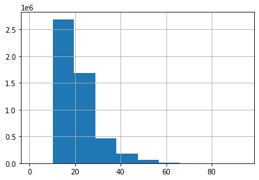
    


```python
dados["NU_IDADE"].hist(bins = 20, figsize = (10,8))
```


    <AxesSubplot:>


    
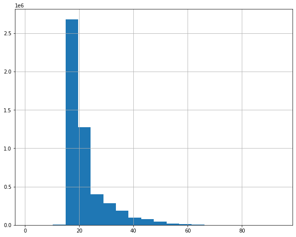
    


```python
dados.query("IN_TREINEIRO == 1")["NU_IDADE"].value_counts().sort_index()
```


    1     1
    2     3
    4     1
    5     1
    6     7
         ..
    68    2
    69    2
    70    1
    72    1
    73    1
    Name: NU_IDADE, Length: 70, dtype: int64


```python
dados["NU_NOTA_REDACAO"].hist(bins = 20, figsize=(8, 6))
```


    <AxesSubplot:>


    
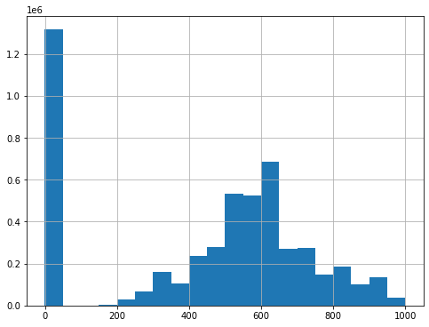
    


```python
dados["NU_NOTA_LC"].hist(bins = 20, figsize=(8, 6))
```


    <AxesSubplot:>


    
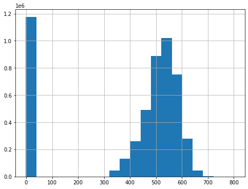
    


```python
dados["NU_NOTA_REDACAO"].mean()
```


    439.5610073656548


```python
dados["NU_NOTA_REDACAO"].std()
```


    292.2750397301862


```python
provas = ["NU_NOTA_CN","NU_NOTA_CH","NU_NOTA_MT","NU_NOTA_LC","NU_NOTA_REDACAO"]

dados[provas].describe()
```


<div>

<table border="1" class="dataframe">
  <thead>
    <tr style="text-align: right;">
      <th></th>
      <th>NU_NOTA_CN</th>
      <th>NU_NOTA_CH</th>
      <th>NU_NOTA_MT</th>
      <th>NU_NOTA_LC</th>
      <th>NU_NOTA_REDACAO</th>
    </tr>
  </thead>
  <tbody>
    <tr>
      <th>count</th>
      <td>5.095270e+06</td>
      <td>5.095270e+06</td>
      <td>5.095270e+06</td>
      <td>5.095270e+06</td>
      <td>5.095270e+06</td>
    </tr>
    <tr>
      <th>mean</th>
      <td>3.476851e+02</td>
      <td>3.903302e+02</td>
      <td>3.806731e+02</td>
      <td>4.005468e+02</td>
      <td>4.395610e+02</td>
    </tr>
    <tr>
      <th>std</th>
      <td>2.226982e+02</td>
      <td>2.257942e+02</td>
      <td>2.510612e+02</td>
      <td>2.265889e+02</td>
      <td>2.922750e+02</td>
    </tr>
    <tr>
      <th>min</th>
      <td>-1.000000e+00</td>
      <td>-1.000000e+00</td>
      <td>-1.000000e+00</td>
      <td>-1.000000e+00</td>
      <td>-1.000000e+00</td>
    </tr>
    <tr>
      <th>25%</th>
      <td>-1.000000e+00</td>
      <td>3.566000e+02</td>
      <td>-1.000000e+00</td>
      <td>3.808000e+02</td>
      <td>0.000000e+00</td>
    </tr>
    <tr>
      <th>50%</th>
      <td>4.307000e+02</td>
      <td>4.747000e+02</td>
      <td>4.502000e+02</td>
      <td>5.027000e+02</td>
      <td>5.400000e+02</td>
    </tr>
    <tr>
      <th>75%</th>
      <td>5.082000e+02</td>
      <td>5.496000e+02</td>
      <td>5.572000e+02</td>
      <td>5.530000e+02</td>
      <td>6.400000e+02</td>
    </tr>
    <tr>
      <th>max</th>
      <td>8.609000e+02</td>
      <td>8.351000e+02</td>
      <td>9.855000e+02</td>
      <td>8.017000e+02</td>
      <td>1.000000e+03</td>
    </tr>
  </tbody>
</table>
</div>


```python
dados["NU_NOTA_LC"].quantile(0.1)
```


    -1.0


```python
dados["NU_NOTA_LC"].plot.box(grid = True, figsize=(8,6))
```


    <AxesSubplot:>


    
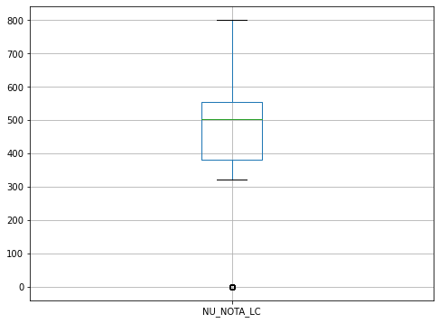
    


```python
dados[provas].boxplot(grid=True, figsize= (10,8))
```


    <AxesSubplot:>


    
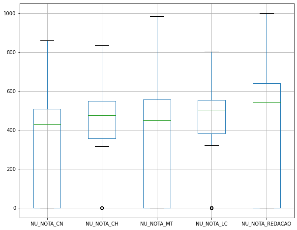
    


```python
dados.query("NU_IDADE == 13")
```


<div>

<table border="1" class="dataframe">
  <thead>
    <tr style="text-align: right;">
      <th></th>
      <th>NU_INSCRICAO</th>
      <th>NU_ANO</th>
      <th>CO_MUNICIPIO_RESIDENCIA</th>
      <th>NO_MUNICIPIO_RESIDENCIA</th>
      <th>CO_UF_RESIDENCIA</th>
      <th>SG_UF_RESIDENCIA</th>
      <th>NU_IDADE</th>
      <th>TP_SEXO</th>
      <th>TP_ESTADO_CIVIL</th>
      <th>TP_COR_RACA</th>
      <th>...</th>
      <th>Q016</th>
      <th>Q017</th>
      <th>Q018</th>
      <th>Q019</th>
      <th>Q020</th>
      <th>Q021</th>
      <th>Q022</th>
      <th>Q023</th>
      <th>Q024</th>
      <th>Q025</th>
    </tr>
  </thead>
  <tbody>
    <tr>
      <th>3998</th>
      <td>190001008625</td>
      <td>2019</td>
      <td>1502400</td>
      <td>Castanhal</td>
      <td>15</td>
      <td>PA</td>
      <td>13</td>
      <td>F</td>
      <td>1</td>
      <td>3</td>
      <td>...</td>
      <td>A</td>
      <td>A</td>
      <td>A</td>
      <td>B</td>
      <td>A</td>
      <td>A</td>
      <td>B</td>
      <td>A</td>
      <td>A</td>
      <td>A</td>
    </tr>
    <tr>
      <th>16081</th>
      <td>190001020708</td>
      <td>2019</td>
      <td>1501402</td>
      <td>Belém</td>
      <td>15</td>
      <td>PA</td>
      <td>13</td>
      <td>F</td>
      <td>1</td>
      <td>1</td>
      <td>...</td>
      <td>B</td>
      <td>A</td>
      <td>B</td>
      <td>D</td>
      <td>A</td>
      <td>B</td>
      <td>C</td>
      <td>B</td>
      <td>B</td>
      <td>B</td>
    </tr>
    <tr>
      <th>42068</th>
      <td>190001046696</td>
      <td>2019</td>
      <td>1100049</td>
      <td>Cacoal</td>
      <td>11</td>
      <td>RO</td>
      <td>13</td>
      <td>M</td>
      <td>1</td>
      <td>3</td>
      <td>...</td>
      <td>B</td>
      <td>A</td>
      <td>A</td>
      <td>B</td>
      <td>A</td>
      <td>A</td>
      <td>D</td>
      <td>A</td>
      <td>B</td>
      <td>A</td>
    </tr>
    <tr>
      <th>43565</th>
      <td>190001048193</td>
      <td>2019</td>
      <td>1101492</td>
      <td>São Francisco do Guaporé</td>
      <td>11</td>
      <td>RO</td>
      <td>13</td>
      <td>F</td>
      <td>1</td>
      <td>1</td>
      <td>...</td>
      <td>A</td>
      <td>A</td>
      <td>A</td>
      <td>A</td>
      <td>A</td>
      <td>A</td>
      <td>B</td>
      <td>A</td>
      <td>A</td>
      <td>B</td>
    </tr>
    <tr>
      <th>47387</th>
      <td>190001052015</td>
      <td>2019</td>
      <td>1502103</td>
      <td>Cametá</td>
      <td>15</td>
      <td>PA</td>
      <td>13</td>
      <td>F</td>
      <td>1</td>
      <td>3</td>
      <td>...</td>
      <td>A</td>
      <td>A</td>
      <td>A</td>
      <td>B</td>
      <td>A</td>
      <td>A</td>
      <td>B</td>
      <td>A</td>
      <td>A</td>
      <td>A</td>
    </tr>
    <tr>
      <th>...</th>
      <td>...</td>
      <td>...</td>
      <td>...</td>
      <td>...</td>
      <td>...</td>
      <td>...</td>
      <td>...</td>
      <td>...</td>
      <td>...</td>
      <td>...</td>
      <td>...</td>
      <td>...</td>
      <td>...</td>
      <td>...</td>
      <td>...</td>
      <td>...</td>
      <td>...</td>
      <td>...</td>
      <td>...</td>
      <td>...</td>
      <td>...</td>
    </tr>
    <tr>
      <th>4984398</th>
      <td>190005989309</td>
      <td>2019</td>
      <td>3542602</td>
      <td>Registro</td>
      <td>35</td>
      <td>SP</td>
      <td>13</td>
      <td>M</td>
      <td>1</td>
      <td>1</td>
      <td>...</td>
      <td>B</td>
      <td>A</td>
      <td>B</td>
      <td>C</td>
      <td>A</td>
      <td>B</td>
      <td>C</td>
      <td>A</td>
      <td>B</td>
      <td>B</td>
    </tr>
    <tr>
      <th>5040502</th>
      <td>190006045417</td>
      <td>2019</td>
      <td>5300108</td>
      <td>Brasília</td>
      <td>53</td>
      <td>DF</td>
      <td>13</td>
      <td>F</td>
      <td>1</td>
      <td>1</td>
      <td>...</td>
      <td>B</td>
      <td>B</td>
      <td>B</td>
      <td>D</td>
      <td>B</td>
      <td>A</td>
      <td>E</td>
      <td>A</td>
      <td>E</td>
      <td>B</td>
    </tr>
    <tr>
      <th>5044330</th>
      <td>190006049245</td>
      <td>2019</td>
      <td>5212204</td>
      <td>Jussara</td>
      <td>52</td>
      <td>GO</td>
      <td>13</td>
      <td>F</td>
      <td>1</td>
      <td>1</td>
      <td>...</td>
      <td>A</td>
      <td>A</td>
      <td>A</td>
      <td>B</td>
      <td>A</td>
      <td>A</td>
      <td>B</td>
      <td>A</td>
      <td>B</td>
      <td>B</td>
    </tr>
    <tr>
      <th>5049093</th>
      <td>190006054008</td>
      <td>2019</td>
      <td>5300108</td>
      <td>Brasília</td>
      <td>53</td>
      <td>DF</td>
      <td>13</td>
      <td>F</td>
      <td>1</td>
      <td>3</td>
      <td>...</td>
      <td>B</td>
      <td>A</td>
      <td>A</td>
      <td>C</td>
      <td>A</td>
      <td>A</td>
      <td>D</td>
      <td>B</td>
      <td>C</td>
      <td>B</td>
    </tr>
    <tr>
      <th>5088408</th>
      <td>190006110907</td>
      <td>2019</td>
      <td>1706100</td>
      <td>Cristalândia</td>
      <td>17</td>
      <td>TO</td>
      <td>13</td>
      <td>F</td>
      <td>1</td>
      <td>3</td>
      <td>...</td>
      <td>A</td>
      <td>A</td>
      <td>A</td>
      <td>C</td>
      <td>B</td>
      <td>A</td>
      <td>E</td>
      <td>A</td>
      <td>B</td>
      <td>B</td>
    </tr>
  </tbody>
</table>
<p>266 rows × 136 columns</p>
</div>


```python
dados.query("NU_IDADE <= 14")["SG_UF_RESIDENCIA"].value_counts()
```


    PA    509
    CE    467
    PE    458
    MA    457
    BA    415
    SP    406
    PB    395
    MG    345
    GO    303
    SE    246
    PI    227
    PR    166
    MT    154
    AM    139
    TO    124
    DF    109
    RJ    108
    RO     98
    MS     88
    SC     78
    RN     76
    AP     62
    RS     59
    AL     56
    AC     51
    ES     47
    RR     20
    Name: SG_UF_RESIDENCIA, dtype: int64


```python
dados.query("NU_IDADE <= 14")["SG_UF_RESIDENCIA"].value_counts(normalize=True)
```


    PA    0.089882
    CE    0.082465
    PE    0.080876
    MA    0.080699
    BA    0.073283
    SP    0.071693
    PB    0.069751
    MG    0.060922
    GO    0.053505
    SE    0.043440
    PI    0.040085
    PR    0.029313
    MT    0.027194
    AM    0.024545
    TO    0.021897
    DF    0.019248
    RJ    0.019071
    RO    0.017305
    MS    0.015539
    SC    0.013774
    RN    0.013420
    AP    0.010948
    RS    0.010419
    AL    0.009889
    AC    0.009006
    ES    0.008299
    RR    0.003532
    Name: SG_UF_RESIDENCIA, dtype: float64


```python
alunos_menor_quartoze = dados.query("NU_IDADE <= 14")
alunos_menor_quartoze["SG_UF_RESIDENCIA"].value_counts().plot.pie(figsize=(10,8))
```


    <AxesSubplot:ylabel='SG_UF_RESIDENCIA'>


    
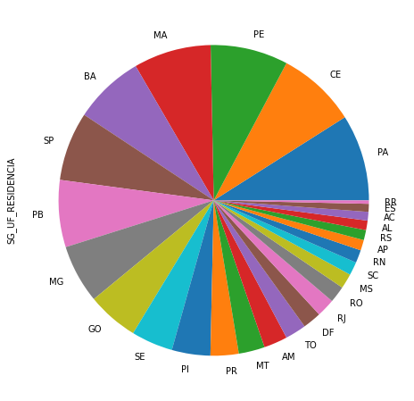
    


```python
alunos_menor_quartoze["SG_UF_RESIDENCIA"].value_counts(normalize = True).plot.bar(figsize=(10,8))
```


    <AxesSubplot:>


    
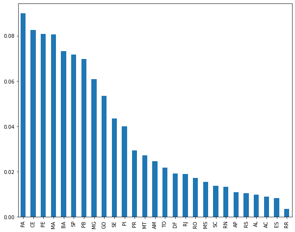
    


```python
len(alunos_menor_quartoze)
```


    5663


```python
import seaborn as sns
import matplotlib.pyplot as plt

plt.figure(figsize=(10, 8))
sns.boxplot(x="Q006", y = "NU_NOTA_MT", data = dados)
plt.title("Boxplot das notas de matemática pela renda")
```


    Text(0.5, 1.0, 'Boxplot das notas de matemática pela renda')


    
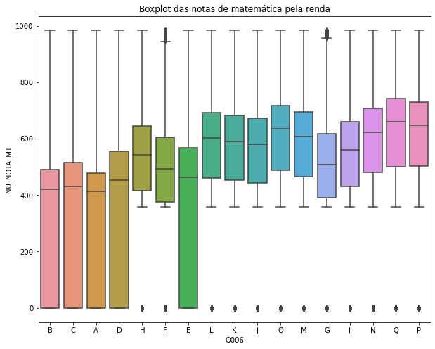
    


```python
renda_ordenada = dados["Q006"].unique()
renda_ordenada.sort()
```


```python
renda_ordenada
```


    array(['A', 'B', 'C', 'D', 'E', 'F', 'G', 'H', 'I', 'J', 'K', 'L', 'M',
           'N', 'O', 'P', 'Q'], dtype=object)


```python
plt.figure(figsize=(10, 6))
sns.boxplot(x="Q006", y = "NU_NOTA_MT", data = dados, order = renda_ordenada)
plt.title("Boxplot das notas de matemática pela renda")
```


    Text(0.5, 1.0, 'Boxplot das notas de matemática pela renda')


    
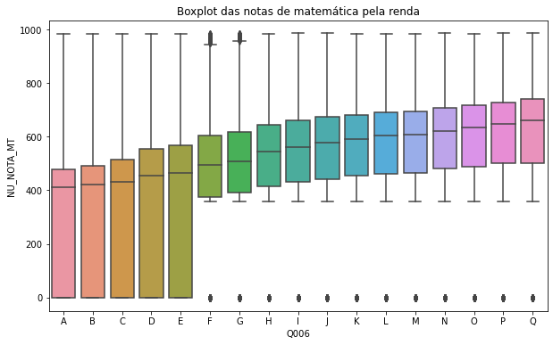
    


```python
dados[provas].sum()
```


    NU_NOTA_CN         1.771549e+09
    NU_NOTA_CH         1.988838e+09
    NU_NOTA_MT         1.939632e+09
    NU_NOTA_LC         2.040894e+09
    NU_NOTA_REDACAO    2.239682e+09
    dtype: float64


```python
dados["NU_NOTA_TOTAL"] = dados[provas].sum(axis=1)
dados.head()
```


<div>

<table border="1" class="dataframe">
  <thead>
    <tr style="text-align: right;">
      <th></th>
      <th>NU_INSCRICAO</th>
      <th>NU_ANO</th>
      <th>CO_MUNICIPIO_RESIDENCIA</th>
      <th>NO_MUNICIPIO_RESIDENCIA</th>
      <th>CO_UF_RESIDENCIA</th>
      <th>SG_UF_RESIDENCIA</th>
      <th>NU_IDADE</th>
      <th>TP_SEXO</th>
      <th>TP_ESTADO_CIVIL</th>
      <th>TP_COR_RACA</th>
      <th>...</th>
      <th>Q017</th>
      <th>Q018</th>
      <th>Q019</th>
      <th>Q020</th>
      <th>Q021</th>
      <th>Q022</th>
      <th>Q023</th>
      <th>Q024</th>
      <th>Q025</th>
      <th>NU_NOTA_TOTAL</th>
    </tr>
  </thead>
  <tbody>
    <tr>
      <th>0</th>
      <td>190001004627</td>
      <td>2019</td>
      <td>1506807</td>
      <td>Santarém</td>
      <td>15</td>
      <td>PA</td>
      <td>21</td>
      <td>M</td>
      <td>1</td>
      <td>3</td>
      <td>...</td>
      <td>A</td>
      <td>A</td>
      <td>C</td>
      <td>B</td>
      <td>A</td>
      <td>D</td>
      <td>A</td>
      <td>B</td>
      <td>A</td>
      <td>2585.3</td>
    </tr>
    <tr>
      <th>1</th>
      <td>190001004628</td>
      <td>2019</td>
      <td>1504059</td>
      <td>Mãe do Rio</td>
      <td>15</td>
      <td>PA</td>
      <td>16</td>
      <td>F</td>
      <td>1</td>
      <td>3</td>
      <td>...</td>
      <td>A</td>
      <td>A</td>
      <td>B</td>
      <td>B</td>
      <td>A</td>
      <td>B</td>
      <td>A</td>
      <td>A</td>
      <td>A</td>
      <td>2353.1</td>
    </tr>
    <tr>
      <th>2</th>
      <td>190001004629</td>
      <td>2019</td>
      <td>1505502</td>
      <td>Paragominas</td>
      <td>15</td>
      <td>PA</td>
      <td>18</td>
      <td>F</td>
      <td>1</td>
      <td>1</td>
      <td>...</td>
      <td>A</td>
      <td>A</td>
      <td>D</td>
      <td>B</td>
      <td>B</td>
      <td>D</td>
      <td>A</td>
      <td>C</td>
      <td>B</td>
      <td>2907.0</td>
    </tr>
    <tr>
      <th>3</th>
      <td>190001004630</td>
      <td>2019</td>
      <td>1507706</td>
      <td>São Sebastião da Boa Vista</td>
      <td>15</td>
      <td>PA</td>
      <td>23</td>
      <td>M</td>
      <td>0</td>
      <td>3</td>
      <td>...</td>
      <td>A</td>
      <td>A</td>
      <td>C</td>
      <td>A</td>
      <td>A</td>
      <td>D</td>
      <td>A</td>
      <td>A</td>
      <td>A</td>
      <td>-5.0</td>
    </tr>
    <tr>
      <th>4</th>
      <td>190001004631</td>
      <td>2019</td>
      <td>1503903</td>
      <td>Juruti</td>
      <td>15</td>
      <td>PA</td>
      <td>23</td>
      <td>M</td>
      <td>1</td>
      <td>3</td>
      <td>...</td>
      <td>A</td>
      <td>A</td>
      <td>B</td>
      <td>A</td>
      <td>A</td>
      <td>D</td>
      <td>A</td>
      <td>A</td>
      <td>A</td>
      <td>-5.0</td>
    </tr>
  </tbody>
</table>
<p>5 rows × 137 columns</p>
</div>


```python
plt.figure(figsize=(10, 6))
sns.boxplot(x="Q006", y = "NU_NOTA_TOTAL", data = dados, order = renda_ordenada)
plt.title("Boxplot das notas de total pela renda")
```


    Text(0.5, 1.0, 'Boxplot das notas de total pela renda')


    

    


```python
sns.displot(dados, x ="NU_NOTA_TOTAL")
```


    <seaborn.axisgrid.FacetGrid at 0x10cc9abd730>


    
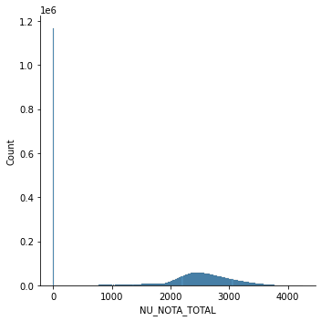
    


```python
provas = ["NU_NOTA_CN","NU_NOTA_CH","NU_NOTA_MT","NU_NOTA_LC","NU_NOTA_REDACAO"]
provas.append("NU_NOTA_TOTAL")
dados[provas].query("NU_NOTA_TOTAL == 0")
```


<div>

<table border="1" class="dataframe">
  <thead>
    <tr style="text-align: right;">
      <th></th>
      <th>NU_NOTA_CN</th>
      <th>NU_NOTA_CH</th>
      <th>NU_NOTA_MT</th>
      <th>NU_NOTA_LC</th>
      <th>NU_NOTA_REDACAO</th>
      <th>NU_NOTA_TOTAL</th>
    </tr>
  </thead>
  <tbody>
    <tr>
      <th>6263</th>
      <td>0.0</td>
      <td>0.0</td>
      <td>0.0</td>
      <td>0.0</td>
      <td>0.0</td>
      <td>0.0</td>
    </tr>
    <tr>
      <th>341980</th>
      <td>0.0</td>
      <td>0.0</td>
      <td>0.0</td>
      <td>0.0</td>
      <td>0.0</td>
      <td>0.0</td>
    </tr>
    <tr>
      <th>484095</th>
      <td>0.0</td>
      <td>0.0</td>
      <td>0.0</td>
      <td>0.0</td>
      <td>0.0</td>
      <td>0.0</td>
    </tr>
    <tr>
      <th>971228</th>
      <td>0.0</td>
      <td>0.0</td>
      <td>0.0</td>
      <td>0.0</td>
      <td>0.0</td>
      <td>0.0</td>
    </tr>
    <tr>
      <th>1190465</th>
      <td>0.0</td>
      <td>0.0</td>
      <td>0.0</td>
      <td>0.0</td>
      <td>0.0</td>
      <td>0.0</td>
    </tr>
    <tr>
      <th>1526384</th>
      <td>0.0</td>
      <td>0.0</td>
      <td>0.0</td>
      <td>0.0</td>
      <td>0.0</td>
      <td>0.0</td>
    </tr>
    <tr>
      <th>1707077</th>
      <td>0.0</td>
      <td>0.0</td>
      <td>0.0</td>
      <td>0.0</td>
      <td>0.0</td>
      <td>0.0</td>
    </tr>
    <tr>
      <th>1854048</th>
      <td>0.0</td>
      <td>0.0</td>
      <td>0.0</td>
      <td>0.0</td>
      <td>0.0</td>
      <td>0.0</td>
    </tr>
    <tr>
      <th>1876274</th>
      <td>0.0</td>
      <td>0.0</td>
      <td>0.0</td>
      <td>0.0</td>
      <td>0.0</td>
      <td>0.0</td>
    </tr>
    <tr>
      <th>2100905</th>
      <td>0.0</td>
      <td>0.0</td>
      <td>0.0</td>
      <td>0.0</td>
      <td>0.0</td>
      <td>0.0</td>
    </tr>
    <tr>
      <th>2255845</th>
      <td>0.0</td>
      <td>0.0</td>
      <td>0.0</td>
      <td>0.0</td>
      <td>0.0</td>
      <td>0.0</td>
    </tr>
    <tr>
      <th>2308480</th>
      <td>0.0</td>
      <td>0.0</td>
      <td>0.0</td>
      <td>0.0</td>
      <td>0.0</td>
      <td>0.0</td>
    </tr>
    <tr>
      <th>2527865</th>
      <td>0.0</td>
      <td>0.0</td>
      <td>0.0</td>
      <td>0.0</td>
      <td>0.0</td>
      <td>0.0</td>
    </tr>
    <tr>
      <th>2737021</th>
      <td>0.0</td>
      <td>0.0</td>
      <td>0.0</td>
      <td>0.0</td>
      <td>0.0</td>
      <td>0.0</td>
    </tr>
    <tr>
      <th>2938661</th>
      <td>0.0</td>
      <td>0.0</td>
      <td>0.0</td>
      <td>0.0</td>
      <td>0.0</td>
      <td>0.0</td>
    </tr>
    <tr>
      <th>2953186</th>
      <td>0.0</td>
      <td>0.0</td>
      <td>0.0</td>
      <td>0.0</td>
      <td>0.0</td>
      <td>0.0</td>
    </tr>
    <tr>
      <th>2953200</th>
      <td>0.0</td>
      <td>0.0</td>
      <td>0.0</td>
      <td>0.0</td>
      <td>0.0</td>
      <td>0.0</td>
    </tr>
    <tr>
      <th>2958877</th>
      <td>0.0</td>
      <td>0.0</td>
      <td>0.0</td>
      <td>0.0</td>
      <td>0.0</td>
      <td>0.0</td>
    </tr>
    <tr>
      <th>3069323</th>
      <td>0.0</td>
      <td>0.0</td>
      <td>0.0</td>
      <td>0.0</td>
      <td>0.0</td>
      <td>0.0</td>
    </tr>
    <tr>
      <th>3166974</th>
      <td>0.0</td>
      <td>0.0</td>
      <td>0.0</td>
      <td>0.0</td>
      <td>0.0</td>
      <td>0.0</td>
    </tr>
    <tr>
      <th>3284504</th>
      <td>0.0</td>
      <td>0.0</td>
      <td>0.0</td>
      <td>0.0</td>
      <td>0.0</td>
      <td>0.0</td>
    </tr>
    <tr>
      <th>3324977</th>
      <td>0.0</td>
      <td>0.0</td>
      <td>0.0</td>
      <td>0.0</td>
      <td>0.0</td>
      <td>0.0</td>
    </tr>
    <tr>
      <th>3532679</th>
      <td>0.0</td>
      <td>0.0</td>
      <td>0.0</td>
      <td>0.0</td>
      <td>0.0</td>
      <td>0.0</td>
    </tr>
    <tr>
      <th>3984771</th>
      <td>0.0</td>
      <td>0.0</td>
      <td>0.0</td>
      <td>0.0</td>
      <td>0.0</td>
      <td>0.0</td>
    </tr>
    <tr>
      <th>4033543</th>
      <td>0.0</td>
      <td>0.0</td>
      <td>0.0</td>
      <td>0.0</td>
      <td>0.0</td>
      <td>0.0</td>
    </tr>
    <tr>
      <th>4045331</th>
      <td>0.0</td>
      <td>0.0</td>
      <td>0.0</td>
      <td>0.0</td>
      <td>0.0</td>
      <td>0.0</td>
    </tr>
    <tr>
      <th>4161284</th>
      <td>0.0</td>
      <td>0.0</td>
      <td>0.0</td>
      <td>0.0</td>
      <td>0.0</td>
      <td>0.0</td>
    </tr>
    <tr>
      <th>4590036</th>
      <td>0.0</td>
      <td>0.0</td>
      <td>0.0</td>
      <td>0.0</td>
      <td>0.0</td>
      <td>0.0</td>
    </tr>
    <tr>
      <th>4595341</th>
      <td>0.0</td>
      <td>0.0</td>
      <td>0.0</td>
      <td>0.0</td>
      <td>0.0</td>
      <td>0.0</td>
    </tr>
    <tr>
      <th>4612977</th>
      <td>0.0</td>
      <td>0.0</td>
      <td>0.0</td>
      <td>0.0</td>
      <td>0.0</td>
      <td>0.0</td>
    </tr>
    <tr>
      <th>4955878</th>
      <td>0.0</td>
      <td>0.0</td>
      <td>0.0</td>
      <td>0.0</td>
      <td>0.0</td>
      <td>0.0</td>
    </tr>
  </tbody>
</table>
</div>


```python
dados_sem_notas_zero = dados.query("NU_NOTA_TOTAL != 0")
dados_sem_notas_zero.head()
```


<div>

<table border="1" class="dataframe">
  <thead>
    <tr style="text-align: right;">
      <th></th>
      <th>NU_INSCRICAO</th>
      <th>NU_ANO</th>
      <th>CO_MUNICIPIO_RESIDENCIA</th>
      <th>NO_MUNICIPIO_RESIDENCIA</th>
      <th>CO_UF_RESIDENCIA</th>
      <th>SG_UF_RESIDENCIA</th>
      <th>NU_IDADE</th>
      <th>TP_SEXO</th>
      <th>TP_ESTADO_CIVIL</th>
      <th>TP_COR_RACA</th>
      <th>...</th>
      <th>Q017</th>
      <th>Q018</th>
      <th>Q019</th>
      <th>Q020</th>
      <th>Q021</th>
      <th>Q022</th>
      <th>Q023</th>
      <th>Q024</th>
      <th>Q025</th>
      <th>NU_NOTA_TOTAL</th>
    </tr>
  </thead>
  <tbody>
    <tr>
      <th>0</th>
      <td>190001004627</td>
      <td>2019</td>
      <td>1506807</td>
      <td>Santarém</td>
      <td>15</td>
      <td>PA</td>
      <td>21</td>
      <td>M</td>
      <td>1</td>
      <td>3</td>
      <td>...</td>
      <td>A</td>
      <td>A</td>
      <td>C</td>
      <td>B</td>
      <td>A</td>
      <td>D</td>
      <td>A</td>
      <td>B</td>
      <td>A</td>
      <td>2585.3</td>
    </tr>
    <tr>
      <th>1</th>
      <td>190001004628</td>
      <td>2019</td>
      <td>1504059</td>
      <td>Mãe do Rio</td>
      <td>15</td>
      <td>PA</td>
      <td>16</td>
      <td>F</td>
      <td>1</td>
      <td>3</td>
      <td>...</td>
      <td>A</td>
      <td>A</td>
      <td>B</td>
      <td>B</td>
      <td>A</td>
      <td>B</td>
      <td>A</td>
      <td>A</td>
      <td>A</td>
      <td>2353.1</td>
    </tr>
    <tr>
      <th>2</th>
      <td>190001004629</td>
      <td>2019</td>
      <td>1505502</td>
      <td>Paragominas</td>
      <td>15</td>
      <td>PA</td>
      <td>18</td>
      <td>F</td>
      <td>1</td>
      <td>1</td>
      <td>...</td>
      <td>A</td>
      <td>A</td>
      <td>D</td>
      <td>B</td>
      <td>B</td>
      <td>D</td>
      <td>A</td>
      <td>C</td>
      <td>B</td>
      <td>2907.0</td>
    </tr>
    <tr>
      <th>3</th>
      <td>190001004630</td>
      <td>2019</td>
      <td>1507706</td>
      <td>São Sebastião da Boa Vista</td>
      <td>15</td>
      <td>PA</td>
      <td>23</td>
      <td>M</td>
      <td>0</td>
      <td>3</td>
      <td>...</td>
      <td>A</td>
      <td>A</td>
      <td>C</td>
      <td>A</td>
      <td>A</td>
      <td>D</td>
      <td>A</td>
      <td>A</td>
      <td>A</td>
      <td>-5.0</td>
    </tr>
    <tr>
      <th>4</th>
      <td>190001004631</td>
      <td>2019</td>
      <td>1503903</td>
      <td>Juruti</td>
      <td>15</td>
      <td>PA</td>
      <td>23</td>
      <td>M</td>
      <td>1</td>
      <td>3</td>
      <td>...</td>
      <td>A</td>
      <td>A</td>
      <td>B</td>
      <td>A</td>
      <td>A</td>
      <td>D</td>
      <td>A</td>
      <td>A</td>
      <td>A</td>
      <td>-5.0</td>
    </tr>
  </tbody>
</table>
<p>5 rows × 137 columns</p>
</div>


```python
plt.figure(figsize=(10, 6))
sns.boxplot(x="Q006", y = "NU_NOTA_TOTAL", data = dados_sem_notas_zero, order = renda_ordenada)
plt.title("Boxplot das notas de total pela renda")
```


    Text(0.5, 1.0, 'Boxplot das notas de total pela renda')


    
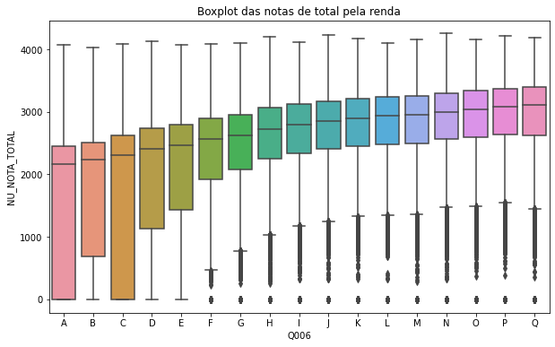
    


```python
plt.figure(figsize=(14, 8))
sns.boxplot(x="Q006", y = "NU_NOTA_TOTAL", data = dados_sem_notas_zero, 
            hue = "IN_TREINEIRO", order = renda_ordenada)
plt.title("Boxplot das notas de total pela renda")
```


    Text(0.5, 1.0, 'Boxplot das notas de total pela renda')


    
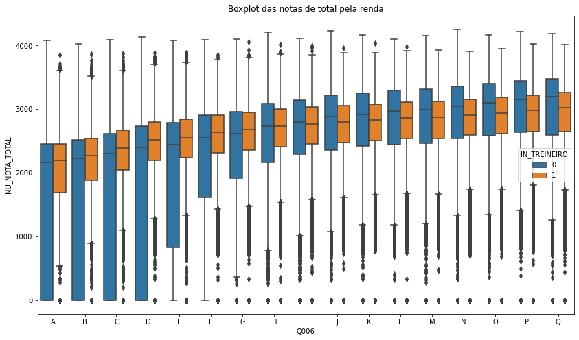
    


```python
plt.figure(figsize=(12,8))
sns.histplot(dados_sem_notas_zero, x = "NU_NOTA_TOTAL")
```


    <AxesSubplot:xlabel='NU_NOTA_TOTAL', ylabel='Count'>


    
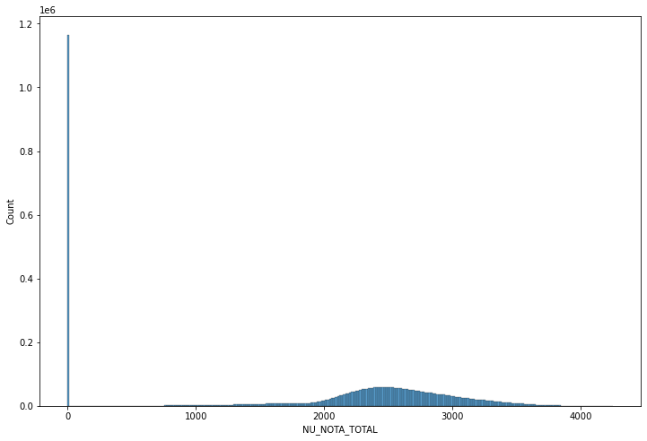
    


```python
plt.figure(figsize=(12,8))
sns.histplot(dados_sem_notas_zero, x = "NU_NOTA_MT")
```


    <AxesSubplot:xlabel='NU_NOTA_MT', ylabel='Count'>


    
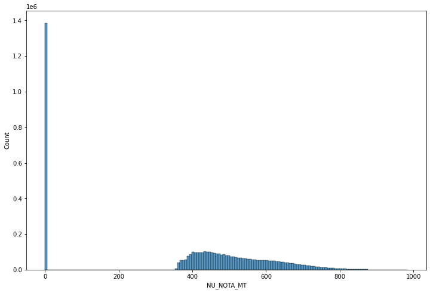
    


```python
plt.figure(figsize=(12,8))
sns.histplot(dados_sem_notas_zero, x = "NU_NOTA_LC")
```


    <AxesSubplot:xlabel='NU_NOTA_LC', ylabel='Count'>


    
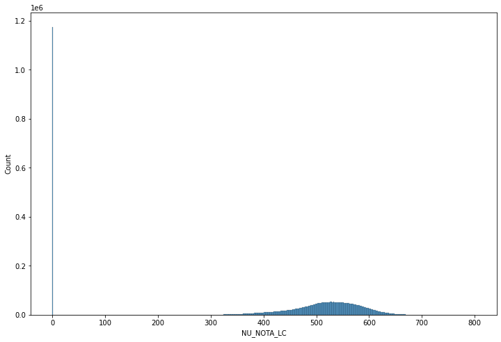
    


```python
plt.figure(figsize=(12,8))
sns.histplot(dados_sem_notas_zero, x = "NU_NOTA_TOTAL", hue="Q025", kde=True)
```


    <AxesSubplot:xlabel='NU_NOTA_TOTAL', ylabel='Count'>


    
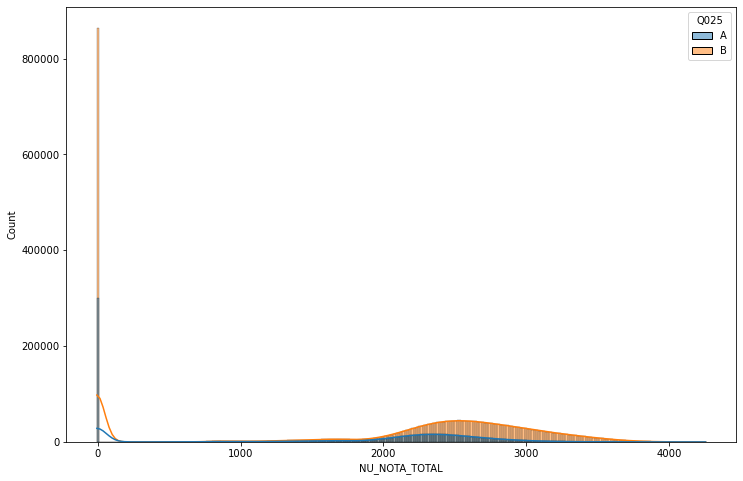
    


```python
plt.figure(figsize=(12,8))
sns.histplot(dados_sem_notas_zero, x = "NU_NOTA_TOTAL", hue="Q025", kde=True, stat="probability")
```


    <AxesSubplot:xlabel='NU_NOTA_TOTAL', ylabel='Probability'>


    
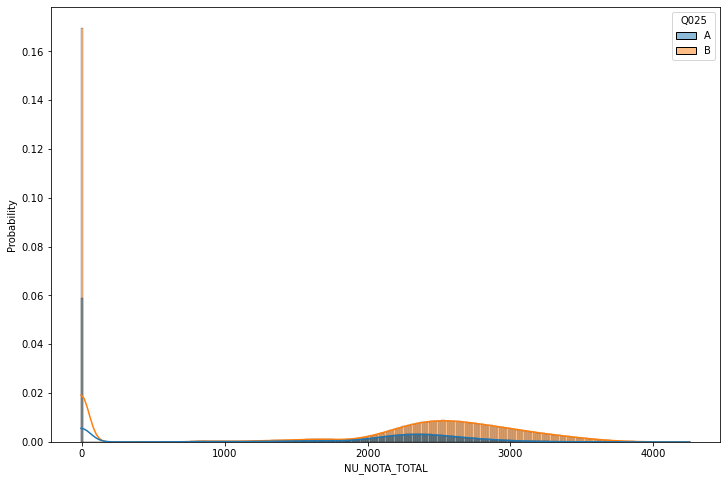
    


```python
plt.figure(figsize=(12,8))
sns.histplot(dados_sem_notas_zero, x = "NU_NOTA_TOTAL", hue="Q025", kde=True, stat="density", cumulative=True)
```


    <AxesSubplot:xlabel='NU_NOTA_TOTAL', ylabel='Density'>


    
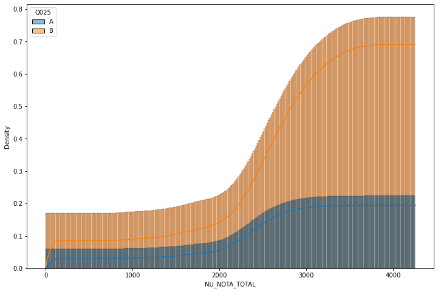
    


```python
plt.figure(figsize=(10, 10))
sns.scatterplot(data = dados_sem_notas_zero, x="NU_NOTA_MT", y="NU_NOTA_LC", hue="Q025")
plt.xlim((-50, 1050))
plt.ylim((-50, 1050))
```


    (-50.0, 1050.0)


    
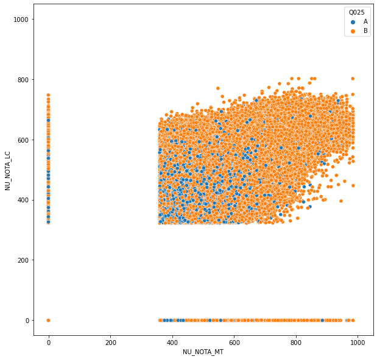
    


```python
provas
```


    ['NU_NOTA_CN',
     'NU_NOTA_CH',
     'NU_NOTA_MT',
     'NU_NOTA_LC',
     'NU_NOTA_REDACAO',
     'NU_NOTA_TOTAL']


```python
sns.pairplot(dados_sem_notas_zero[provas])
```


    <seaborn.axisgrid.PairGrid at 0x10cd2d3bb20>


    
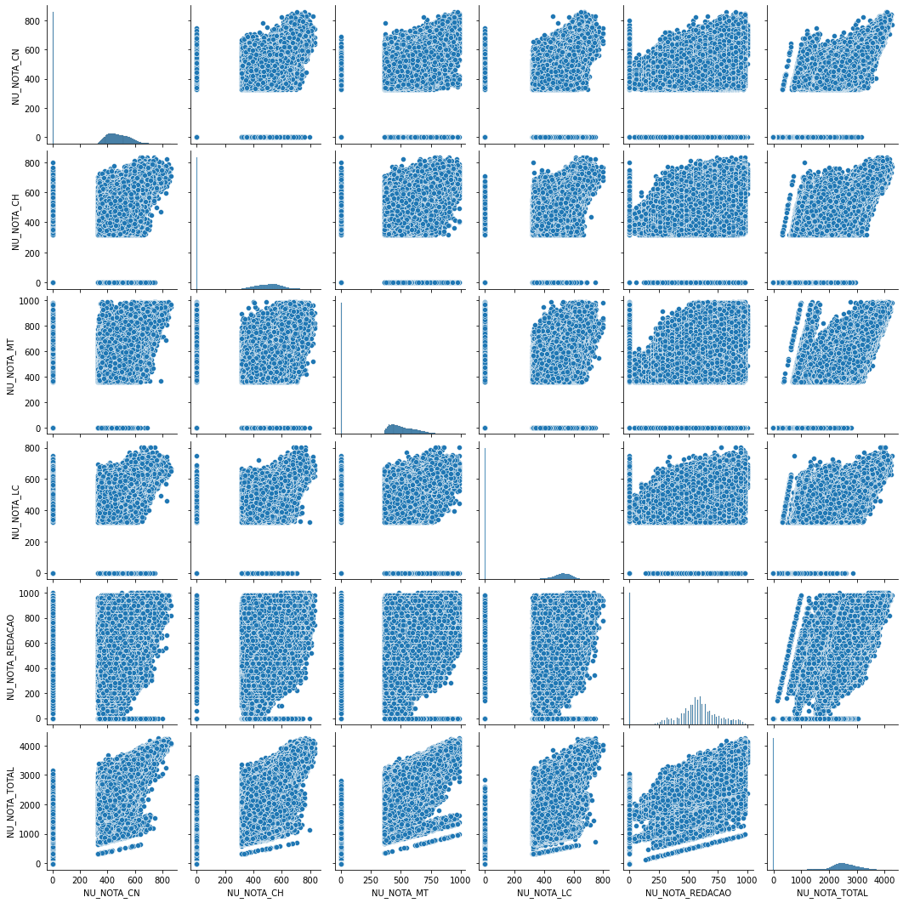
    


```python
correlacao = dados_sem_notas_zero[provas].corr()
correlacao
```


<div>

<table border="1" class="dataframe">
  <thead>
    <tr style="text-align: right;">
      <th></th>
      <th>NU_NOTA_CN</th>
      <th>NU_NOTA_CH</th>
      <th>NU_NOTA_MT</th>
      <th>NU_NOTA_LC</th>
      <th>NU_NOTA_REDACAO</th>
      <th>NU_NOTA_TOTAL</th>
    </tr>
  </thead>
  <tbody>
    <tr>
      <th>NU_NOTA_CN</th>
      <td>1.000000</td>
      <td>0.881009</td>
      <td>0.958437</td>
      <td>0.878383</td>
      <td>0.822708</td>
      <td>0.951756</td>
    </tr>
    <tr>
      <th>NU_NOTA_CH</th>
      <td>0.881009</td>
      <td>1.000000</td>
      <td>0.866665</td>
      <td>0.976917</td>
      <td>0.876726</td>
      <td>0.965096</td>
    </tr>
    <tr>
      <th>NU_NOTA_MT</th>
      <td>0.958437</td>
      <td>0.866665</td>
      <td>1.000000</td>
      <td>0.861475</td>
      <td>0.820418</td>
      <td>0.946088</td>
    </tr>
    <tr>
      <th>NU_NOTA_LC</th>
      <td>0.878383</td>
      <td>0.976917</td>
      <td>0.861475</td>
      <td>1.000000</td>
      <td>0.873913</td>
      <td>0.962771</td>
    </tr>
    <tr>
      <th>NU_NOTA_REDACAO</th>
      <td>0.822708</td>
      <td>0.876726</td>
      <td>0.820418</td>
      <td>0.873913</td>
      <td>1.000000</td>
      <td>0.930768</td>
    </tr>
    <tr>
      <th>NU_NOTA_TOTAL</th>
      <td>0.951756</td>
      <td>0.965096</td>
      <td>0.946088</td>
      <td>0.962771</td>
      <td>0.930768</td>
      <td>1.000000</td>
    </tr>
  </tbody>
</table>
</div>


```python
sns.heatmap(correlacao, cmap="Blues", center=0, annot=True)
```


    <AxesSubplot:>


    
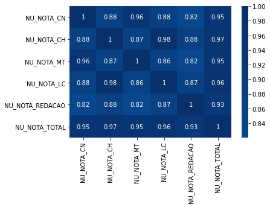
    


```python
provas
```


    ['NU_NOTA_CN',
     'NU_NOTA_CH',
     'NU_NOTA_MT',
     'NU_NOTA_LC',
     'NU_NOTA_REDACAO',
     'NU_NOTA_TOTAL']


```python
provas_entrada = ["NU_NOTA_CH","NU_NOTA_LC", "NU_NOTA_CN","NU_NOTA_REDACAO"]
prova_saida = "NU_NOTA_MT"
dados_sem_notas_zero = dados_sem_notas_zero[provas].dropna()
notas_entrada = dados_sem_notas_zero[provas_entrada]
notas_saida = dados_sem_notas_zero[prova_saida]
```


```python
notas_entrada
```


<div>

<table border="1" class="dataframe">
  <thead>
    <tr style="text-align: right;">
      <th></th>
      <th>NU_NOTA_CH</th>
      <th>NU_NOTA_LC</th>
      <th>NU_NOTA_CN</th>
      <th>NU_NOTA_REDACAO</th>
    </tr>
  </thead>
  <tbody>
    <tr>
      <th>0</th>
      <td>466.0</td>
      <td>497.3</td>
      <td>472.9</td>
      <td>780.0</td>
    </tr>
    <tr>
      <th>1</th>
      <td>495.4</td>
      <td>482.3</td>
      <td>358.9</td>
      <td>600.0</td>
    </tr>
    <tr>
      <th>2</th>
      <td>538.7</td>
      <td>582.6</td>
      <td>574.2</td>
      <td>640.0</td>
    </tr>
    <tr>
      <th>3</th>
      <td>-1.0</td>
      <td>-1.0</td>
      <td>-1.0</td>
      <td>-1.0</td>
    </tr>
    <tr>
      <th>4</th>
      <td>-1.0</td>
      <td>-1.0</td>
      <td>-1.0</td>
      <td>-1.0</td>
    </tr>
    <tr>
      <th>...</th>
      <td>...</td>
      <td>...</td>
      <td>...</td>
      <td>...</td>
    </tr>
    <tr>
      <th>5095265</th>
      <td>-1.0</td>
      <td>-1.0</td>
      <td>-1.0</td>
      <td>-1.0</td>
    </tr>
    <tr>
      <th>5095266</th>
      <td>-1.0</td>
      <td>-1.0</td>
      <td>-1.0</td>
      <td>-1.0</td>
    </tr>
    <tr>
      <th>5095267</th>
      <td>-1.0</td>
      <td>-1.0</td>
      <td>-1.0</td>
      <td>-1.0</td>
    </tr>
    <tr>
      <th>5095268</th>
      <td>380.6</td>
      <td>493.1</td>
      <td>458.8</td>
      <td>800.0</td>
    </tr>
    <tr>
      <th>5095269</th>
      <td>473.5</td>
      <td>473.2</td>
      <td>451.6</td>
      <td>280.0</td>
    </tr>
  </tbody>
</table>
<p>5095239 rows × 4 columns</p>
</div>


```python
x = notas_entrada
y = notas_saida 
```


```python
from sklearn.model_selection import train_test_split

SEED = 4321

x_treino, x_teste, y_treino, y_teste = train_test_split(x, y, test_size = 0.25,
                                                        random_state=SEED)
```


```python
from sklearn.svm import LinearSVR

modelo = LinearSVR(random_state = SEED)
modelo.fit(x_treino, y_treino)
```

    C:\ProgramData\Anaconda3\lib\site-packages\sklearn\svm\_base.py:976: ConvergenceWarning: Liblinear failed to converge, increase the number of iterations.
      warnings.warn("Liblinear failed to converge, increase "
    


    LinearSVR(random_state=4321)


```python
predicoes_matematica = modelo.predict(x_teste)
```


```python
y_teste[:5]
```


    3515004    626.1
    1891627    522.6
    3893335    468.9
    4625956     -1.0
    3949490    414.2
    Name: NU_NOTA_MT, dtype: float64


```python
plt.figure(figsize=(8, 8))
sns.scatterplot(x=predicoes_matematica, y=y_teste)
plt.xlim((-50, 1050))
plt.ylim((-50, 1050))
```


    (-50.0, 1050.0)


    
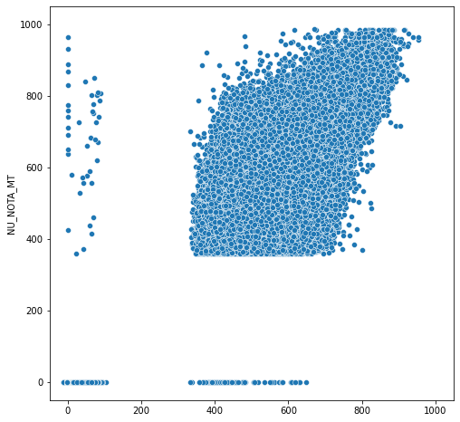
    


```python
plt.figure(figsize=(8, 8))
sns.scatterplot(x=y_teste, y=y_teste - predicoes_matematica)
```


    <AxesSubplot:xlabel='NU_NOTA_MT', ylabel='NU_NOTA_MT'>


    
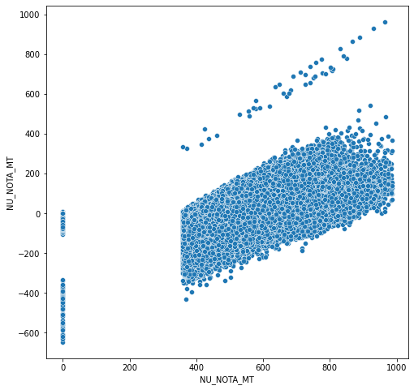
    


```python
plt.figure(figsize=(8, 8))
sns.scatterplot(x=y_teste, y=x_teste.mean(axis=1))
plt.xlim((-50, 1050))
plt.ylim((-50, 1050))
```


    (-50.0, 1050.0)


    
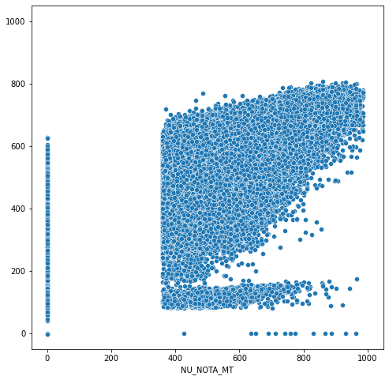
    


```python
resultados = pd.DataFrame()
resultados["Real"] = y_teste
resultados["Previsao"] = predicoes_matematica
resultados["diferenca"] = resultados["Real"] - resultados["Previsao"]
resultados["quadrado_diferenca"] = (resultados["Real"] - resultados["Previsao"])**2
```


```python
resultados
```


<div>

<table border="1" class="dataframe">
  <thead>
    <tr style="text-align: right;">
      <th></th>
      <th>Real</th>
      <th>Previsao</th>
      <th>diferenca</th>
      <th>quadrado_diferenca</th>
    </tr>
  </thead>
  <tbody>
    <tr>
      <th>3515004</th>
      <td>626.1</td>
      <td>570.001762</td>
      <td>56.098238</td>
      <td>3147.012314</td>
    </tr>
    <tr>
      <th>1891627</th>
      <td>522.6</td>
      <td>667.373663</td>
      <td>-144.773663</td>
      <td>20959.413420</td>
    </tr>
    <tr>
      <th>3893335</th>
      <td>468.9</td>
      <td>594.512664</td>
      <td>-125.612664</td>
      <td>15778.541310</td>
    </tr>
    <tr>
      <th>4625956</th>
      <td>-1.0</td>
      <td>-1.052290</td>
      <td>0.052290</td>
      <td>0.002734</td>
    </tr>
    <tr>
      <th>3949490</th>
      <td>414.2</td>
      <td>559.720781</td>
      <td>-145.520781</td>
      <td>21176.297604</td>
    </tr>
    <tr>
      <th>...</th>
      <td>...</td>
      <td>...</td>
      <td>...</td>
      <td>...</td>
    </tr>
    <tr>
      <th>814546</th>
      <td>715.1</td>
      <td>713.275302</td>
      <td>1.824698</td>
      <td>3.329521</td>
    </tr>
    <tr>
      <th>506323</th>
      <td>-1.0</td>
      <td>65.076008</td>
      <td>-66.076008</td>
      <td>4366.038880</td>
    </tr>
    <tr>
      <th>2128520</th>
      <td>559.2</td>
      <td>637.881797</td>
      <td>-78.681797</td>
      <td>6190.825111</td>
    </tr>
    <tr>
      <th>1616798</th>
      <td>-1.0</td>
      <td>-1.052290</td>
      <td>0.052290</td>
      <td>0.002734</td>
    </tr>
    <tr>
      <th>488241</th>
      <td>573.3</td>
      <td>637.811960</td>
      <td>-64.511960</td>
      <td>4161.793002</td>
    </tr>
  </tbody>
</table>
<p>1273810 rows × 4 columns</p>
</div>


```python
resultados["quadrado_diferenca"].mean()
```


    5387.322566721209


```python
resultados["quadrado_diferenca"].mean()**(1/2)
```


    73.39838258927243


```python
from sklearn.dummy import DummyRegressor

modelo_dummy = DummyRegressor()
modelo_dummy.fit(x_treino, y_treino)
dummy_predicoes = modelo_dummy.predict(x_teste)
```


```python
from sklearn.metrics import mean_squared_error

mean_squared_error(y_teste, dummy_predicoes)
```


    63049.6270996896


```python
mean_squared_error(y_teste, predicoes_matematica)
```


    5387.322566735999


```python
from sklearn.svm import LinearSVR

modelo = LinearSVR(random_state=SEED)
modelo.fit(x_treino, y_treino)
predicoes_matematica = modelo.predict(x_teste)
mean_squared_error(y_teste, predicoes_matematica)
```

    C:\ProgramData\Anaconda3\lib\site-packages\sklearn\svm\_base.py:976: ConvergenceWarning: Liblinear failed to converge, increase the number of iterations.
      warnings.warn("Liblinear failed to converge, increase "
    


    5387.322566735999


```python
from sklearn.tree import DecisionTreeRegressor

x_treino, x_teste, y_treino, y_teste = train_test_split(x, y, test_size=0.25)
modelo_arvore = DecisionTreeRegressor(max_depth = 3)
modelo_arvore.fit(x_treino, y_treino)
predicoes_matematica_arvore = modelo_arvore.predict(x_teste)
mean_squared_error(y_teste, predicoes_matematica_arvore)

```


    4750.791047411961


```python
from sklearn.model_selection import cross_validate

modelo_arvore = DecisionTreeRegressor(max_depth=2)
resultados = cross_validate(modelo_arvore, x, y, cv= 10, scoring="neg_mean_squared_error")
media = (resultados["test_score"]*-1).mean()
```


```python
from sklearn.model_selection import cross_validate

modelo_arvore = DecisionTreeRegressor(max_depth=2)
resultados = cross_validate(modelo_arvore, x, y, cv= 10, scoring="neg_mean_squared_error")
media = (resultados["test_score"]*-1).mean()
desvio_padrao = (resultados["test_score"]*-1).std()
lim_inferior = media - (2*desvio_padrao)
lim_superior = media + (2*desvio_padrao)

print(f"Intervalo de confiança {lim_inferior} - {lim_superior}")
```

    Intervalo de confiança 5096.019566777237 - 6302.613179291391
    


```python
resultados["test_score"]*-1
```


    array([5615.36053189, 5815.83443365, 5861.66580436, 5733.27728091,
           5685.6280561 , 6016.29992613, 6102.65391438, 5836.98494729,
           5205.33807707, 5120.12075855])


```python
def calcula_mse(resultados):
    media = (resultados["test_score"]*-1).mean()
    desvio_padrao = (resultados["test_score"]*-1).std()
    lim_inferior = media - (2*desvio_padrao)
    lim_superior = media + (2*desvio_padrao)
    print(f"Intervalo de confiança {lim_inferior} - {lim_superior}")
```


```python
from sklearn.model_selection import cross_validate
from sklearn.model_selection import KFold
import numpy as np

SEED= 1232
np.random.seed(SEED)


partes = KFold(n_splits = 10, shuffle=True)
modelo_arvore = DecisionTreeRegressor(max_depth=3)
resultados = cross_validate(modelo_arvore, x, y, cv= partes, scoring="neg_mean_squared_error")
calcula_mse(resultados)
```

    Intervalo de confiança 4718.495122104185 - 4770.715869473757
    


```python
def regressor_arvore(nivel):
    SEED= 1232
    np.random.seed(SEED)
    partes = KFold(n_splits = 10, shuffle=True)
    modelo_arvore = DecisionTreeRegressor(max_depth=nivel)
    resultados = cross_validate(modelo_arvore, x, y, cv= partes, scoring="neg_mean_squared_error", return_train_score=True)
    print(f"Treino = {(resultados['train_score']*-1).mean()}|Teste = {(resultados['test_score']*-1).mean()}")

regressor_arvore(4)
```

    Treino = 4387.948321197781|Teste = 4391.045217836308
    


```python
for i in range(1,21):
    regressor_arvore(i)
```

    Treino = 8652.775217863053|Teste = 8652.787232895545
    Treino = 5692.924672467637|Teste = 5693.667691865369
    Treino = 4742.692704504871|Teste = 4744.605495788971
    Treino = 4387.948321197781|Teste = 4391.045217836308
    Treino = 4200.641750228765|Teste = 4204.227784605866
    Treino = 4087.0148181927443|Teste = 4093.0436646384433
    Treino = 4011.5489136535048|Teste = 4019.801816863732
    Treino = 3964.9686081409736|Teste = 3976.5498828035875
    Treino = 3932.009069776845|Teste = 3948.1566014869045
    Treino = 3906.372607224005|Teste = 3929.0891691420757
    Treino = 3885.5566151591565|Teste = 3918.5124628249796
    Treino = 3866.20367755209|Teste = 3916.9388397640664
    Treino = 3843.8358930186646|Teste = 3925.943637957627
    Treino = 3813.5422951283194|Teste = 3949.6677459404223
    Treino = 3769.923129761847|Teste = 3992.8206957034854
    Treino = 3708.580015029545|Teste = 4057.5179652992
    Treino = 3625.2984499329723|Teste = 4149.667230573784
    Treino = 3517.355234974664|Teste = 4269.209049667124
    Treino = 3383.388199306879|Teste = 4416.79404034532
    Treino = 3224.317913065389|Teste = 4593.955538811655
    
## GRÁFICOS DINÂMICOS PRELIMINARES https://murilokrominski.github.io/Data-Science_ENEM-2019/

## Conclusões
+ As conclusões seguem disponíveis através do link abaixo:
```

<a href="https://github.com/MuriloKrominski/Data-Science_ENEM-2019-Results">
     https://github.com/MuriloKrominski/Data-Science_ENEM-2019-Results
  </a>
